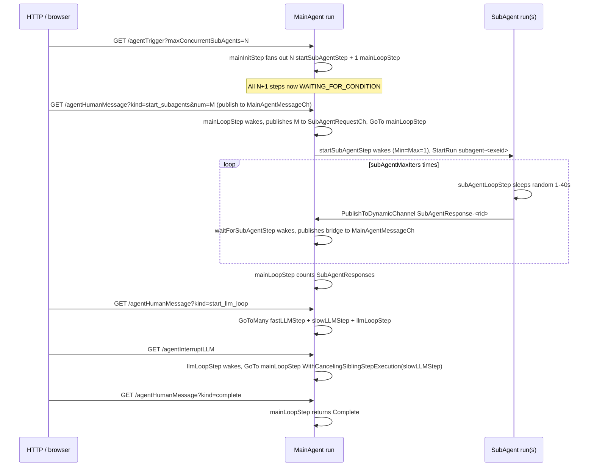
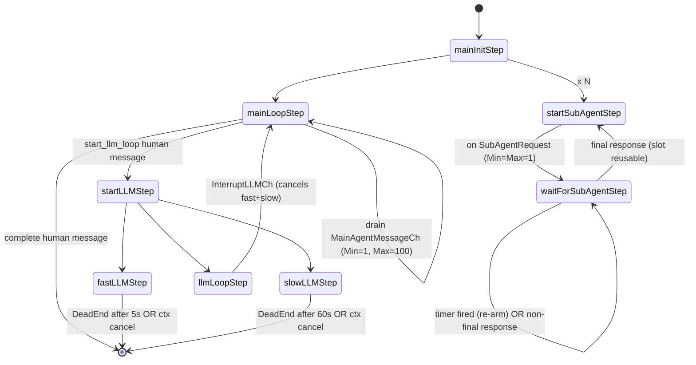
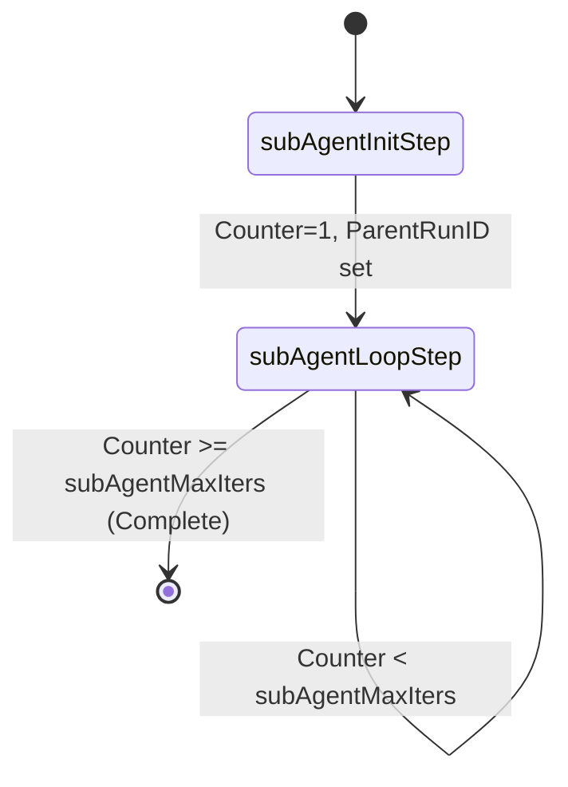

# Multi-Agent Benchmark Flow

The multi-agent benchmark exercises nearly every advanced dex SDK
feature in a single demo: cross-run `StartRun` from inside `Execute`,
cross-run dynamic-channel publish, channel `Min`/`Max` draining,
`AnyOf(channel, timer)` with re-arm on timer-fired, and sibling
cancellation. It lives in
[`benchmark/cmd/benchmarkworker/agent_flows.go`](cmd/benchmarkworker/agent_flows.go)
and is driven by three GET HTTP endpoints that you can paste into a
browser address bar.

## Scenario at a glance

A single MainAgent run orchestrates `N` reusable "subagent slots". An
external operator drives the run through three stages:

1. **Spawn subagents.** The operator sends a `start_subagents` human
   message; the MainAgent fans the request out to the per-slot
   `startSubAgentStep` instances, each of which calls
   `dex.StartRun` on a child `subAgentFlow` run. Each subagent
   loops 3 times, sleeping a random 1–40 s between iterations,
   publishing back to the parent on `SubAgentResponse-<subRunID>`.
2. **Run the LLM loop.** The operator sends `start_llm_loop`; the
   MainAgent fans out to `fastLLMStep` (5 s) + `slowLLMStep` (60 s) +
   `llmLoopStep` (waits for an interrupt). The operator can fire
   `/agentInterruptLLM` to cut the loop short — `llmLoopStep` returns
   `WithCancelingSiblingStepExecution(fastLLMStep, slowLLMStep)`,
   killing whichever LLM branches are still in flight.
3. **Complete.** The operator sends `complete`; the MainAgent
   terminates with a final `SubAgentResponseCount` in state.

## Diagrams

### High-level sequence



### MainAgent state graph



### SubAgent state graph



## Channel topology

| Channel name                       | Type                              | Producer(s)                               | Consumer(s)                            | Min/Max     |
| ---------------------------------- | --------------------------------- | ----------------------------------------- | -------------------------------------- | ----------- |
| `SubAgentRequest`                  | static `Channel[subAgentRequest]` | `mainLoopStep`                            | `startSubAgentStep` (per-slot)         | 1 / 1       |
| `MainAgentMessage`                 | static `Channel[mainAgentMessage]`| HTTP `/agentHumanMessage` + `waitForSubAgentStep` | `mainLoopStep`                | 1 / 100     |
| `InterruptLLM`                     | static `Channel[interruptSignal]` | HTTP `/agentInterruptLLM`                 | `llmLoopStep`                          | 1 / 100     |
| `SubAgentResponse-<subRunID>`      | dynamic family                    | `subAgentLoopStep` (cross-run)            | `waitForSubAgentStep` (per-instance)   | 1 / 1       |

The dynamic family's per-instance Min=Max=1 makes each
`waitForSubAgentStep` execution drain exactly one message at a time, so
the `IsLast` decision applies to a single response without ambiguity.

## State

### `mainAgentState`

| Field                   | Type     | Notes                                                                                       |
| ----------------------- | -------- | ------------------------------------------------------------------------------------------- |
| `SubAgentResponseCount` | `int`    | Accumulates each time `mainLoopStep` drains a batch.                                        |
| `FastLLMRunning`        | `bool`   | Set when entering the LLM loop; cleared on natural DeadEnd.                                 |
| `SlowLLMRunning`        | `bool`   | Set when entering the LLM loop; cleared on natural DeadEnd.                                 |
| `Notes`                 | `[]string` | Reserved for free-form annotations.                                                       |

> The engine's nested-merge skips zero values for primitives, so setting
> `false` on a bool field is a no-op merge — the "running" booleans are
> best-effort indicators rather than precise post-cancel state. To
> observe the cancel definitively, look at the ActiveStepExecution
> history events for `slowLLMStep`.

### `subAgentState`

| Field         | Type     | Notes                                                              |
| ------------- | -------- | ------------------------------------------------------------------ |
| `Counter`     | `int`    | Starts at 1; `subAgentLoopStep` completes when `Counter >= 3`.      |
| `ParentRunID` | `string` | Captured on init so the loop step can publish back without context.|

## HTTP endpoint reference

All three endpoints are `GET` so they can be invoked from a browser
address bar. They reuse the existing `X-Benchmark-Token` header gating.

| Endpoint                    | Required params                                       | Effect                                                                                       |
| --------------------------- | ----------------------------------------------------- | -------------------------------------------------------------------------------------------- |
| `GET /agentTrigger`         | `maxConcurrentSubAgents` (int, default 2)             | Starts one `mainAgentFlow` run; returns the synthesized `run_id`.                            |
| `GET /agentHumanMessage`    | `runId`, `kind`, optional `num`                       | Publishes a typed `mainAgentMessage` to `MainAgentMessageCh`. `kind` ∈ `{start_subagents, start_llm_loop, complete}`. `num` is read only when `kind=start_subagents` (default 1). |
| `GET /agentInterruptLLM`    | `runId`, optional `reason`                            | Publishes one `interruptSignal{Reason}` to `InterruptLLMCh`.                                |

### Examples

```bash
# Start a run with 2 reusable subagent slots.
curl "http://127.0.0.1:9123/agentTrigger?maxConcurrentSubAgents=2"

# Ask the agent to spawn 3 subagents.
curl "http://127.0.0.1:9123/agentHumanMessage?runId=<RUN_ID>&kind=start_subagents&num=3"

# Enter the LLM loop and interrupt it 8 seconds later.
curl "http://127.0.0.1:9123/agentHumanMessage?runId=<RUN_ID>&kind=start_llm_loop"
sleep 8
curl "http://127.0.0.1:9123/agentInterruptLLM?runId=<RUN_ID>&reason=user-changed-mind"

# Tear down.
curl "http://127.0.0.1:9123/agentHumanMessage?runId=<RUN_ID>&kind=complete"
```

## How to drive it locally

The simplest way to see the whole demo light up the WebUI is the
canonical dev-stack script:

```bash
./dev-stack.sh
```

The script's `AGENT_RUN=1` (default) section appends a single
mainAgent run after the existing `dynamicChannel` runs, with the same
sequence as the curl examples above (configurable via
`AGENT_MAX_CONCURRENT` and `AGENT_REQUEST_NUM` env vars). After it
finishes, open the WebUI and look for the run with `flow_type =
main.mainAgentFlow` to see:

- The N+1 fan-out from `mainInitStep`
- N `startSubAgentStep` instances draining `SubAgentRequestCh`
- N child `subAgentFlow` runs each emitting 3 responses on
  `SubAgentResponse-<rid>`
- `mainLoopStep` re-arming on each batch
- The 3-way LLM-loop fan-out with `slowLLMStep` cancelled
- A clean `Complete` terminal

## Implementation notes / known limitations

- **Idempotent `StartRun` from inside a step.** `startSubAgentStep`
  derives the child runID as
  `"subagent-" + ctx.RunID() + "-" + ctx.StepExecutionID()`. The
  parent RunID component is required for namespace-wide uniqueness
  (without it, two concurrent mainAgent runs would derive identical
  subagent runIDs for their i-th slot and the second StartRun would
  fail with `codes.AlreadyExists` pointing at the WRONG run). The
  stepExecutionID component is required to keep slots within the
  same parent unique. With both, a worker-replay surfaces as
  `codes.AlreadyExists` from the server pointing at the SAME run we
  just tried to start, which we treat as success.
- **Child runs need a worker on their tasklist.** `startSubAgentStep`
  uses the package-level `agentTaskListName` (set by `main.go` from
  `cfg.TaskListName`) when launching child `subAgentFlow` runs. If
  you forget to set this and fall back to `dex.DefaultTaskListName`
  ("defaultTaskList"), child runs sit in `RunStatusWaitingForWorker`
  forever because the benchmark process doesn't run a worker on
  that tasklist. The setter pattern is documented in `agent_flows.go`.
- **No SDK Execute retry today.** If `StartRun` fails for a non-
  `AlreadyExists` reason, `startSubAgentStep` logs an ERROR and
  `DeadEnd`s the slot. Returning the error from `Execute` would abort
  the whole run loop in the worker (see [`sdk-go/dex/worker.go`](../sdk-go/dex/worker.go)),
  so we sacrifice the slot. Once SDK-level Execute retry lands, flip
  `DeadEnd()` → `return nil, err`; the deterministic runID makes that
  retry idempotent.
- **`MainAgentMessage.Max(100)`.** Under heavy fan-in (e.g. 50
  subagents × 3 responses = 150) the cap means `mainLoopStep` drains
  100 per wake; the surplus is durably queued in
  `RunRow.UnconsumedChannelMessages` and consumed on the next wake.
- **State merge skips zero booleans.** See note under
  `mainAgentState` above.
- **Subagent sleep range.** `subAgentLoopStep` sleeps 1–40 s per
  iteration to produce a visible distribution of staggered publishes
  in the WebUI timeline. For tests, the e2e variant in
  [`server/internal/integration/sdke2e/sdk_e2e_multi_agent_test.go`](../server/internal/integration/sdke2e/sdk_e2e_multi_agent_test.go)
  uses 50 ms instead.
