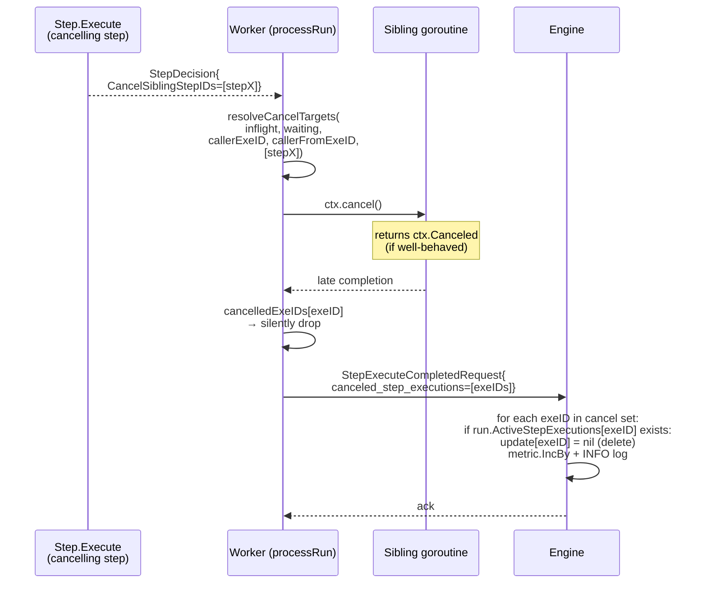

# CancelSiblingStepExecution

## Motivation

Some step patterns can't be expressed cleanly with WaitFor conditions
alone. Two examples that this design enables:

- **First-to-finish wins.** A parent step fans out to N siblings that
  each chase a different signal (RPC, channel, timer). The first one to
  resolve should retire the others — leaving them parked on
  WAITING_FOR_CONDITION forever leaks ActiveStepExecutions slots and
  durable timer rows, and prevents the run from completing.
- **Abort-on-error / abort-on-cancel.** A sibling that observes a
  cancellation signal (an `order-cancel-{id}` channel publish in
  benchmark/dynamicChannelFlow, an upstream user cancel in a real
  flow) needs to delete its peer waiters in the same commit so the
  run can promptly transition to a terminal status.

Without an explicit cancellation API, callers have no way to delete a
sibling step execution: the engine treats every step in
`ActiveStepExecutions` as live work and blocks the run from completing
until it transitions out of WAITING / INVOKING.

## Public API

```go
return dex.GoTo(&nextStep{}, in).
    WithCancelingSiblingStepExecution(
        dex.CancelOf(&siblingStepA{}),
        dex.CancelOf(&siblingStepB{}),
    )
```

- `CancelOf[IN any, ST any](step Step[IN, ST]) CancelSiblingStepRef`
  is generic for compile-time safety (only real `Step` implementers
  type-check). Because there's no `input IN` argument to anchor
  inference, Go resolves `IN`/`ST` from the concrete struct's
  `Execute` / `WaitFor` method set, so call sites stay clean. Explicit
  type params (`CancelOf[InputT, StateT](&step{})`) work as a fallback
  for the rare case where generic embedding defeats inference.
- `(*StepDecision).WithCancelingSiblingStepExecution(refs ...CancelSiblingStepRef)`
  appends to `StepDecision.CancelSiblingStepIDs`. Multiple calls
  accumulate; zero refs is a no-op.

## Cancellation rules

1. Each `CancelSiblingStepRef` carries a `stepID` (resolved from the
   step's `GetStepId()` or its reflected type name, exactly as
   `MovementOf` does).
2. The worker resolves each `stepID` to the **set** of currently-active
   step execution IDs whose:
   - `StepIDFromStepExecutionID(exeID) == ref.StepID`, AND
   - `ActiveStepExecution.FromStepExeID == callerStep.FromStepExeID`
     (the **same-parent rule** — without this a cancel would
     accidentally hit other fan-out cohorts under different parents).
3. The caller's own exe-id is always excluded from the cancel set.
4. Already-finished or unknown exe-ids are silently ignored
   (idempotent — callers never need to read state to decide whether
   to fire).
5. WAITING_FOR_CONDITION siblings: removed from worker's in-memory
   `waitingSteps`, their armed local timers stopped, and their exe-ids
   put on the outgoing RPC's `canceled_step_executions` so the engine
   deletes them from `ActiveStepExecutions`.
6. Mid-Execute siblings on the same worker: per-task `context.CancelFunc`
   invoked, the eventual completion suppressed by the worker (never
   round-trips to the engine), and the exe-id likewise included on
   the outgoing RPC.

## Wire format

The proto field already existed as a forward-compat slot from the
initial wire design; this work fills in the producer side:

```proto
// protocol-grpc/protos/dex.proto
message StepExecuteCompletedRequest {
  // ... existing fields ...
  repeated string canceled_step_executions = 9;
  // ... existing fields ...
}

message HistoryStepExecuteCompletedPayload {
  // ... existing fields ...
  repeated string canceled_step_executions = 8;
  // ... existing fields ...
}
```

No proto changes were required for this feature.

## Architecture



## Worker resolution algorithm

```go
// resolveCancelTargets is exported for testability; see
// sdk-go/dex/worker_cancel_siblings_test.go.
func resolveCancelTargets(
    inflight map[string]inflightTaskInfo,
    waiting map[string]*pb.ActiveStepExecution,
    callerExeID, callerFromStepExeID string,
    cancelStepIDs []string,
) []string
```

Walks both maps, dedupes exe-ids that appear in both (transient state
during a status transition), excludes the caller, filters by parent +
target stepID, returns sorted output for deterministic logging + RPC
payload.

## Server commit semantics

Inside `tryProcessStepExecuteCompleted` ([server/internal/engine/run_engine.go](../server/internal/engine/run_engine.go)):

1. **Reservation splice batch** (before deletes): collect the completing
   step plus any cancelled `INVOKING_EXECUTE` siblings that hold channel
   reservations. Splice their ranges out of `UnconsumedChannelMessages`
   in one descending-`executeMethodExeID` batch (see
   [wait-for-conditions-design](wait-for-conditions-design.md)). WAITING-only
   cancels skip splice.
2. Walk `req.CanceledStepExecutions`. For each ID:
   - Skip if it equals `req.StepExeId` (defensive — the worker also
     filters this).
   - If absent from `run.ActiveStepExecutions`, log DEBUG and skip.
     (Idempotent: a duplicate request, a step that already completed,
     or a stale worker view all land here.)
   - Otherwise set `update.ActiveStepExecutions[id] = nil` (delete).
3. Increment `CounterStepExecutionCancelled` by the number of IDs
   actually deleted (not the request size — the metric reflects real
   impact).
4. INFO log once per request when at least one ID was actually
   cancelled.
5. The history payload (`HistoryStepExecuteCompletedPayload`) embeds
   the raw `req.CanceledStepExecutions` so observers see exactly what
   the SDK requested, including any idempotent no-ops.

The SDK worker mirrors the splice batch locally before shipping the RPC
when the completing step or a cancelled inflight sibling holds channel
reservations (`sdk-go/dex/worker_run_executor.go::handleExecuteCompletion`).

After the cancel loop, the existing `computeNewStatus` /
`createDurableTimerIfNeeded` helpers operate on the post-cancel
merged step set, so:

- A run with empty `ActiveStepExecutions` after the commit goes
  `Completed`.
- The durable timer is lazy-reused if its existing fire-at is `<=`
  the new earliest needed fire-at across the surviving waiting steps.
  Cancellation never forces a timer swap on the cancel commit itself —
  firing early is harmless because of the matching re-arm logic in
  `ProcessStepWaitForTimerFired`: when the early fire arrives and no
  surviving step's condition is satisfied, the engine **must**
  schedule a fresh timer task for the next-needed fire-at (it cannot
  lazy-reuse the just-fired timer because that task is already
  consumed). Without this re-arm, a run with a single surviving step
  whose actual fire-at is later than the cancelled-sibling's fire-at
  the timer was originally armed for would be stuck in
  `AllStepsWaitingForConditions` forever — see
  `TestE2E_StepWaitForTimerFired_RearmsWhenLazyReuseStaleAfterCancellation`
  in `server/internal/integration/runengine/runengine_test.go` for
  the regression guard.

## Run-completion implication

When the cancelling step `DeadEnd`s AND every sibling is in the
cancel set, post-commit `ActiveStepExecutions` becomes empty and
`computeNewStatus` returns `Completed`. This matches "first-to-finish
wins" semantics. Callers that want a different outcome can:

- Use `Complete(out)` instead of `DeadEnd()` — explicit terminal
  decision overrides the empty-active inference.
- Use `Fail(out)` to mark the run failed with the cancelled siblings
  treated as the failure cause.
- Pair the cancellation with `GoTo(nextStep, in)` so a continuation
  step keeps the run alive.

## Limits

- **Cross-parent**: cancellation is scoped by `FromStepExeID`. A step
  cannot cancel siblings spawned by a different parent. To cascade
  cancellation up a fan-out tree, each level must include its own
  `WithCancelingSiblingStepExecution` call.
- **Cross-run**: there is no API for cancelling step executions in a
  different run. Use `StopRun` (with `stop_decision` and optional
  `reason`) for run-level cancellation.
- **In-flight ctx cancellation is best-effort**: a step that does NOT
  observe `ctx.Done()` will run to completion; the worker drops its
  result on receipt but cannot abort the goroutine. Steps that issue
  long-running RPCs / IO must propagate the framework's `*Context`
  to their downstream calls.
- **WaitFor cancellation from a peer**: not supported in this design.
  Only `StepDecision` (the Execute-method return value) carries
  `WithCancelingSiblingStepExecution`. A `WaitForCondition` cannot
  cancel siblings.

## Tests

- SDK unit tests for the API + the resolution helper:
  [sdk-go/dex/decision_test.go](../sdk-go/dex/decision_test.go),
  [sdk-go/dex/worker_cancel_siblings_test.go](../sdk-go/dex/worker_cancel_siblings_test.go).
- Engine integration tests in
  [server/internal/integration/runengine/runengine_test.go](../server/internal/integration/runengine/runengine_test.go)
  cover delete, ignore-unknown, and the lazy-reuse interaction with
  the durable timer.
- SDK end-to-end tests in
  [server/internal/integration/sdke2e/sdk_e2e_cancel_sibling_test.go](../server/internal/integration/sdke2e/sdk_e2e_cancel_sibling_test.go)
  cover both the WAITING-state cancel path and the in-flight ctx
  cancel path, asserting on history events for the cancellation
  metadata.

## Demo

The `dynamicChannelFlow` benchmark
([benchmark/cmd/benchmarkworker/wait_flows.go](../benchmark/cmd/benchmarkworker/wait_flows.go))
exercises this end-to-end: the dev-stack publishes `order-cancel-ord-4`
to one orderID's `OrderCancellations` instance, and the resulting
`orderWaitStep.Execute` issues a `CancelOf(&orderAckStep{})`. Because
every `orderAckStep` instance shares `dispatchOrdersStep-1` as parent,
the same-parent rule matches **every** still-active `orderAckStep`
under that cohort — at the moment ord-4's cancel fires, ord-3's
`orderAckStep` is also `WAITING_FOR_CONDITION` and gets cancelled
collaterally. This pins the documented "cancel every matching same-stepID
sibling under the parent" semantics. To get per-orderID isolation a flow
would need to introduce a per-orderID dispatcher level so each ord's
siblings have a distinct parent exe-id; that's a flow-design choice,
not a property of `WithCancelingSiblingStepExecution`.

In the WebUI's run graph the cancelled steps render with a rose-colored
`Cancelled` badge, a dashed border, faded body, and a "↳ cancelled by
&lt;exe-id&gt;" footer pointing at the canceller's exe-id (also
surfaced in the StepExecuteCompleted timeline event under the
"Cancelled siblings" section).
