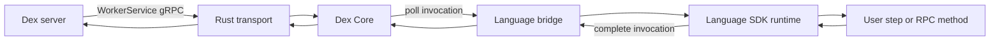
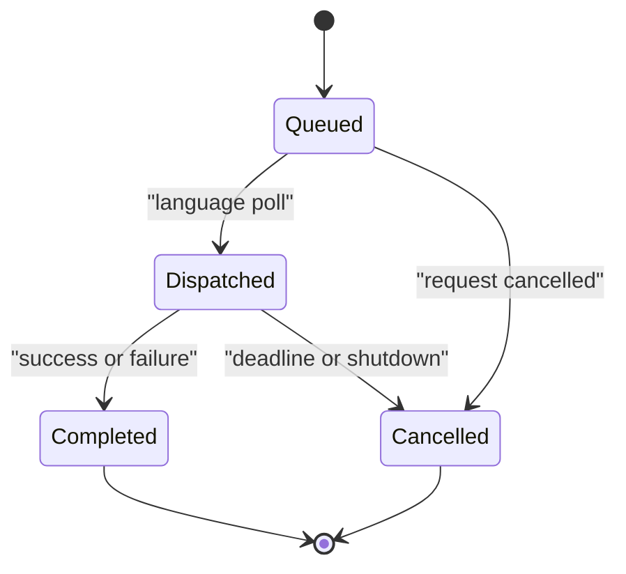

# Multi-language Rust SDK Core

Status: draft.

## Decision

Dex SDKs will share an embedded Rust Core. Core owns worker transport,
invocation lifecycle, backpressure, shutdown, and protocol-level telemetry.
Each language layer owns its public API, type conversion, registry, and user
code execution.

Core will not invoke user functions directly from Rust runtime threads. A
language worker polls Core for an invocation, executes the registered function,
and returns a completion. This follows the activation/completion boundary used
by Temporal SDK Core without adopting Temporal's workflow coroutine model.

Dex step methods are remote worker operations. The server-side interpreter owns
durability and replay, so language SDKs may support both synchronous and
asynchronous step methods.

## Goals

- Share worker correctness across Rust, Java, Python, TypeScript, PHP, C#,
  Ruby, and future SDKs.
- Keep language runtimes and object models outside Core.
- Preserve the canonical `WorkerService` contract in `protos/dex.proto`.
- Apply bounded backpressure before invoking user code.
- Make shutdown, cancellation, deadlines, and error propagation explicit.
- Test Core independently from every language bridge.

## Non-goals

- Core does not define each language's user-facing API.
- Core does not serialize arbitrary language objects.
- Core does not provide a durable coroutine scheduler.
- Core does not expose Rust structs as a stable cross-language ABI.
- The first phase does not replace existing SDKs.

## Architecture



The Rust workspace is split by responsibility:

| Component | Responsibility |
| --- | --- |
| `dex-core` | Invocation lifecycle, bounded queue, completion routing, shutdown |
| `dex-core-protocol` | Generated internal poll/completion protobuf messages |
| `dex-worker-grpc` | `WorkerService` implementation using canonical Dex IDL |
| `dex-sdk` | Native Rust public SDK |
| `dex-bridge-jni` | Java 8-compatible JNI bridge |
| language bridges | PyO3, Node-API, C ABI, or managed-runtime adapters |

Only `dex-core` is implemented in the first phase. The other crates will be
added when their contracts are exercised.

## Two protocol boundaries

### Server protocol

`protos/dex.proto` remains authoritative between the Dex server and a worker.
The Rust gRPC adapter decodes `InvokeWaitForMethod`,
`InvokeExecuteMethod`, and `InvokeWorkerRPC` requests and dispatches their
serialized request payloads to Core.

The adapter maps a language completion back to the matching gRPC response.
Transport errors and user-code failures remain distinct.

### Core protocol

The language boundary uses a small versioned protocol:

```text
Invocation {
  protocol_version
  invocation_id
  kind
  request_bytes
}

Completion {
  protocol_version
  invocation_id
  success_bytes | failure
}
```

Request and response bytes contain canonical protobuf messages. Bridges do not
reconstruct all Dex messages as FFI structs.

The initial protocol version is `1`. A bridge and Core must reject unsupported
versions during worker validation.

## Invocation lifecycle



Core assigns an opaque nonzero invocation ID. The transport waits on a one-shot
completion channel. The language bridge returns only that ID and serialized
completion data.

Completions are accepted once. Unknown, cancelled, or already-completed IDs are
errors. Queue capacity is mandatory and positive.

## Concurrency and threading

Core uses a Tokio runtime for networking and protocol tasks. Language execution
never runs on a Tokio worker thread.

Each language layer selects its execution strategy:

| Language code | Execution |
| --- | --- |
| Python `async def` | Python asyncio event loop |
| Python `def` | Bounded Python thread pool |
| TypeScript | JavaScript event loop or Worker Thread policy |
| Java `CompletionStage` | JVM asynchronous completion |
| Java synchronous method | Bounded `ExecutorService` |
| Rust async | Configured Rust executor |
| Rust sync | Bounded blocking pool |
| C#, Ruby, PHP | Native runtime scheduler or bounded worker pool |

A bridge may poll ahead only up to its configured language concurrency.
Core queue capacity limits accepted work beyond that point.

Python sync methods remain supported. CPU-bound Python code still requires a
process, subinterpreter, or native code that releases the GIL for parallelism.

## Bridge strategy

Rust uses `dex-core` directly.

Java, Python, and TypeScript receive dedicated ergonomic bridges:

- Java: JNI plus `CompletableFuture` polling and completion.
- Python: PyO3 plus a Python asyncio awaitable.
- TypeScript: Node-API plus Promise-based polling.

The Java bridge targets the SDK's current Java 8 baseline. It does not require
Project Panama. JNI entry points exchange owned byte arrays and opaque handles;
Java user methods execute on JVM-managed executors, never Rust Tokio threads.

C#, Ruby, and PHP can initially share a C ABI bridge with:

- opaque runtime and worker handles;
- owned byte buffers;
- asynchronous poll and completion functions;
- explicit allocation and destruction functions; and
- numeric error codes plus serialized error details.

The C ABI must not expose Rust layouts, unwinding, borrowed buffers, or runtime
specific callback objects.

## Sync and async user methods

Registration accepts both synchronous and asynchronous methods. The language
layer determines the method form before invocation.

Async methods execute on the language event loop. They must not perform
blocking I/O.

Sync methods execute in a bounded executor. Timing out the caller does not
safely terminate a running thread, so cancellation is cooperative. A context
API will expose deadlines and cancellation state.

## Cancellation and shutdown

Shutdown has two phases:

1. Stop accepting new transport requests and close Core polling.
2. Wait for in-flight work up to a configured grace period, then cancel it.

Async language work should receive native task cancellation. Sync work receives
a cooperative cancellation signal. Core never injects an exception into an
arbitrary language thread.

The initial `dex-core` scaffold implements immediate shutdown. Graceful
transport draining is added with the gRPC adapter.

## Errors

Core distinguishes:

- configuration and lifecycle errors;
- transport errors;
- bridge protocol errors;
- user-code failures; and
- cancellation or deadline failures.

User failures retain a language type, message, stack trace, and optional
serialized details. A bridge must not stringify every failure into a transport
error.

Rust panics, Java exceptions crossing JNI, Python exceptions crossing PyO3, and
native exceptions crossing the C ABI are caught at their bridge boundary.

## Packaging

Core artifacts are built per supported platform. Language packages bundle the
matching native library.

The target matrix starts with:

- Linux glibc x86-64 and arm64;
- Linux musl x86-64 and arm64;
- macOS x86-64 and arm64; and
- Windows x86-64.

No bridge may depend on a system Rust installation.

Java publishes one API JAR plus platform-native artifacts selected by the build
or extracted by a loader. Unsupported platforms fail during worker startup.

## Observability

Core emits structured metrics and traces for:

- queue wait and execution latency;
- outstanding and queued invocation counts;
- poll and completion failures;
- cancellation and deadline causes; and
- bridge and protocol versions.

Language SDKs add workflow, step, and RPC identifiers after applying their
logging and data-handling policies.

## Implementation phases

1. Build and test the language-neutral invocation engine.
2. Generate the internal Core protocol crate.
3. Implement `WorkerService` with tonic.
4. Add the native Rust SDK layer.
5. Add the Java 8 JNI bridge and JVM execution adapter.
6. Replace the Python HTTP worker with PyO3 and asyncio/thread-pool dispatch.
7. Add Node-API and the shared C ABI bridge.
8. Add packaging, compatibility, and cross-language conformance suites.

## Tests

- Integration: dispatch, poll, and complete a successful invocation.
- Integration: preserve structured user failures through completion routing.
- Integration: reject duplicate and unknown completions.
- Integration: wake blocked pollers and requests during shutdown.
- Integration: prove queue capacity applies backpressure before dispatch.
- E2E: run each bridge against the same `WorkerService` conformance suite.
- E2E: exercise sync and async user methods, cancellation, and worker shutdown.
- E2E: verify Java 8 JNI loading, `CompletableFuture`, and `ExecutorService`.

## Documentation

- Maintain `sdk-rust/README.md` as the workspace and bridge entry point.
- Update `protos/README.md` when the tonic adapter is added.
- Update each language SDK README when it migrates to Core.
- Add contributor build and release instructions before publishing artifacts.

## UI/UX

N/A: no in-repo web UI.
