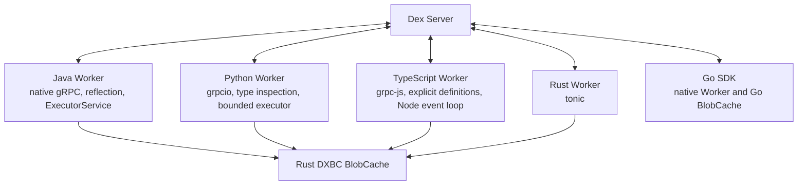

# Multi-language SDK Runtime Architecture

Status: accepted.

## Decision

Java, Python, TypeScript, and future language SDKs implement their Worker,
Registry, user callback dispatch, and client transport in the host language.
They do not route every Worker invocation through Rust.

Rust provides the shared blob cache and the native Rust SDK runtime. The Go SDK
continues to use its existing Go blob cache and does not link Rust.

Cross-language behavior is standardized through the Dex protocol, shared
fixtures, integration tests, and blob-cache conformance tests rather than a
shared callback runtime.

In short:

> Share the complex storage component whose behavior can drift. Keep the
> callback execution layer native to the language runtime that owns the code.

## Context

Dex and Temporal place different responsibilities in their SDK cores. Temporal
Core owns substantial workflow-machine behavior that is valuable to share
across language SDKs. Dex keeps workflow orchestration, state machines, and
persistence in Dex Server. A Dex Worker primarily:

1. receives a WorkerService request;
2. resolves a registered Flow, Step, or RPC;
3. decodes the request into language values;
4. invokes application code; and
5. encodes the result or failure.

Putting this path behind Rust would add a transport and FFI round trip:

```text
gRPC -> Rust -> FFI -> host-language callback -> FFI -> Rust -> gRPC
```

The shared worker logic is not currently complex enough to justify JNI,
PyO3, and Node-API callback runtimes. Such runtimes add native packaging,
thread attachment, class-loader or interpreter lifetime, exception mapping,
debugging, and native-crash concerns.

Blob caching has the opposite profile. Its public API is small, while its
implementation contains substantial filesystem, concurrency, recovery,
integrity, and eviction behavior. It is therefore a good native boundary.

## Goals

- Keep Flow, Step, RPC, Attribute, Channel, Wait, and Decision APIs strongly
  typed and idiomatic in each language.
- Keep user callbacks on the host language's normal runtime and debugging path.
- Maintain one non-Go implementation of the DXBC blob cache.
- Preserve Go and Rust blob-cache disk-format compatibility.
- Support Java, Python, TypeScript, Rust, C#, Ruby, and PHP without requiring
  all SDKs to adopt one callback runtime.
- Verify equivalent behavior through common integration and conformance tests.

## Non-goals

- Reusing one Worker implementation at any cost is not a goal.
- Rust does not serialize arbitrary host-language objects.
- Rust does not reflect over Java, Python, or TypeScript definitions.
- Rust does not invoke Java, Python, or JavaScript application handlers.
- Go does not depend on the Rust library.
- Identical public syntax across languages is not required.

## Architecture



Every SDK owns its public contracts and Worker transport. Non-Go SDKs may use a
thin native binding to the shared cache. Client and Worker construction depend
on a language-level `BlobCache` interface so tests and specialized deployments
can supply another implementation.

## Rust workspace boundaries

### `dex-core`

`dex-core` contains code that is independent of a language runtime and network
transport. Its primary shared responsibility is the blob cache:

- DXBC disk format;
- CRC32C validation;
- admission and eviction policy;
- startup scan and reconciliation;
- corrupt-file handling;
- interrupted-write recovery;
- cleanup retry backlog;
- concurrency and lifecycle; and
- typed, transport-neutral errors.

It must not depend on tonic, JNI, PyO3, Node-API, or host-language callback
interfaces. A queue or registry model belongs here only if it has a real
transport-neutral consumer. Code used solely by the Rust gRPC Worker belongs in
the Rust Worker runtime instead.

The cache may be split into a dedicated `dex-blob-cache` crate when that makes
the dependency boundary clearer. `dex-core` must not become a miscellaneous
collection of code merely because several SDKs exist.

### Rust Worker runtime

The Rust SDK needs its own runtime for:

- tonic/prost WorkerService transport;
- Rust Registry assembly;
- Rust handler dispatch;
- cancellation and shutdown; and
- Rust client transport.

If the current `dex-runtime` crate primarily implements tonic WorkerService,
rename it to a responsibility-oriented name such as `dex-worker-grpc` or
`dex-worker-runtime`. It is a Rust SDK component, not a mandatory runtime for
other languages.

### Native cache bindings

The preferred package structure is:

```text
dex-blob-cache          pure Rust cache implementation
dex-blob-cache-cabi     stable minimal C ABI
dex-blob-cache-jni      Java binding
dex-blob-cache-python   PyO3 binding
dex-blob-cache-node     Node-API binding
```

The exact crate count may be reduced initially, but the dependency direction
must remain the same. Binding layers perform only:

- argument validation and conversion;
- owned byte-buffer conversion;
- error mapping; and
- opaque-handle lifecycle management.

They do not contain Registry, Worker invocation, or application callback
logic. C# can use the C ABI through P/Invoke. Ruby and PHP can use the C ABI or
small native extensions.

## Language runtimes

### Java

Java implements WorkerService with the Java gRPC stack. Registry assembly uses
Java reflection over `Flow`, `Step`, and `@RPC`. Synchronous handlers execute on
a bounded `ExecutorService`. Java exceptions are converted directly into Dex
Worker failures while their Java type, message, and stack remain available for
diagnostics.

This keeps class loading, thread context, reflection, Jackson configuration,
and RPCStub typing inside the JVM. JNI is used only for BlobCache operations.

### Python

Python implements WorkerService with `grpcio`. Registry assembly uses Python
classes, decorators, and type annotations. The public handler contract may be
synchronous. Synchronous application handlers run in a bounded Python executor
so a handler does not block gRPC progress.

The transport implementation may internally use asynchronous I/O without
requiring application handlers to be `async def`. PyO3 is used only for the
BlobCache binding.

### TypeScript

TypeScript implements WorkerService with `@grpc/grpc-js`. Client network APIs
return `Promise` because Node network I/O is asynchronous. Handler contracts
may remain synchronous if that is the selected SDK contract.

FlowType and StepType are explicit. Registry must not use `constructor.name`,
including in development, because bundlers and minifiers can change it. N-API
is used only for the BlobCache binding.

### C#, Ruby, and PHP

C# should use its native gRPC and reflection facilities, with P/Invoke for the
cache. Ruby should start with a native-language Worker and a thin cache binding.

PHP should also start with a native Worker where its deployment model supports
a long-lived process. A Rust sidecar can be evaluated later if PHP concurrency
or process-lifetime constraints prove it necessary. That possible optimization
does not define the architecture for other SDKs.

## Blob cache contract

Rust continues to provide a Go-compatible DXBC version 1 blob cache. The shared
contract covers immutable blob IDs, CRC32C, admission, eviction, recovery,
cleanup retry, and owned buffers.

The Go and Rust implementations share these observable behaviors:

- a miss, oversized value, or policy rejection is not an application failure;
- capacity counts the header, blob ID, and payload;
- reads may proceed concurrently while mutations and lifecycle changes are
  serialized;
- `put` reports whether the value was retained, including identical reuse;
- `delete_all` leaves the open cache empty and reusable;
- `close` preserves committed files for the next process;
- startup removes interrupted writes and corruption, then reconciles the
  configured budget; and
- one directory is exclusively owned by one cache process.

Files use DXBC version 1:

```text
magic[4] = "DXBC"
version uint8 = 1
reserved uint24 = 0
blob_id_length uint32 little-endian
payload_length uint64 little-endian
crc32c uint32 little-endian
blob_id bytes
payload bytes
```

CRC32C covers the blob ID and payload. Rust uses a hardware-accelerated CRC32C
library where the platform supports it. Cache paths are derived from the SHA-256
of the blob ID. Writes use a temporary file and atomic rename. Invalid versions,
lengths, reserved bytes, path hashes, and checksums are recoverable corruption.

The cache is non-authoritative. Losing the most recent cache entry during power
failure is observed as a miss, not data loss. Any stronger directory-fsync
guarantee must be introduced in Go and Rust as an explicit shared contract.

Eviction-policy internals may be timing-dependent. Exact victim selection is
not a portable contract unless a conformance test explicitly requires it.

## Packaging

Sharing Rust BlobCache requires native artifacts for supported combinations,
including:

- Linux glibc and, if supported, musl on x86-64 and arm64;
- macOS on x86-64 and arm64;
- Windows on x86-64 and, when supported, arm64;
- JVM, Python, and Node package conventions.

Published SDK packages must not require users to install Rust or protoc.
Native loading failures return explicit configuration errors and must not
silently select behavior with a different disk contract.

The native packaging cost is why the boundary remains small. It does not
justify routing Worker callbacks through Rust.

## Protocol and behavioral consistency

Language SDK consistency comes from:

- one canonical Dex protocol;
- checked-in protocol fixtures;
- equivalent Registry validation rules;
- shared integration scenario mappings;
- SDK-specific compile and type-check contracts; and
- cross-language end-to-end tests.

Each language SDK implements the applicable `sdk-go` integration scenarios.
Java, Python, and TypeScript also port the relevant legacy IWF Java integration
scenarios using their new APIs. Tests should preserve scenario behavior without
retaining obsolete API shapes.

## Tests

Worker integration suites must cover:

- starting and completing a Flow;
- Steps with and without wait methods;
- timers and channel combinations;
- typed Step transitions;
- persistence reads, writes, maps, and execution-local values;
- typed RPC functions and procedures;
- RPC attribute and attribute-map locking;
- retry, timeout, failure, recovery, cancellation, and shutdown; and
- cross-language clients and workers using explicit durable names.

Blob-cache conformance must cover:

- Go writes followed by Rust and bound-language reads;
- Rust writes followed by Go reads;
- CRC mismatch and truncated files;
- invalid headers, versions, lengths, and path hashes;
- interrupted writes and orphan temporary-file recovery;
- admission, eviction, and capacity reconciliation;
- failed-delete cleanup retry;
- concurrent get, put, delete, and close behavior; and
- committed-file reuse across process restarts.

Language SDK type checks must prove that Flow start inputs, Step movements,
attributes, channels, and RPC inputs and outputs retain their host-language
types.

## Implementation direction

1. Keep the Go SDK and Go BlobCache independent.
2. Extract a narrow, language-neutral Rust BlobCache API.
3. Separate Rust Worker transport from the shared cache crate.
4. Remove Java, Python, and TypeScript dependencies on a Rust invocation queue
   or callback runtime.
5. Implement native WorkerService, Registry, and dispatch in each language.
6. Add thin Java, Python, and Node cache bindings.
7. Establish shared Worker fixtures and Go/Rust cache conformance fixtures.
8. Complete each SDK's integration suite against Dex Server.

## Consequences

This design intentionally accepts some duplicated Worker plumbing. That code is
small, idiomatic, easier to debug, and naturally integrated with each language's
reflection, typing, threading, exception, and packaging model.

It avoids duplicating the storage component most likely to diverge in subtle
ways. Rust provides one implementation for non-Go SDKs, while conformance tests
keep its independently maintained Go counterpart compatible.

The architecture can be revisited if substantial language-neutral workflow
machine behavior later moves into the SDK. The current Dex Server architecture
does not justify that complexity.

## Documentation

- Keep this document as the runtime ownership and Rust-boundary source of truth.
- Keep `sdk-rust/README.md` aligned with crate responsibilities.
- Document threading, callback execution, and native cache packaging in each
  language SDK README.
- Document the integration scenario matrix alongside the shared fixtures.

## UI/UX

N/A: no in-repo web UI.
