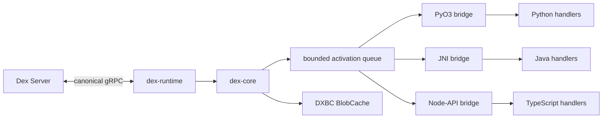

# Multi-language Rust SDK Core

Status: user-contract phase implementation.

## Decision

Python, Java, TypeScript, and later language SDKs share an embedded Rust Core.
Core owns Registry validation, WorkerService and FlowService transport,
invocation state, context buffering, value hydration, errors, lifecycle, and
the disk blob cache. Language packages own their idiomatic public API, runtime
type tokens and codecs, and execution of user functions.

The Go SDK remains independent and is the behavioral reference. Non-Go SDKs
must implement the Go integration suite and the legacy Java IWF integration
suite using their new APIs.

The current phase implements only application-facing contracts and pure value
codecs. It does not connect gRPC, FFI, Registry runtime assembly, or user-code
execution. This follows the staged Go SDK rewrite: later runtime work must fit
the published contracts instead of redesigning them.

## Goals

- Preserve the same Flow, Step, Attribute, Channel, Wait, Decision, and RPC
  semantics in every language.
- Make normal application APIs strongly typed without exposing protobufs.
- Share worker and client correctness in Rust instead of reimplementing it in
  every language.
- Support Python 3.11+, Java 8+, and Node 22/24 first.
- Keep Java Client and Worker APIs synchronous.
- Keep Python Client, Worker, Step, and RPC APIs synchronous.
- Share the existing Rust DXBC blob cache across non-Go SDKs.
- Keep future C#, Ruby, PHP, and C ABI bridges possible without changing Core.

## Non-goals

- The current phase does not perform network calls or invoke user code.
- Core does not serialize arbitrary language objects.
- Core does not call Python, Java, or JavaScript from Tokio threads.
- This phase does not publish a native Rust SDK.
- The rewrite does not preserve obsolete SDK APIs or configuration fields.

## Public type model

Each language exposes equivalent typed concepts with idiomatic names:

```text
Flow<START_INPUT>          Java, Python, and TypeScript
Step<INPUT>                Java, Python, and TypeScript
typed RPC method           annotated or decorated method
Attribute<T> / AttributeMap<T>
Channel<T> / ChannelMap<T>
Codec<T> / TypeToken<T>
BlobCache / BlobCacheConfig
WorkerTarget / ClientOptions / WorkerOptions
```

Normal Client and handler APIs do not accept a durable name plus an untyped
object. Type relationships are carried by definitions:

```text
startFlow(Flow<I>, flowId, I input)
invokeRPC(typed method, flowId, I input) -> O
goTo(Step<I>, I input)
attribute.set(Context, T)
channel.publish(Context, T)
```

Definitions use a derived durable name by default and allow an explicit
override. Cross-language applications must use explicit matching names.

The language Registry validates handler signatures and TypeToken/Codec pairs.
Core later validates durable names, references, options, and encoded wire kinds
from a serialized RegistrySpec. Registry construction is atomic and immutable.

### Values and codecs

Built-in codecs map to canonical Dex Value arms:

| Logical value | Wire representation |
| --- | --- |
| UTF-8 string | `string_value` |
| boolean | `bool_value` |
| signed 64-bit integer | `int_value` |
| finite floating point | `double_value` |
| bytes | `obj_value`, `rawbytes` |
| structured value | `obj_value`, `json` |
| application null | JSON `null` |

The protobuf null arm remains reserved for attribute deletion. Custom
`Codec<T>` implementations must map to a canonical Value and cannot introduce
an opaque language-only wire format.

Python integers are range-checked as int64. Java `long` maps to int64.
TypeScript `bigint` maps to int64 and `number` maps to double, avoiding silent
loss of 64-bit precision.

Python dataclasses, Java Jackson `JavaType`, and TypeScript runtime decoders
provide structured JSON codecs. Erased or parameterized types require an
explicit TypeToken or codec.

## Language contracts

### Python

Python authors implement generic `Flow[I]` and `Step[I]` interfaces. RPC remains
a metadata-only method decorator, preserving the original callable and its
typing. Registry derives built-in and dataclass codecs from method annotations;
only unsupported types and custom encodings require `CodecRegistry`
registration. Handler methods use synchronous `def` signatures. PEP 561
metadata, mypy, and pyright verify the public types.

`Flow.get_steps()` returns `StepDef.start_step(step)` and
`StepDef.non_start_step(step)` wrappers. There is no separate start-Step getter.

Factories are owned by the domain noun they create, so waits read naturally:

```python
Wait.all_of(Timer.by_duration(duration))
```

Handlers later run in a bounded Python executor. User code is never invoked on
a Tokio worker thread.

### Java

Java targets Java 8 and exposes synchronous Client and Worker APIs. Handlers
run on a bounded JVM ExecutorService. The public API does not expose
CompletionStage.

Java authors implement `Flow<I>` and `Step<I>` interfaces directly. `I` keeps
the starting-step input and every step transition type checked. A Flow instance
also owns its annotated RPC methods; there is no untyped RPC-handler field.
`Flow.getSteps()` returns non-generic `StepDef` wrappers, using
`StepDef.startStep(step)` at most once and `StepDef.nonStartStep(step)` for the
remaining Steps. There is no separate start-Step getter.

Java preserves the legacy strongly typed RPCStub call shape:

```java
OrderFlow rpcStub = client.newRpcStub(OrderFlow.class, flowId, runId);
GetOrderOutput output = client.invokeRPC(rpcStub::getOrder, input);
String flowOutput = client.waitForFlow(flowId, String.class);
```

`waitForFlow` resolves the output class using `ClientOptions.objectMapper`.

Worker RPC methods use `@RPC`:

```java
@RPC(
    name = "GetOrder",
    timeoutSeconds = 10,
    lockAttributes = {"status"}
)
public RPCResult<GetOrderOutput> getOrder(
        Context context,
        GetOrderInput input) {
    return RPCResult.of(new GetOrderOutput());
}
```

Annotation elements may use annotation types and arrays of annotation types.
Attribute-map locks therefore use nested annotations:

```java
@RPC(lockAttributeMaps = {
    @RPCAttributeMapLock(attribute = "items", instance = "order-1")
})
```

All `@RPC` elements have defaults. Reflection returns those values, including
non-null empty arrays, whenever the method has `@RPC`.

Registry reads the annotation once and validates its durable name, timeout,
attribute locks, and signature. RPCStub invocation reuses that metadata;
`invokeRPC` does not accept per-call InvokeOptions. Request IDs remain internal.

Each `Step<I>` returns its concrete `Class<I>` through `getInputType()`. Step
inputs do not support parameterized types. `ClientOptions` and `WorkerOptions`
provide default Jackson `ObjectMapper` instances and accept configured mappers.
Steps, attributes, attribute maps, channels, channel maps, execution locals,
and events declare `Class<T>`. Java exposes no public Codec abstraction.

Nested factories form a readable phrase at the call site:

```java
Wait.allOf(Timer.byDuration(duration))
```

The new annotation retains only current server semantics:

- optional durable name override;
- non-negative timeout seconds;
- registered attribute locks; and
- registered attribute-map locks with static instances.

Legacy partial loading, separate data/search attribute loading, and memo-cache
bypass fields are removed. BlobCache is an immutable payload cache, not the old
memo consistency mechanism. Read-modify-write consistency uses attribute locks.

Java retains typed function/procedure method-reference shapes for zero or one
input. No registered Client API accepts a raw RPC string and Object input.

### TypeScript

TypeScript authors implement generic `Flow<I>` and `Step<I>` interfaces. A
typed method decorator adds RPC metadata without replacing the method. Client
network methods return Promise because Node I/O cannot be synchronously blocked
safely. Handlers are synchronous and execute on the Node event loop.

`Flow.getSteps()` returns `StepDef.startStep(step)` and
`StepDef.nonStartStep(step)` wrappers. Its discriminated StepDef type retains
the starting input type while erasing heterogeneous non-starting Step inputs.

TypeScript requires explicit `getFlowType()` and `getStepType()` methods.
Registry never derives durable names from `constructor.name`.

Its equivalent fluent wait expression is:

```typescript
Wait.allOf(Timer.byDuration(durationMs))
```

JSON codecs require a runtime decoder; generic casts without validation are not
provided for values returned by Core.

## Future Core architecture



The Rust workspace will contain:

| Component | Responsibility |
| --- | --- |
| `dex-protocol` | Checked-in generated server and private bridge protobufs |
| `dex-core` | Registry, values, invocation sessions, errors, and BlobCache |
| `dex-runtime` | Tokio, tonic WorkerService, and FlowService client |
| `dex-bridge-python` | PyO3 and Python dispatch adapter |
| `dex-bridge-jni` | Java 8 JNI bridge |
| `dex-bridge-node` | napi-rs Node-API bridge |

Published packages do not require a system Rust or protoc installation.

## Activation boundary

Core never directly invokes a language callback. Worker transport validates and
hydrates a request, creates an invocation session, and places a versioned
activation on a bounded queue. A language dispatcher polls, executes the typed
handler, and completes the activation once.

Context operations use invocation commands against Core-owned state. Core
implements read-your-writes and deterministic response buffers for attributes,
channels, step locals, events, waits, decisions, and RPC movements.

The private protocol starts at version 1. Runtime creation performs an exact
version handshake, and every activation and completion carries the version.
Unknown, duplicate, late, cancelled, or already-completed IDs fail explicitly.

Bridge functions expose opaque handles, owned bytes, and structured errors.
They do not expose Rust layouts, borrowed buffers, or unwinding.

## Blob cache

Rust Core continues to provide the Go-compatible DXBC version 1 blob cache.
Go does not link it. The shared contract includes immutable IDs, CRC32C,
TinyLFU/SampledLFU admission, recovery, cleanup backlog, and owned buffers.

The Rust and Go implementations share these observable behaviors:

- a miss, oversized value, or policy rejection is not an application failure;
- capacity counts the 24-byte header, blob ID, and payload;
- reads may proceed concurrently while mutations and lifecycle changes are
  serialized;
- `put` returns whether the value was retained, including identical reuse;
- `delete_all` leaves the open cache empty and reusable;
- `close` preserves committed files for the next process;
- startup removes interrupted writes and corruption, then reconciles the
  configured budget newest-first; and
- one directory is exclusively owned by one cache process.

Files use DXBC version 1:

```text
magic[4] = "DXBC"
version uint8 = 1
reserved uint24 = 0
blob_id_length uint32 little-endian
payload_length uint64 little-endian
crc32c uint32 little-endian
blob_id bytes
payload bytes
```

CRC32C covers the blob ID and payload. Rust uses the `crc32c` crate so supported
x86-64 and ARM targets use hardware instructions. Cache paths are
`blobs/ab/cd/<sha256(blob-id)>.blob`; a file is synchronized and atomically
renamed into place. Unknown versions, invalid lengths, nonzero reserved bytes,
path-hash mismatches, and checksum failures are recoverable corruption.

Stretto 0.9 stores metadata only and supplies TinyLFU admission plus SampledLFU
eviction. It matches the Ristretto policy family used by Go, but exact admission
and victim choices are timing-dependent and are not a portable contract.

Go panics if an admitted policy entry remains pending after synchronization.
Rust intentionally returns a reconciliation error to avoid unwinding into a
host language. This unreachable invariant is the sole intentional behavioral
deviation.

Cache filesystem work runs on a blocking pool when called from an event-loop
bridge. The cache is non-authoritative: a missing directory entry after power
loss is a cache miss. Parent-directory fsync is not promised unless both Go and
Rust add an explicit durability policy.

## Threading, cancellation, and shutdown

Core uses Tokio for transport and protocol work, never for application
callbacks. A bridge may poll ahead only up to its configured language
concurrency, and the Core activation queue provides bounded backpressure.

| Language code | Execution |
| --- | --- |
| Python synchronous handler | bounded Python executor |
| Java synchronous handler | bounded `ExecutorService` |
| TypeScript handler | JavaScript event loop |
| C#, Ruby, PHP | runtime scheduler or bounded executor |

Shutdown first stops transport admission and polling, then waits for in-flight
work up to a grace period. Async tasks receive native cancellation. Synchronous
threads receive a cooperative cancellation signal; Core never injects an
exception into an arbitrary language thread.

## Errors and packaging

Core distinguishes configuration, lifecycle, transport, protocol, user-code,
cancellation, and deadline failures. User failures retain language type,
message, stack trace, and optional structured details. Every bridge catches
panic or exception escape at its native boundary.

Language packages bundle platform-specific Core artifacts. The initial matrix
is Linux glibc and musl on x86-64/arm64, macOS on x86-64/arm64, and Windows
x86-64. No published package requires a system Rust or protoc installation.

Core metrics cover queue wait, execution latency, outstanding work, poll and
completion failures, cancellation causes, and protocol versions. Language
layers add Flow, Step, and RPC identifiers under their logging policies.

## Implementation phases

1. Implement the Python, Java, and TypeScript public contracts, codecs, and
   compile/type tests without transport.
2. Add `dex-protocol`, RegistrySpec, canonical Values, and the Core invocation
   session model.
3. Add tonic WorkerService, FlowService Client, hydration, lifecycle, and
   graceful shutdown.
4. Prove minimal PyO3, JNI, and Node-API E2E paths.
5. Complete Python, then Java, then TypeScript runtime integrations.
6. Run full per-language conformance and cross-language E2E suites.
7. Add packaging and the future stable C ABI.

## Tests

The user-contract phase uses tests reachable without transport:

- Python pytest contract tests plus strict mypy and pyright fixtures.
- Java 8 compilation and contract tests for generics, annotations, RPCStub,
  definitions, waits, decisions, attributes, and channels.
- TypeScript `tsc --strict`, runtime contract tests, and negative type fixtures.
- BlobCache config and synchronous typed operation contracts in every language.
- Codec round trips, overflow, malformed values, null/delete distinction, and
  unsupported wire kinds in every language.

Runtime phases add a checked-in `sdk-conformance` manifest. Every non-Go SDK
must implement every scenario in `sdk-go/integ` and every behavioral scenario
in the legacy Java IWF integration tests. Terminology migrates to the new model;
obsolete APIs are not restored. A missing legacy equivalent requires explicit
approval and cannot be silently skipped.

Cross-language E2E includes Java RPCStub to Python workers, Python clients to
Java workers, TypeScript clients to Java RPCs, canonical JSON/int64/bytes, blob
hydration, explicit durable names, failures, cancellation, and shutdown.

## Documentation

- Keep this document as the architecture and phased delivery source of truth.
- Keep `sdk-rust/README.md` aligned with workspace and bridge responsibilities.
- Document public contracts and threading in each language SDK README.
- Add `sdk-conformance/README.md` with Go and legacy Java test mappings before
  runtime feature-complete status.

## UI/UX

N/A: no in-repo web UI.
