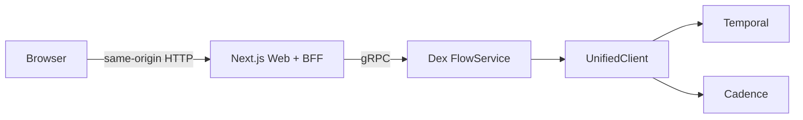
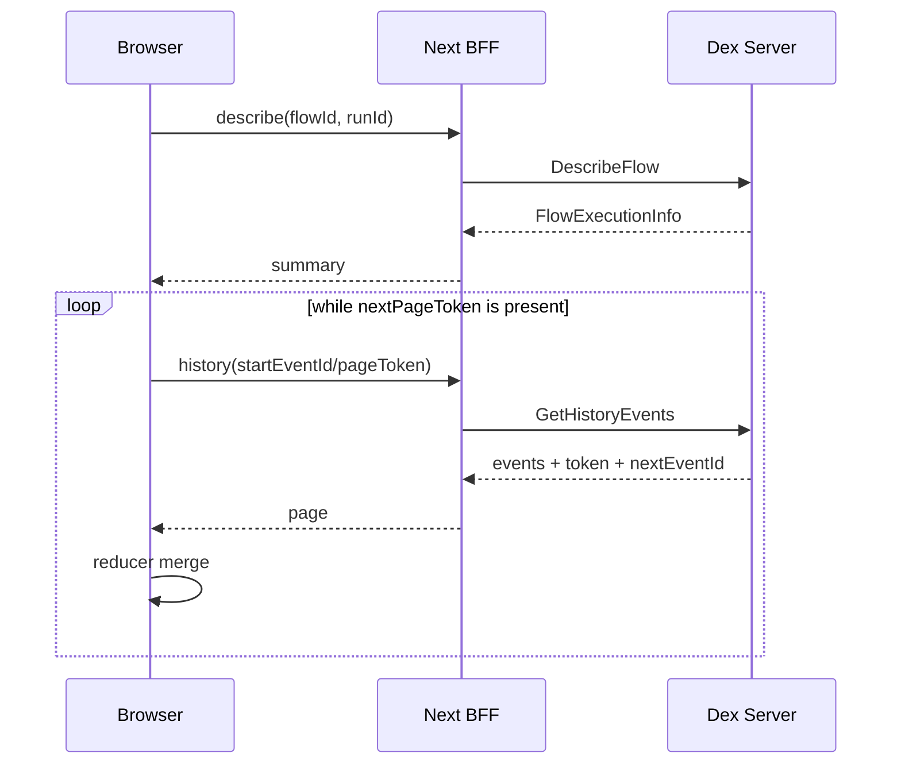
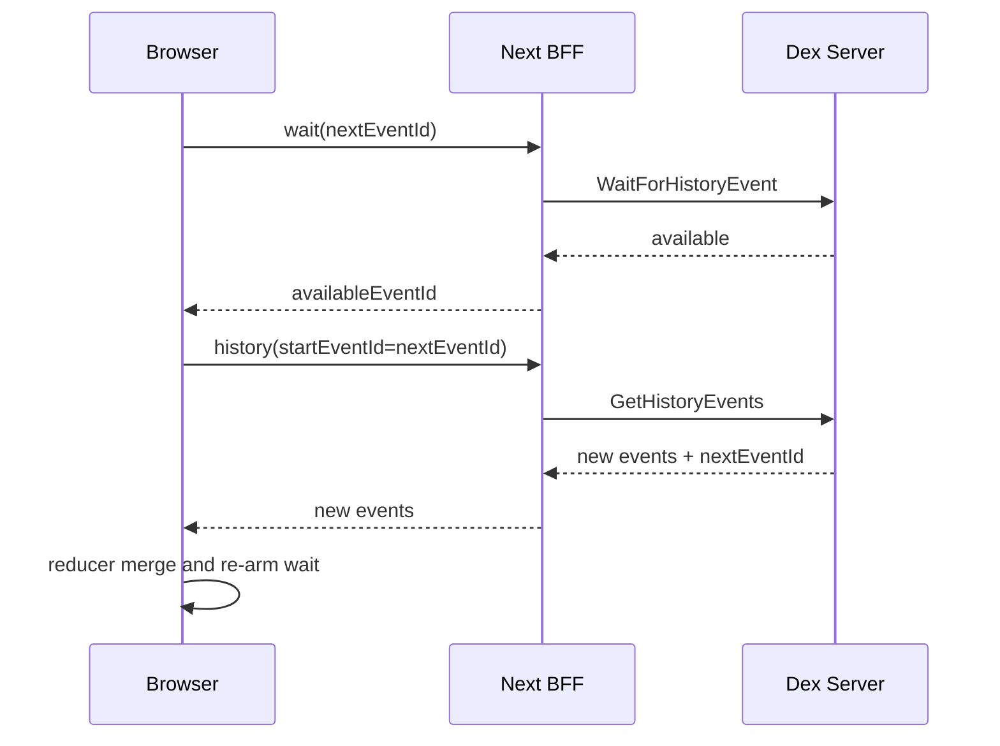

# Dex Web 设计

状态：Draft，待评审  
日期：2026-07-28

## 1. 背景与参考基线

本设计基于以下三份事实源：

1. 本地 `/Users/qlong/sd/dex-base/web`。
2. [`durableworkflow/iwf-web`](https://github.com/durableworkflow/iwf-web/tree/2b0008ec916a87b13d4df71a99ef97ebcfc746dc)。
3. 当前仓库的 [`protos/dex.proto`](../../../protos/dex.proto) 和 Temporal/Cadence unified client。

两个参考 Web 的数据源不同：

- `dex-base/web` 读取自有 run/history 模型，擅长展示实时 step、retry、waiting condition、channel 和 step graph。
- `iwf-web` 直接读取 Temporal visibility/history，擅长高级搜索、可配置列表、完整 history timeline、event graph、配置和 continue-as-new 信息。
- 当前 Dex 以 Temporal/Cadence workflow history 为持久事实源，不能直接复用 `dex-base` 的 run event schema。

因此，本设计采用“服务端规范化 engine history，前端增量归并为 Dex 语义视图”的方式，不让浏览器理解 Temporal/Cadence 的不同 wire model。

## 2. 目标

- 新增仓库内 `web/`，功能和页面内容覆盖 `dex-base/web` 与 `iwf-web` 的功能并集。
- Temporal 和 Cadence 使用同一套 Web 页面、URL 和前端数据模型。
- 同时支持 `STEP_DURABILITY_SYNC` 和 `STEP_DURABILITY_ASYNC`，不能假设两种模式具有相同的 engine history。
- 浏览器只访问同源 Next.js BFF，不直接持有 Temporal/Cadence 或 Dex gRPC 凭证。
- 增加以下 Dex service API：
  - `WaitForHistoryEvent(flowID, runID, nextEventId)`
  - `GetHistoryEvents(flowID, runID, startEventId, pageSize, nextPageToken)`
  - `DescribeFlow(flowID)`，并返回 run ID 与 workflow engine 可提供的元数据。
- 扩充 `SearchFlows` 返回值，使列表页不产生逐行 `DescribeFlow` 的 N+1 请求。
- 运行中 flow 使用 long poll 增量更新；终态 flow 停止 long poll。
- 搜索条件、分页、视图模式和当前 flow/run 都可通过 URL 分享。
- 对大 history 使用服务端分页、前端增量 reducer 和列表虚拟化。

## 3. 非目标

- 不替代 Temporal Web 或 Cadence Web 的通用 cluster 管理功能。
- 首版不提供 namespace、task queue、worker deployment、schedule 的管理操作。
- 首版不提供任意 payload 编辑。
- 首版不实现用户系统或 RBAC；生产部署依赖反向代理或平台认证。
- 首版不增加数据库。查询、历史和元数据均来自 Dex server 及 workflow engine。

## 4. 关键设计决策

### 4.1 Web 只连接 Dex server

`iwf-web` 的 Next.js server 直接连接 Temporal。Dex Web 改为只连接 Dex gRPC：

- Temporal/Cadence 差异集中在 `server/service/client/{temporal,cadence}`。
- Web 无需配置 engine API key、domain 或 namespace credential。
- 历史解码复用 Dex server 已有 binary protobuf DataConverter。
- API error 继续使用 `ErrorResponse`、gRPC code 和 `ErrorSubStatus`。

### 4.2 规范化 history event，而不是透传 engine event

Temporal protobuf event 和 Cadence Thrift event 不应进入公开的 `dex.proto`。服务端把两类 history 映射成原子、后端无关的 `FlowHistoryEvent`。

一个 engine event 映射成零个或一个 `FlowHistoryEvent`。前端按 `event_id` 增量归并，把 scheduled/started/attempt-failed/completed 等原子事件聚合为：

- flow timeline；
- step lifecycle；
- retry 和失败后继续执行状态；
- step graph；
- event graph；
- 当前 waiting condition；
- history 可推导的 channel backlog。

原子事件不会在后续请求中被修改，因而分页边界和实时追加都是稳定的。

### 4.3 搜索结果直接携带列表元数据

当前 `SearchFlowsResponseEntry` 只有 `flow_id` 和 `run_id`，无法覆盖参考页面的列表内容。逐行调用 `DescribeFlow` 会造成 N+1 请求。

`SearchFlows` 应直接映射 `ListWorkflowExecutions` 的 execution info，返回 ID、类型、状态、时间、history 大小、task queue 和 search attributes。

### 4.4 run URL 必须 canonical

`DescribeFlow(flow_id)` 在 `run_id` 省略时解析当前/最新 run，并返回实际 run ID。页面随后跳转到包含 run ID 的 canonical URL，避免 continue-as-new 或 ID reuse 令同一 URL 指向不同 execution。

建议把 `run_id` 设计为 `DescribeFlowRequest` 的可选字段：

- 空：满足用户给出的 `DescribeFlow(flowID)` 语义，解析当前/最新 run。
- 非空：描述历史 run，支持分享链接和 continue-as-new chain 导航。

### 4.5 “Fork to here” 使用现有 `ResetFlow`

当前 `ResetFlow` 已支持按 history event ID reset。Web 中沿用 `dex-base` 的 “Fork to here” 交互，但 UI 文案使用更准确的 “Reset from here”：

- 必填 reason；
- 可配置 channel message 和 locking RPC reapply；
- 成功后跳转到 `ResetFlowResponse.run_id`；
- 默认只读部署可隐藏所有 mutation。

### 4.6 namespace/domain 通过 allowlisted profile 切换

当前 Dex server 是 namespace/domain scoped，公开 API 不接收任意 namespace。为了保留 `dex-base` 的 namespace 切换能力，同时避免 BFF SSRF，Web 使用部署时配置的 connection profiles：

```text
DEX_WEB_PROFILES=[
  {id: "dev-temporal", dexAddress: "...", engineWebUrl: "..."},
  {id: "prod-cadence", dexAddress: "...", engineWebUrl: "..."}
]
```

浏览器只能提交 profile ID。BFF 从 allowlist 解析 Dex address，不能接受任意 host:port。profile、namespace/domain 和 backend 显示在 Header，profile ID 写入可分享 URL。

## 5. 总体架构



职责划分：

| 层 | 职责 |
|---|---|
| Browser | URL state、搜索交互、history reducer、timeline/graph 渲染、偏好持久化 |
| Next.js BFF | HTTP 参数校验、gRPC 调用、gRPC-to-HTTP error mapping、long-poll 生命周期 |
| FlowService | API 校验、page token、错误语义、API wait 上限 |
| UnifiedClient | Temporal/Cadence describe/list/history/long-poll 的统一接口 |
| Backend mapper | engine event 解码为 `FlowHistoryEvent` |

## 6. 建议目录

```text
web/
  app/
    api/
      config/route.ts
      flows/search/route.ts
      flows/describe/route.ts
      flows/history/route.ts
      flows/history/wait/route.ts
      flows/attributes/route.ts
      flows/reset/route.ts
    flows/
      page.tsx
      [flowId]/
        page.tsx
        runs/[runId]/page.tsx
    components/
    lib/
      grpc/
      history/
      preferences/
  e2e/
  public/
  package.json
  playwright.config.ts
  README.md
```

技术选择：

- Next.js App Router、React、TypeScript。
- Tailwind CSS。
- `@xyflow/react` + Dagre。
- `@grpc/grpc-js` + `@grpc/proto-loader`，BFF 在 Node runtime 动态加载 `protos/dex.proto`。
- Playwright E2E。

动态加载可避免首版扩大多语言 codegen pipeline。前端只使用 BFF 定义的 JSON DTO，gRPC wire type 不进入 client bundle。

## 7. 路由与 URL 状态

### 7.1 搜索页

```text
/flows?profile=dev-temporal&query=...&pageSize=50&timezone=America%2FLos_Angeles
```

`nextPageToken` 不写入可分享 URL。浏览器用 token stack 支持 First/Previous/Next；刷新后重新执行当前 query 的第一页。

### 7.2 flow 解析页

```text
/flows/{flowId}?profile=dev-temporal
```

调用 `DescribeFlow(flow_id)`，然后替换为 canonical URL：

```text
/flows/{flowId}/runs/{runId}?profile=dev-temporal
```

### 7.3 run 详情页

```text
/flows/{flowId}/runs/{runId}?profile=dev-temporal&view=graph&graph=steps&timezone=...
```

URL 参数：

- `view=graph|timeline`，默认 `graph`。
- `graph=steps|events`，默认 `steps`。
- `profile=<allowlisted profile ID>`。
- `timezone=<IANA timezone>`。
- `event=<eventId>` 或 `step=<stepExecutionId>`，用于分享已打开的详情侧栏。

## 8. 页面设计

### 8.1 全局 Header

Header 包含：

- Dex logo 和 “Flows” 导航。
- 当前 backend、namespace/domain、Dex endpoint 的只读摘要。
- allowlisted connection profile selector。
- timezone selector。
- 配置弹窗：
  - Dex server address；
  - backend type；
  - namespace/domain；
  - 可选 Temporal/Cadence Web URL；
  - read-only/mutation 状态。
- 响应式移动端菜单。

backend 和 namespace/domain 建议扩充现有 `HealthInfo` 返回，不新增独立 gRPC RPC。

### 8.2 Flow 搜索页

#### 搜索能力

- 原生 visibility query 输入框。
- Enter 或 Search 按钮执行。
- Clear 按钮。
- 列头 Filter 弹窗：
  - string/keyword：`=`, `!=`；
  - numeric/datetime：`=`, `!=`, `>`, `<`, `>=`, `<=`；
  - boolean：`=`, `!=`；
  - keyword array：backend 支持的 contains 语法。
- 已应用 filter 高亮，可逐个或全部清除。
- query、page size、timezone 同步 URL。
- 最近搜索记录。
- 命名并保存 query。
- Recent 和 Named query 存在 `localStorage`，不上传服务端。

query 语法由当前 backend 决定。配置弹窗明确显示 Temporal 或 Cadence，并提供对应语法帮助链接。

#### 表格

默认列：

- Status
- Flow ID
- Run ID
- Flow type
- Start time
- Close time
- Duration
- Task queue
- History length
- History size
- Active step types
- Search attributes

表格能力：

- 列显示/隐藏。
- 拖拽调整列顺序。
- 将当前结果中发现的 custom search attribute 加为独立列。
- 恢复默认列。
- 点击 search attributes 打开完整键值和类型弹窗。
- 用户列偏好持久化到 `localStorage`。
- 状态 badge。
- 空状态、首次加载 skeleton、保留旧结果的翻页 loading 状态和可重试错误。

#### 分页

- page size：10、20、50、100。
- First、Previous、Next。
- 当前页和当前页结果数量。
- token stack 仅存内存；query 或 page size 变化时清空。

服务端 page token 是 opaque base64url 字符串，Web 不解析。

### 8.3 Run 详情页

页面从 `DescribeFlow(flow_id, run_id)`、`GetHistoryEvents` 和现有 `GetAttributes` 组合数据。

#### Summary

显示：

- Flow ID
- Run ID
- First run ID
- Flow type
- engine workflow type
- Status
- Start time
- Execution time
- Close time
- Duration
- Task queue
- History length
- History size
- State transition count
- Parent flow/run
- Root flow/run
- backend
- 最后更新时间与 Live indicator

Temporal-only 字段在 Cadence 上显示 `—`，而不是伪造 `0`。

操作：

- 返回搜索页，并保留原 query。
- 复制 flow ID、run ID 和页面 URL。
- 打开可选的 Temporal/Cadence Web 深链。
- 手动 Refresh。
- 对支持的 event 执行 Reset from here。

#### Continue-as-new / retry / reset chain

- 显示 previous run、next run 和 first run。
- 点击后进入对应 canonical run URL。
- 页面不会自动把指定 run 跟随到最新 run，避免审计视角漂移。
- 当前 run 终止为 `CONTINUED_AS_NEW` 时停止其 long poll，并显示 next run 入口。

#### 配置与输入弹窗

从 FlowStarted history event 展示：

- worker target；
- start step type；
- step input；
- step options；
- flow config；
- initial attributes；
- retry/timeout；
- continue-as-new snapshot 摘要；
- memo 和 indexed search attributes。

`Value` 展示规则：

- primitive 直接显示；
- JSON 编码 payload pretty print；
- binary payload 显示 encoding、大小和 base64 preview；
- blob reference 默认折叠；
- 大 payload 延迟展开。

#### Live state 左栏

与 `dex-base` 对齐，显示：

- 当前 flow status；
- 持久 attributes，来自 `GetAttributes`；
- active step 列表；
- 每个 step 的 WaitFor/Execute 阶段；
- 当前 attempt、last error、stack trace；
- 当前 waiting condition、timer deadline、channel condition；
- history 可推导的 pending channel messages；
- continue-as-new 后从 snapshot 恢复的状态。

active step、retry 和 channel 状态由 history reducer 推导。若 history 无法证明精确 backlog，UI 标记为 “history-derived”，不把估算值展示成权威值。

未来若需要权威的 interpreter snapshot，可另行设计 `GetFlowDebugState`；本期不把 debug query 塞入 `DescribeFlow`。

### 8.4 Timeline

按 engine event ID 升序展示规范化事件：

- Flow started
- WaitFor scheduled / started / attempt failed / completed
- Execute scheduled / started / attempt failed / completed
- RPC scheduled / completed / failed
- Channel message published
- Config updated
- Timer skipped
- Continue-as-new triggered
- Flow completed / failed / timed out / canceled / terminated / continued-as-new
- Unknown

Timeline 只展示 history 中存在的 lifecycle。ASYNC local activity 通常直接出现 completed 或
attempt-failed marker，不补造 scheduled/started card；card 同时显示 requested durability 和 actual source。

每张 event card 显示：

- 类型、event ID、时间、worker identity。
- step type、step execution ID、attempt。
- request/response 摘要。
- waiting conditions 和 condition results。
- next steps。
- upsert attributes、step locals、record events、published channel messages。
- error、stack trace、retry 信息。
- “failed → proceeded” 状态。
- Raw normalized JSON 折叠区。

Timeline 使用虚拟列表。默认只自动滚到尾部一次；用户向上查看历史时，新事件只显示 “N new events” 提示，不抢滚动位置。

### 8.5 Step graph

这是默认 graph，覆盖 `dex-base`：

- 虚拟 Start/End 节点。
- 一个 step execution 一个节点。
- WaitFor 和 Execute 分区可独立点击。
- Pending、Waiting、Running、Retrying、Completed、Failed、Canceled 状态。
- stop/close decision。
- retry attempt 和 last error。
- failure 后继续到 configured step。
- Any/All/Combination waiting condition。
- timer satisfied、channel consumed。
- next step fan-out 和 join。
- active step overlay。
- 点击节点打开可调整宽度的详情侧栏。
- MiniMap、zoom、fit view。

graph reducer 必须以 history 为权威。完成或取消的节点不能被较旧 live state 降级。

### 8.6 Event graph

这是对 `iwf-web` event graph 的保留：

- 一个语义事件一个节点。
- Scheduled/completed、signal、RPC、close 都可见。
- 显式 correlation edge 优先；缺失关联时使用虚线时序 edge。
- 点击节点打开完整 event details。
- MiniMap、zoom、fit view。

### 8.7 Reset from here

允许 reset 的 event 由服务端语义决定，不仅由前端 event type 判断。

确认弹窗包含：

- flow ID / source run ID / event ID。
- 必填 reason。
- skip channel message reapply。
- skip locking RPC reapply。
- 新 run 将被创建的说明。

按钮为 destructive style。请求期间禁用重复提交。成功后跳转到新 run；失败保留表单和后端 error detail。

生产默认建议：

```text
DEX_WEB_ENABLE_MUTATIONS=false
```

## 9. 功能覆盖矩阵

| 功能 | dex-base | iwf-web | Dex Web |
|---|---:|---:|---:|
| Visibility query |  | ✓ | ✓ |
| 列 filter |  | ✓ | ✓ |
| Shareable URL | 部分 | ✓ | ✓ |
| Recent / named search |  | ✓ | ✓ |
| 自定义列、顺序、显示 |  | ✓ | ✓ |
| Custom search attribute 列和详情 |  | ✓ | ✓ |
| Timezone | 浏览器本地 | ✓ | ✓ |
| First/Previous/Next/page size | Previous/Next | ✓ | ✓ |
| Summary 和 status | ✓ | ✓ | ✓ |
| Flow config/input/initial attributes | 部分 | ✓ | ✓ |
| Timeline | ✓ | ✓ | ✓ |
| Raw JSON | ✓ | 详情展开 | ✓ |
| Step graph | ✓ |  | ✓ |
| Event graph |  | ✓ | ✓ |
| Graph detail side panel | ✓ | ✓ | ✓ |
| Live active step | ✓ |  | ✓ |
| Retry / stack trace | ✓ | 部分 | ✓ |
| Waiting condition | ✓ | 详情中 | ✓ |
| Channel backlog | ✓ | signal event | ✓，并标注推导状态 |
| Failed → proceeded | ✓ | event detail | ✓ |
| Reset/Fork to event | ✓ |  | ✓ |
| Continue-as-new chain |  | ✓ | ✓ |
| Responsive / persistent preferences | 部分 | ✓ | ✓ |
| 实时增量 | 轮询 | README 声明 | ✓，long poll |
| Backend config 摘要 | namespace 输入 | ✓ | ✓ |

## 10. gRPC API 设计

以下为建议的 `dex.proto` 结构示意。字段号在实现前需与实际文件再次核对。

### 10.1 FlowService

```proto
service FlowService {
  // Existing RPCs omitted.
  rpc DescribeFlow(DescribeFlowRequest) returns (DescribeFlowResponse);
  rpc GetHistoryEvents(GetHistoryEventsRequest) returns (GetHistoryEventsResponse);
  rpc WaitForHistoryEvent(WaitForHistoryEventRequest) returns (WaitForHistoryEventResponse);
}
```

首版继续放在 `FlowService`，与已有 `SearchFlows`、`ResetFlow` 保持同一 endpoint。后续若需要独立授权，可整体拆出 `OpsService`，不在本期同时维护兼容 shim。

### 10.2 DescribeFlow

```proto
message DescribeFlowRequest {
  string flow_id = 1;
  // Empty resolves the current/latest execution.
  string run_id = 2;
}

message DescribeFlowResponse {
  FlowExecutionInfo flow = 1;
}

message FlowExecutionInfo {
  string flow_id = 1;
  string run_id = 2;
  string first_run_id = 3;
  string flow_type = 4;
  string engine_workflow_type = 5;
  FlowStatus status = 6;
  string task_queue = 7;

  optional int64 start_time_unix_ms = 8;
  optional int64 execution_time_unix_ms = 9;
  optional int64 close_time_unix_ms = 10;
  optional int64 execution_duration_ms = 11;

  optional int64 history_length = 12;
  optional int64 history_size_bytes = 13;
  optional int64 state_transition_count = 14;

  string parent_flow_id = 15;
  string parent_run_id = 16;
  string root_flow_id = 17;
  string root_run_id = 18;

  repeated IndexedValue indexed_attributes = 19;
  map<string, Value> memo = 20;
  BackendType backend = 21;
}

message IndexedValue {
  string key = 1;
  IndexType type = 2;
  Value value = 3;
}

enum BackendType {
  BACKEND_TYPE_UNSPECIFIED = 0;
  BACKEND_TYPE_TEMPORAL = 1;
  BACKEND_TYPE_CADENCE = 2;
}
```

时间统一为 Unix milliseconds：

- JavaScript `number` 在当前日期范围内安全。
- 避免当前代码中纳秒、秒、毫秒混用。
- 缺失字段使用 proto3 `optional`，Cadence 缺失的 Temporal-only 字段不返回。

`flow_type` 来自 Dex 的 `FlowType` search attribute；`engine_workflow_type` 是实际 Temporal/Cadence workflow type。

### 10.3 SearchFlows 扩充

建议将现有 entry 扩成：

```proto
message SearchFlowsResponse {
  repeated FlowExecutionInfo flows = 1;
  string next_page_token = 2;
}
```

`UnifiedClient.ListWorkflow` 直接映射 list response 的 execution info。不要由 API service 对每一行调用 `DescribeWorkflowExecution`。

Temporal/Cadence 的 `GetSearchAttributes` 类型表在 server 内缓存，用于把 indexed fields 解码成 `IndexedValue`。系统字段和 custom 字段均保留，由 Web 决定默认隐藏哪些列。

`next_page_token` 使用 base64url；不再把 backend 的任意二进制 token 直接强制转换为 UTF-8 string。

### 10.4 GetHistoryEvents

```proto
message GetHistoryEventsRequest {
  string flow_id = 1;
  string run_id = 2;
  // Inclusive. Zero means the first event.
  int64 start_event_id = 3;
  // Zero uses 200. Maximum is 1000.
  int32 page_size = 4;
  // Opaque. When set, start_event_id is ignored.
  string next_page_token = 5;
}

message GetHistoryEventsResponse {
  repeated FlowHistoryEvent events = 1;
  string next_page_token = 2;
  // One greater than the highest engine event ID observed.
  int64 next_event_id = 3;
  bool archived = 4;
}
```

语义：

- `run_id` 必填，保证分页期间 execution 不漂移。
- `start_event_id` inclusive；`0` 等价于 `1`。
- `next_page_token` 绑定 flow ID、run ID 和 cursor；跨 run 使用返回 `InvalidArgument`。
- response events 严格按 `event_id` 升序。
- page 之间不重复；前端仍按 event ID 幂等去重。
- unknown engine event 不令整页失败，映射为 `HISTORY_EVENT_TYPE_UNKNOWN`。
- `page_size` 限制本次扫描的 raw engine events；过滤后 `events` 可以为空。
- 即使 `events` 为空，`next_event_id` 也必须越过所有已扫描的 raw events。
- 无更多 page 时 `next_page_token` 为空。

engine API 没有通用的 start-event-ID 参数。服务端首版允许从 history 起点扫描到 `start_event_id`，同时：

- 页面连续翻页必须使用 `next_page_token`；
- Web 初次加载只扫描一次；
- live 更新只请求新增 cursor，并始终采用 response 的 `next_event_id`；
- 后续可在 unified client 中加入 reverse-history 或 bounded cursor cache 优化，不改变公开 API。

### 10.5 FlowHistoryEvent

```proto
message FlowHistoryEvent {
  int64 event_id = 1;
  int64 event_time_unix_ms = 2;
  HistoryEventType event_type = 3;
  int64 related_event_id = 4;
  string worker_identity = 5;
  int32 attempt = 6;
  HistoryFailure failure = 7;
  bool resettable = 8;
  StepDurability requested_durability = 9;
  HistoryEventSource source = 10;
  // Set on a regular activity emitted after an async local failure.
  int64 fallback_from_event_id = 11;
  bool correlation_unresolved = 12;

  oneof payload {
    FlowStartedHistoryEvent flow_started = 20;
    InvokeWaitForMethodActivityInput wait_for_scheduled = 21;
    InvokeWaitForMethodActivityOutput wait_for_completed = 22;
    InvokeExecuteMethodActivityInput execute_scheduled = 23;
    InvokeExecuteMethodActivityOutput execute_completed = 24;
    InvokeWorkerRPCActivityInput rpc_scheduled = 25;
    InvokeWorkerRPCActivityOutput rpc_completed = 26;
    ExecuteRpcSignalRequest signal_received = 27;
    FlowClosedHistoryEvent flow_closed = 28;
    ContinueAsNewHistoryEvent continued_as_new = 29;
    UnknownHistoryEvent unknown = 30;
  }
}

message FlowStartedHistoryEvent {
  InterpreterWorkflowInput input = 1;
  string previous_run_id = 2;
  string original_run_id = 3;
  optional int64 reset_event_id = 4;
}

enum HistoryEventSource {
  HISTORY_EVENT_SOURCE_UNSPECIFIED = 0;
  HISTORY_EVENT_SOURCE_WORKFLOW = 1;
  HISTORY_EVENT_SOURCE_REGULAR_ACTIVITY = 2;
  HISTORY_EVENT_SOURCE_LOCAL_ACTIVITY_MARKER = 3;
  HISTORY_EVENT_SOURCE_SIGNAL = 4;
}
```

`HistoryEventType` 至少包含：

- FLOW_STARTED
- WAIT_FOR_SCHEDULED
- WAIT_FOR_STARTED
- WAIT_FOR_ATTEMPT_FAILED
- WAIT_FOR_COMPLETED
- EXECUTE_SCHEDULED
- EXECUTE_STARTED
- EXECUTE_ATTEMPT_FAILED
- EXECUTE_COMPLETED
- RPC_SCHEDULED
- RPC_COMPLETED
- RPC_FAILED
- SIGNAL_RECEIVED
- CONFIG_UPDATED
- TIMER_SKIPPED
- FLOW_COMPLETED
- FLOW_FAILED
- FLOW_TIMED_OUT
- FLOW_CANCELED
- FLOW_TERMINATED
- FLOW_CONTINUED_AS_NEW
- UNKNOWN

Started/attempt-failed 等无独立业务 payload 的事件通过 `related_event_id` 关联 scheduled event。

`requested_durability` 表示 FlowConfig/StepOptions 最终选择的模式，`source` 表示这条事实在 engine history
中的实际载体。`requested_durability=ASYNC` 且 `source=REGULAR_ACTIVITY` 表示本地执行失败后已回退到普通
Activity；`fallback_from_event_id` 指向对应的 local failure marker。

`HistoryFailure` 需要保留：

- message；
- error type；
- stack trace；
- retry state；
- cause chain 的规范化 JSON。

`UnknownHistoryEvent` 保留 backend event type 和受大小限制的 JSON，便于未来 engine 升级后排障。

### 10.6 WaitForHistoryEvent

```proto
message WaitForHistoryEventRequest {
  string flow_id = 1;
  string run_id = 2;
  // The first engine event ID the caller has not consumed.
  int64 next_event_id = 3;
}

message WaitForHistoryEventResponse {
  bool event_available = 1;
  int64 available_event_id = 2;
  FlowStatus flow_status = 3;
}
```

语义：

- `flow_id`、`run_id` 必填。
- `next_event_id >= 1`。
- 若该 event 已存在，立即返回。
- 若 run 仍运行，调用 engine history long poll 等待新 event。
- 若 run 已终止且没有该 event，立即返回 `event_available=false` 和终态 status。
- wait 达到 caller deadline 或 server `ApiConfig.EffectiveMaxWaitSeconds()` 时，返回 `DeadlineExceeded + LONG_POLL_TIME_OUT`。
- context cancel 返回 `Canceled`。
- continue-as-new 只结束当前 run 的 wait，不自动切到新 run。

Web BFF 把 long-poll timeout 转成正常的 HTTP `204` heartbeat，不展示为红色错误。

### 10.7 HealthInfo 扩充

Header 不依赖部署者重复填写 backend 信息，扩充现有响应：

```proto
message HealthInfo {
  string condition = 1;
  string hostname = 2;
  int32 duration = 3;
  BackendType backend = 4;
  string namespace_or_domain = 5;
}
```

Dex server address 和可选 engine Web URL 仍来自 BFF allowlisted profile，不从 gRPC 返回。

## 11. Server 实现设计

### 11.1 UnifiedClient

增加高层接口，不在 `service/api` 中 type switch：

```go
DescribeWorkflowExecution(...)
ListWorkflow(...)
GetHistoryEvents(...)
WaitForHistoryEvent(...)
GetSearchAttributeTypes(...)
```

相关公共类型放在 `server/service/client/interfaces.go`。

### 11.2 Backend mapper

新增：

```text
server/service/client/temporal/history.go
server/service/client/cadence/history.go
server/service/client/history.go
```

职责：

- 调用各自 history API。
- 解码 normal activity、local activity marker、signal 和 close event。
- 用现有 Dex DataConverter 解码 binary protobuf。
- 转成相同的 `dexpb.FlowHistoryEvent`。
- 保留 event ID、时间、correlation ID、attempt 和 worker identity。

必须覆盖 sync/async step durability，因为 Temporal local activity 使用 marker，而 normal activity 使用 activity history events。

### 11.3 SYNC / ASYNC × Temporal / Cadence 归一化

最终 durability 按现有解释器语义计算：`StepOptions` 的 WaitFor/Execute override 优先，否则使用
`FlowConfig.step_durability`。同一个 step 的 WaitFor 和 Execute 可以使用不同模式。

| Backend / 模式 | Raw history | 规范化规则 |
|---|---|---|
| Temporal SYNC | ActivityTaskScheduled/Started/Failed/TimedOut/Completed | 保留完整 lifecycle、worker、failure 和 attempt |
| Cadence SYNC | 对应的 Thrift activity events | 映射为同一 lifecycle；缺失字段保持 absent |
| Temporal ASYNC | `MarkerRecorded("LocalActivity")`，成功结果或 failure 在 marker details 中 | 成功映射为 completed；失败映射为 attempt-failed；attempt 统一为从 1 开始 |
| Cadence ASYNC | `MarkerRecorded("LocalActivity")`，JSON marker details | 解码 result/error；Cadence 从 0 开始的 local attempt 加 1 |

ASYNC 不是“永远只产生 marker”。当前解释器在 local activity 失败后立即执行普通 Activity 作为 durability
fallback，因此一次逻辑 WaitFor/Execute 可能依次出现：

```text
LocalActivity failure marker
  -> ActivityTaskScheduled
  -> ActivityTaskStarted
  -> ActivityTaskFailed/TimedOut/Completed
```

mapper 和 reducer 必须把这段历史聚合为同一个逻辑 operation：

- local marker 保留自己的 engine event ID，并产生 `*_ATTEMPT_FAILED`。
- 后续 regular scheduled event 设置 `requested_durability=ASYNC`、`source=REGULAR_ACTIVITY` 和
  `fallback_from_event_id=<marker event ID>`。
- fallback 关联按同一 workflow-task command batch、相同 Dex activity type 和 FIFO 顺序完成；page token
  保存尚未配对的 marker，保证 engine page 边界不改变结果。
- 并发时如果关联条件仍不唯一，保留两条 event 并标记 correlation unresolved，不得错误合并两个 step。
- 前端看到 fallback link 后，把临时 local failure operation 并入 scheduled input 中携带的
  `step_execution_id` 和 `step_type`。

successful local marker 没有独立 scheduled/started engine event。前端从 marker output 的
`local_activity_input`、FlowStarted input 和之前的 step decision 恢复 step identity，只展示 history
能够证明的 completed 事实。local activity 完成前没有持久 history event：

- 不伪造 started event、started time 或 worker identity。
- 可用 `ActiveStepTypes` indexed attribute 补充 “active, history pending” 提示。
- `ActiveStepTypes` 不可用时显示 “async execution is not durably observable yet”。

Temporal/Cadence 的内部 RPC、continue-as-new dump 等操作是否表现为 marker 也可能不同，mapper 一律按
实际 `source` 解码，不能根据 activity 名称推断 SYNC/ASYNC。

跨后端验收比较规范化的 step、attempt、failure、decision 和 flow status，不比较 raw history event
数量或 event ID。event ID 只在单个 run 内用于排序、增量 cursor 和 reset。

### 11.4 Describe/List

扩充 unified `DescribeWorkflowExecutionResponse`，并把 list/describe 映射共享到同一个 `FlowExecutionInfo` builder。

共同字段：

- execution/type/start/close/status/history length；
- parent execution；
- execution time；
- memo/search attributes；
- task queue。

Temporal 额外字段：

- first run ID；
- root execution；
- state transition count；
- history size；
- execution duration。

仅在 backend 真正返回时设置 optional 字段。

### 11.5 Page token

定义 server 私有 cursor envelope，包含：

- version；
- backend；
- flow ID；
- run ID；
- native page token；
- last observed raw event ID；
- 尚未与 fallback regular activity 配对的 local marker 摘要。

序列化后使用 base64url。所有字段都按 untrusted input 校验；token 不用于授权。

### 11.6 错误映射

| 条件 | gRPC code | sub status |
|---|---|---|
| 空 flow/run、非法 event ID/page size/token | InvalidArgument | UNCATEGORIZED |
| execution 不存在 | NotFound | FLOW_NOT_EXISTS |
| long poll timeout | DeadlineExceeded | LONG_POLL_TIME_OUT |
| caller cancel | Canceled | UNSPECIFIED |
| Temporal/Cadence 不可用 | Unavailable | UNCATEGORIZED |
| 已知 history payload 解码失败 | Internal | UNCATEGORIZED |
| 未知 engine event type | 成功，UNKNOWN event | N/A |

解码失败和未知 event 必须区分：已知 Dex event 的 payload 损坏是 invariant violation；新 engine event type 则可前向兼容展示。

## 12. Web 数据流

### 12.1 初次加载



summary 和第一页 history 并行请求。后续页顺序请求，因为 token 有依赖。

### 12.2 实时更新



客户端策略：

- 同一 run 同时只允许一个 wait。
- route change/unmount 使用 `AbortController` 取消。
- `204` 立即重新 arm。
- Unavailable/网络错误使用带 jitter 的 1s、2s、4s、8s、最大 30s backoff。
- 成功收到 event 后重置 backoff。
- `GetHistoryEvents.events` 为空时仍采用 response 的 `nextEventId`，避免在被过滤的 raw event 上循环。
- terminal status 后停止。
- 页面重新获得 visibility 时立即 refresh describe，并补 history。

## 13. 前端 history reducer

reducer 输入是严格递增但可能重复投递的原子事件，状态包括：

```text
eventsById
operationsByScheduledEventId
stepsByExecutionId
edges
signals
rpcExecutions
flowStart
flowClose
nextEventId
```

核心规则：

- event ID 幂等；相同 ID payload 不同视为前端 invariant error。
- completed/canceled/failed 不被 started 或 retry 降级。
- scheduled event 建立 operation；started/failed/completed 通过 `related_event_id` 更新。
- local completed 可在没有 scheduled event 时直接建立 operation，并标记 lifecycle 部分不可观测。
- `fallback_from_event_id` 把 local failure 与后续 regular activity 合并为一个 operation。
- requested durability 与实际 event source 分开保存，ASYNC fallback 不能显示成 SYNC step。
- step execution ID 来自 activity request context。
- parent edge 优先从上一个 step decision 的 `next_steps` 匹配。
- 同类型并发 step 按 engine 调度顺序与 execution number 稳定匹配。
- 无法证明 parent 时进入 `unresolved` group，不画错误实线 edge。
- unknown event 进入 timeline，不参与 step graph。
- continue-as-new 保持 run 边界，不把两个 run 合并为一个 event ID 空间。

reducer 和 UI DTO 不引用 Temporal/Cadence package。

## 14. 可用性与视觉规范

- Desktop：左侧 live state，右侧主视图。
- Tablet：live state 可折叠。
- Mobile：summary、live state、timeline 单列；graph 提供全屏模式。
- 所有状态不仅用颜色表达，还显示文字和 icon。
- keyboard 可操作 view toggle、event card、graph side panel、弹窗。
- focus trap、Esc close、恢复触发按钮 focus。
- timestamp 同时提供选定 timezone 和 hover UTC。
- ID 使用 monospace、可复制、长字符串换行。
- stack trace 保持换行，不造成整页横向滚动。
- loading、empty、partial data、reconnecting、terminal 状态有独立文案。

视觉方向沿用两个参考实现的运维控制台风格，但统一为：

- 中性灰背景；
- 白色 card；
- blue 表示运行；
- amber 表示等待/retry；
- green 表示完成；
- red 表示失败；
- rose 表示 canceled；
- purple 表示 continued-as-new。

## 15. 安全与运维

- engine/Dex credential 只存在于 BFF server process。
- Browser 不允许提交任意 gRPC method。
- mutation route 校验 same-origin，并建议部署层 CSRF 防护。
- reset 默认禁用，启用时要求 reason 和确认。
- 不在 server log 中记录 payload、memo、attribute value 或 page token。
- 保存到 `localStorage` 的只有 query、列偏好、timezone；不保存 history payload。
- 对 raw JSON、stack trace 和 attribute value 做纯文本渲染，禁止 `dangerouslySetInnerHTML`。
- BFF 设置 CSP、`X-Content-Type-Options` 和 frame policy。
- history response、单 event JSON 和 UI 展开 payload 均设大小上限。

## 16. 性能预算

- Search 默认 20，最大 100。
- History 默认 200，最大 1000。
- 首屏只需 summary + 第一页 history 即可渲染。
- Timeline 超过 500 条启用 virtualization。
- Graph 超过 500 个语义节点提示切换 timeline，并允许用户确认后渲染。
- BFF 不聚合所有 history page 到一个 HTTP response。
- Search 不执行逐行 Describe。
- 运行中 flow 使用一个 long poll，不使用固定 2 秒全量 history refresh。
- timezone 和列变更不重新请求数据。

## Tests

### Server integration tests

默认使用 `server/integ/`。history 场景必须覆盖 Temporal SYNC、Temporal ASYNC、Cadence SYNC、
Cadence ASYNC 四种组合：

1. `DescribeFlow` 在 run ID 省略时返回实际 run ID、type、status、start time、task queue 和 search attributes。
2. `DescribeFlow` 指定历史 run 时不漂移到最新 run。
3. Temporal-only optional metadata 在 Temporal 有值，在 Cadence 缺失而非零值。
4. `SearchFlows` 返回完整列表元数据，并在两页间正确 round-trip opaque token。
5. `GetHistoryEvents` 从 event 1 开始分页，page 间无重复且严格有序。
6. `start_event_id` inclusive，落在 page 中间时返回该 event。
7. 一页 raw events 全被过滤时，`events` 为空但 `next_event_id` 和 token 正确前进。
8. 非法 page size、损坏 token、跨 run token 返回 `InvalidArgument`。
9. SYNC WaitFor/Execute 在两个 backend 都映射完整 regular activity lifecycle。
10. ASYNC success 在两个 backend 都由 local marker 映射 completed，attempt 统一从 1 开始且不伪造 started。
11. ASYNC local failure → regular activity fallback 在两个 backend 都合并为同一 operation，并保留两种 source。
12. local failure 与 fallback 被 engine page 边界分开时，cursor 仍生成相同关联结果。
13. WaitFor=SYNC/Execute=ASYNC 及相反 override 都按阶段显示 requested durability。
14. retry attempt failure、最终成功和 retry exhaustion 的 event/关联关系正确。
15. signal、RPC、timer skip、config update 和 flow close 被规范化。
16. completed、failed、timeout、cancel、terminate、continue-as-new 各自返回正确终态 event。
17. continue-as-new 的旧 run 和新 run 保持独立 event ID 空间，chain run ID 可导航。
18. `WaitForHistoryEvent` 对已存在 event 立即返回。
19. `WaitForHistoryEvent` 在新 signal/step event 到达后解除阻塞。
20. terminal run 没有目标 event 时立即返回 `event_available=false`。
21. wait timeout 返回 `DeadlineExceeded + LONG_POLL_TIME_OUT`，context cancel 返回 `Canceled`。
22. unknown engine event 被降级为 UNKNOWN；已知 Dex payload 损坏返回 Internal。

这些是 engine API/DataConverter 的真实集成行为，单元 mock 无法覆盖。

仅对集成路径无法稳定制造的纯算法边界增加 unit test，例如：

- private cursor envelope 的版本迁移；
- backend raw event 到 normalized event 的未知 enum fallback。

### Web E2E tests

Playwright 的页面功能在 Temporal 执行完整 suite；history/timeline/graph/live state 场景在 Cadence
复跑，且 SYNC、ASYNC success、ASYNC fallback 都要有 fixture：

1. 搜索、清除、URL 恢复、recent/named query。
2. 列 filter、显示隐藏、拖拽顺序、custom attribute 列、偏好恢复。
3. First/Previous/Next 和 page size。
4. 从列表进入 canonical run URL。
5. Summary、config/input、memo/search attribute 弹窗。
6. Timeline 增量追加、raw JSON、retry、failed-proceeded、waiting condition。
7. Step graph 的 Start/End、parallel edge、active/retrying/completed 节点和详情侧栏。
8. Event graph 的 signal/RPC/close 节点和 fallback edge。
9. timezone 同时更新 table、summary、timeline 和 graph details。
10. long poll timeout 不显示错误；断线显示 reconnecting；恢复后补齐 event。
11. continue-as-new previous/next run 导航。
12. read-only 模式隐藏 reset；mutation 模式 reset 确认并跳转新 run。
13. mobile viewport 下所有页面可用。
14. keyboard navigation、focus return、dialog semantics 和关键 aria label。
15. 同一逻辑 flow 的 SYNC/ASYNC 页面语义一致，但允许 raw event 数量和 ID 不同。
16. ASYNC 未产生 marker 前不展示伪造的 started time，并显示 history visibility 限制。

E2E 断言用户可见行为，不复制 reducer 的内部实现断言。

## Documentation

实现时更新：

- 根 [`README.md`](../../../README.md)：增加 `web/` module、端口和 quick start。
- 新建 `web/README.md`：开发、构建、配置、read-only/mutation、Playwright。
- [`server/README.md`](../../../server/README.md)：新增 describe/history RPC、long-poll 和 Web 部署配置。
- [`protos/README.md`](../../../protos/README.md)：补充新 RPC、page token 和 TS 动态加载说明。
- [`docs/README.md`](../../README.md)：链接本设计或实现后的正式 Web 运维文档。
- [`CONTRIBUTING.md`](../../../CONTRIBUTING.md)：Node/Playwright prerequisites 和 Web test 命令。

产品文档新增：

- `docs/wiki/Dex-Web.md`：搜索语法、页面说明、timezone、continue-as-new、reset 风险。
- Temporal/Cadence metadata 差异、SYNC/ASYNC history 差异和部署认证建议。

## UI/UX

本变更新增 in-repo Web UI，UI/UX 不是 N/A。

验收重点：

- 两个参考 Web 的功能并集均可从 UI 到达。
- 默认信息密度适合运维排障，但 payload/config 均按需展开。
- graph、timeline 和 live state 对同一 step 的状态一致。
- requested SYNC/ASYNC 与 actual marker/regular source 均可见，fallback 不被误报为第二个 step。
- URL 分享后能恢复 query、run、view、timezone 和选中详情。
- Temporal-only 字段在 Cadence 上明确显示不可用。
- long poll、reconnecting、partial history 和 terminal 状态不会互相混淆。
- reset 是明确的高风险操作，必须说明来源 run/event 和目标新 run。

## 实施顺序

### Phase 1：IDL 与 server read APIs

- 定义 `FlowExecutionInfo`、normalized history 和三个 RPC。
- 扩充 `SearchFlows`。
- 实现 Temporal/Cadence describe/list/history mapper，以及 SYNC/ASYNC fallback correlation。
- 完成 server integration tests。

### Phase 2：Web 搜索与 canonical routing

- 建立 `web/`、BFF、Header、config。
- 完成搜索、filter、saved query、table、columns、timezone、pagination。
- 完成 `DescribeFlow` 与 canonical run URL。

### Phase 3：Timeline 与实时更新

- 实现 history reducer。
- 完成分页 timeline、raw details、config/input。
- 接入 `WaitForHistoryEvent` 和 reconnect。

### Phase 4：Graph、live state 与 reset

- 完成 step graph 和 event graph。
- 完成 active/retry/wait/channel 推导。
- 接入 `GetAttributes` 和 `ResetFlow`。

### Phase 5：质量与发布

- 完成 Playwright Temporal suite 和 Cadence history parity suite。
- 完成 responsive、accessibility、security headers 和性能限制。
- 更新所有文档与 Docker/CI。

## 验收标准

- `make -C server integTests`、`temporalIntegTests`、`cadenceIntegTests` 中相关新场景全部通过。
- Web Playwright 的搜索、详情、timeline、两种 graph、live update、continue-as-new 和 reset 场景通过。
- 搜索列表无 N+1 Describe。
- 运行中页面不周期性重新下载全量 history。
- 浏览器不直接连接 Temporal/Cadence/Dex gRPC。
- Temporal 与 Cadence 返回同一 JSON DTO；缺失 metadata 使用 presence 表达。
- 四种 backend/durability 组合产生相同的逻辑 step 语义；不要求 raw event ID/数量相同。
- ASYNC fallback 在 timeline 中保留 local failure，在 step graph 中只形成一个逻辑 step。
- 功能覆盖矩阵中 Dex Web 一列全部满足。
- `make copyright-check` 通过。
