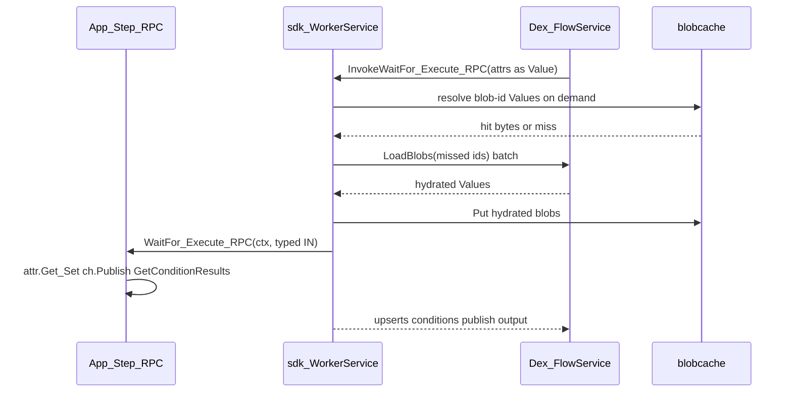

# sdk-go Greenfield Rewrite

## Goals

Replace the broken OpenAPI-era [`sdk-go/dex`](sdk-go/dex) with a new public API shaped like [`/Users/qlong/sd/dex-base/sdk-go`](file:///Users/qlong/sd/dex-base/sdk-go) + [`examples-go`](file:///Users/qlong/sd/dex-base/examples-go), wired to monorepo [`protos/dex.proto`](protos/dex.proto) / [`docs/design/idl-renames.md`](docs/design/idl-renames.md).

**Decisions locked**

- Greenfield: delete old Workflow/State/Command API shapes and the runtime `Persistence` parameter/object; no shims
- Keep `PersistenceSchema`: persistence is the flow's attributes + channels
- Include typed RPC in v1 (`InvokeRPC` + worker `InvokeWorkerRPC`)
- Channel wait reads: `GetConditionResults` (not `GetResults` / not dex-base `GetConsumedMessages`)
- Persisted key/value data is an **attribute**, not state
- Step-scoped data is `StepExecutionLocal[T]`
- WaitFor failure status is `Context.WaitForMethodFailed()`
- RPC channel size is read from the typed handle: `myCh.Size()` / `myChMap.Size(key)`
- Transport: gRPC `FlowService` client + gRPC `WorkerService` server (not dex-base’s poller worker; not Gin/OpenAPI)

## Target user API

```go
var (
  myAttr       = dex.DefineAttribute[int]("mykey")
  myAttrMap    = dex.DefineAttributeAsMap[Order]("orders") // replaces dex-base DynamicState
  myCh         = dex.DefineChannel[Msg]("myChName")
  myChMap      = dex.DefineChannelAsMap[Event]("order-update") // replaces DynamicChannel
  waitForInput = dex.DefineStepExecutionLocal[WaitForInput]("wait-for-input")
)

type InitStep struct{ dex.StepDefaults[int] }

func (s *InitStep) Execute(ctx dex.Context, threshold int) (dex.StepDecision, error) {
  _ = myAttr.Set(ctx, 0)
  v, _ := myAttr.Get(ctx)
  _ = myAttrMap.Set(ctx, "o1", order)
  local, _ := waitForInput.Get(ctx)
  _ = myCh.Publish(ctx, msg)
  msgs, _ := myCh.GetConditionResults(ctx)
  _ = myChMap.Publish(ctx, "o1", event)
  events, _ := myChMap.GetConditionResults(ctx, "o1")
  _ = ctx.RecordEvent("execute-input", local)
  if ctx.WaitForMethodFailed() {
    return dex.Fail("WaitFor failed"), nil
  }
  return dex.GoTo(&Next{}, v), nil
}

// WaitFor / Execute / RPC: only (ctx, input) — attrs/channels/condition results live on ctx
type Step[IN any] interface {
  WaitFor(ctx Context, input IN) (Wait, error) // AnyOf / AllOf / AnyComboOf / EmptyWait
  Execute(ctx Context, input IN) (StepDecision, error)
  // + GetStepType / GetStepOptions via defaults
}
```

Schema still explicit (Go generics cannot put `Attribute[T]` in one slice):

```go
func (f *CounterFlow) GetPersistenceSchema() dex.PersistenceSchema {
  return dex.PersistenceSchema{
    Attributes: []dex.AttributeDef{myAttr.Def(), myAttrMap.Def()},
    Channels:   []dex.ChannelDef{myCh.Def(), myChMap.Def()},
  }
}
```

`DefineX[T](name)` returns the typed handle (dex-base’s `New*` + define collapsed). `.Def()` yields the type-erased schema entry (`IsMap` instead of dex-base `IsDynamic`).

**Naming vs IDL / dex-base**

| Concept | This SDK | Notes |
|--------|----------|--------|
| Workflow | `Flow` | IDL |
| WorkflowState | `Step[IN]` | IDL + dex-base generics |
| Persistence | `Attribute` + `Channel` (including `AsMap`) | retained as `PersistenceSchema`; no runtime `Persistence` parameter |
| Signal/internal channel | `Channel` / `ChannelAsMap` | unified |
| IDL `step_exe_locals` | `StepExecutionLocal[T]` | current step execution only; primarily WaitFor → Execute |
| WaitUntil / Decide | `WaitFor` / `Execute` | dex-base verbs; map to `InvokeWaitForMethod` / `InvokeExecuteMethod` |
| Commands | `AnyOf` / `AllOf` / `AnyComboOf` + channel/timer builders | IDL Condition* |
| Client start | `StartFlow` | IDL (not dex-base `StartRun`) |
| Client wait | `WaitForFlow` | IDL |

## Step execution context

`StepExecutionLocal[T]` is typed data scoped to one step execution. It maps to
IDL `step_exe_locals`, is not part of `PersistenceSchema`, and is primarily used
to pass data from WaitFor to Execute:

```go
func (s *S) WaitFor(ctx dex.Context, input IN) (dex.Wait, error) {
  if err := waitForInput.Set(ctx, buildWaitForInput(input)); err != nil {
    return nil, err
  }
  return dex.AnyOf(myCh.ForOne()), nil
}

func (s *S) Execute(ctx dex.Context, input IN) (dex.StepDecision, error) {
  local, err := waitForInput.Get(ctx)
  if err != nil {
    return nil, err
  }
  if err := ctx.RecordEvent("execute-input", local); err != nil {
    return nil, err
  }
  if ctx.WaitForMethodFailed() {
    return dex.Fail("WaitFor failed"), nil
  }
  return dex.Complete(local), nil
}
```

- `DefineStepExecutionLocal[T](name)` returns a typed handle with `Get(ctx)` and `Set(ctx, value)`.
- `Context.RecordEvent(name, value)` buffers an IDL `record_events` entry.
- `Context.WaitForMethodFailed()` exposes `ConditionResults.wait_for_failed` during Execute.
- `dextest.NewTestContext` can seed step-execution locals, recorded events, and WaitFor failure status.

## Condition API (locked)

`WaitFor` returns a Go wait value that encodes to `dexpb.WaitingCondition`. Combinators and builders:

```go
func (s *S) WaitFor(ctx dex.Context, _ IN) (dex.Wait, error) {
  return dex.AnyOf(
    myCh.ForOne(),
    myCh.ForN(3),                 // exactly 3: at_least=3, at_most=3
    myCh.AtLeast(1),
    myCh.AtMost(10),
    myCh.AtLeastAtMost(1, 10),
    myChMap.ForOne("order-1"),
    dex.Timer(24*time.Hour),
  ), nil
}

// ALL_COMPLETED
return dex.AllOf(myCh.ForOne(), dex.Timer(time.Minute)), nil

// ANY_COMBINATION_COMPLETED — combos reference the same SingleCondition values
cSig := myCh.ForOne().WithID("sig")          // WithID optional except when SkipTimer / debugging needs a stable id
cT   := dex.Timer(24*time.Hour).WithID("timer")
cAlt := otherCh.ForOne().WithID("alt")
return dex.AnyComboOf(
  dex.Combo(cSig, cT),
  dex.Combo(cAlt),
), nil
```

**Channel builders** (all sugar over IDL `optional at_least` / `optional at_most`; omit stays unset — distinguishable from 0):

| Method | `at_least` | `at_most` |
|--------|------------|-----------|
| `ForOne()` | 1 | 1 (exactly one) |
| `ForN(n)` | n | n (exactly n) |
| `AtLeast(n)` | n | omit |
| `AtMost(n)` | omit | n |
| `AtLeastAtMost(lo, hi)` | lo | hi |

`ChannelAsMap` variants take the instance key first: `myChMap.ForOne("k")`, `myChMap.AtLeastAtMost("k", 1, 10)`, …

**Combinators → IDL `WaitingConditionType`**

| SDK | IDL |
|-----|-----|
| `AnyOf(...SingleCondition)` | `ANY_COMPLETED` |
| `AllOf(...SingleCondition)` | `ALL_COMPLETED` |
| `AnyComboOf(...Combo)` | `ANY_COMBINATION_COMPLETED` + `condition_combinations` |

**IDs:** encoder auto-assigns `condition_id` when omitted. `WithID` is required only if the app needs a stable id (e.g. client `SkipTimer` by `timer_condition_id`). `AnyComboOf` takes `Combo(conditions...)` of the same `SingleCondition` values (no parallel `[][]string` id lists) — SDK fills `ConditionCombination.condition_ids` from those values’ ids.

**Execute reads:** still `myCh.GetConditionResults(ctx)` / `myChMap.GetConditionResults(ctx, key)` (and `ctx.TimerFired()` or timer helpers as needed) — not a `ConditionResults` method parameter.

**Empty wait:** `dex.EmptyWait()` (or `nil` if we document skip) → jump straight to Execute / empty `WaitingCondition` with ALL semantics like today’s `EmptyCommandRequest`.

## Package layout

```
sdk-go/
  dex/                    # single public package (mirror dex-base flatness)
    attribute.go          # DefineAttribute / AsMap, Get/Set, Def
    channel.go            # DefineChannel / AsMap, Publish, Size, GetConditionResults, count builders
    step_execution_local.go # DefineStepExecutionLocal, Get/Set
    context.go            # Context + internal step/rpc contextImpl
    flow.go / step.go / decision.go / wait.go   # AnyOf/AllOf/AnyComboOf/Timer/Combo
    rpc.go                # typed RPC registration + handler interface
    client.go             # FlowService wrapper + hydration
    worker.go             # WorkerService gRPC server
    registry.go / codec.go / errors.go
    blobcache/            # disk payload store + Ristretto eviction controller
  gen/dexpb/              # keep regenerated stubs
  dextest/                # rewrite mocks/helpers for new Context APIs
  integ/                  # rewrite E2E against gRPC worker + new API
```

Delete all old OpenAPI-shaped files under `dex/` (`workflow_state.go`, `persistence_impl.go`, `command*.go`, Gin worker paths, etc.) as part of the replace.

Reuse patterns from dex-base (port/adapt, do not copy their `protocol-grpc` import path):

- Reflection invoke of `WaitFor`/`Execute` with decoded `IN` ([`step_method_runner_helpers.go`](file:///Users/qlong/sd/dex-base/sdk-go/dex/step_method_runner_helpers.go))
- Buffered upserts/publishes on `contextImpl`, flushed into worker response
- `GoTo` / `Complete` / `Fail` / `DeadEnd` / `AnyOf` / `AllOf` / `AnyComboOf`

## Worker / client wiring



- **Worker**: implement `dexpb.WorkerServiceServer`; on each invoke build `Context` holding attributes, step-execution locals, condition results, RPC channel info, recorded events, and pending writes; skip WaitFor when step embeds `NoWaitFor` / `StepDefaults`.
- **Client**: `grpc` dial to server; wrap all FlowService RPCs used by apps (`StartFlow`, `PublishToChannel`, `StopFlow`, `Get/SetAttributes`, `WaitForFlow`, `InvokeRPC`, `WaitForStepCompletion`, `WaitForAttribute`, `SkipTimer`, `ResetFlow`, …). `worker_target` is gRPC `host:port`.
- **Codec**: map Go values ↔ `dexpb.Value` (primitives + `EncodedObject` + null delete + optional `IndexConfig` on writes).

## Attribute lazy loading + disk cache

**Policy (IDL):** attributes always present on worker/client responses; large string/object may be blob-id arms; hydrate only when app/client actually reads that value; batch misses into one `LoadBlobs`.

### Library choice (locked)

No standalone Go library provides disk payload storage, a disk-byte budget,
TinyLFU-style admission, warm restart, and synchronous admission visibility.
Use Ristretto v2 only as the eviction controller inside the SDK-owned disk
component:

| Option | Payload on disk | Disk-byte cap | Frequency policy | Verdict |
|--------|-----------------|---------------|------------------|---------|
| [`ristretto/v2`](https://github.com/dgraph-io/ristretto) | no | abstract `MaxCost` | TinyLFU admission + SampledLFU eviction | Chosen policy controller; never store blob bytes in it |
| [`diskv`](https://github.com/peterbourgon/diskv) | yes | no; its cap is for its memory cache | no | Adds a file-layout dependency without solving eviction |
| [`juliewangs/diskcache`](https://github.com/juliewangs/diskcache) | yes | yes | LRU | Close, but does not preserve frequently read blobs |
| [`moonrhythm/parapet`](https://github.com/moonrhythm/parapet/blob/master/pkg/cache/disk.go) | yes | yes | LRU | HTTP-response-specific storage |
| [`meigma/blob`](https://github.com/meigma/blob/tree/master/core/cache/disk) | yes | yes | oldest file modification time | `Get` does not update the eviction timestamp |
| **SDK `DiskBlobCache`** | yes | yes | Ristretto controller | Chosen: SDK owns files; Ristretto owns admission/eviction |

[`lakeFS` uses the same separation](https://github.com/treeverse/lakeFS/blob/master/pkg/pyramid/eviction.go):
Ristretto tracks path metadata and file-size cost, while callbacks remove local
files.

`NumCounters` is the number of keys tracked by Ristretto's frequency sketch,
not an exact rolling window of the last N reads. Exact victim order is not an
SDK contract.

### Component boundary (`sdk-go/dex/blobcache`)

`DiskBlobCache` is independently usable and testable. Blob payloads exist only
as files; Ristretto stores only small metadata:

```go
type Config struct {
  Dir         string
  MaxBytes    int64
  NumCounters int64
}

type diskEntry struct {
  path string
  kind Kind
  size int64
}

type Cache struct {
  cfg      *Config
  policy   *ristretto.Cache[string, *diskEntry]
  commitMu sync.Mutex
}
```

Construction rules:

- `Dir` and a positive `MaxBytes` are required.
- `NumCounters` defaults to `10_000`; it controls policy memory, not disk bytes.
- Ristretto `MaxCost` equals `MaxBytes`.
- Each entry's cost is its complete cache-file size: header plus payload.
- Set `IgnoreInternalCost=true`; Ristretto's own memory overhead must not consume the disk budget.
- Do not put payload `[]byte` in Ristretto.

Public component API:

- `Get(blobID) (payload, kind, found, error)`
- `Put(blobID, payload, kind) (cached, error)`
- `Delete(blobID) error`
- `Close() error`

`cached=false, error=nil` means policy rejection or an entry larger than the
cache; the caller still uses the freshly loaded payload.

### Disk layout and file lifecycle

```text
BlobCacheDir/
  tmp/                         # incomplete writes; removed during New
  ab/cd/<safe-blob-key>.blob   # versioned header + kind + payload length + payload
```

- Derive a path-safe deterministic key from `blobID`; never concatenate an unchecked ID into a path.
- Validate the file magic, format version, kind, declared length, and actual length on startup and read.
- Write a new file as `tmp` and atomically rename it into the sharded final path.
- Blob IDs are content-addressed and immutable. An existing valid ID is touched, not overwritten.
- Corrupt or incomplete entries become misses and are removed; failure to remove is returned or logged, never ignored.

### Enforcing `BlobCacheMaxBytes`

Ristretto cost represents **disk file bytes**, not memory bytes. The component
uses reserve-before-write so committed files and the incoming file remain
within `MaxBytes`:

```text
Put(blobID, payload, kind)
  → compute complete file size
  → if size > MaxBytes: return cached=false
  → serialize admission/commit with commitMu
  → policy.Set(blobID, pendingEntry, fileSize)
  → policy.Wait()
  → OnEvict synchronously removes victim files
  → if Set was dropped or policy rejected: do not write; cached=false
  → if any victim deletion failed: cancel reservation; do not write; return error
  → write tmp file and atomic rename to final path
  → mark entry ready; return cached=true
```

The pending entry is not a readable hit. Concurrent hydration for the same blob
is deduplicated by singleflight; unrelated reads continue normally.

Ristretto integration rules:

- `Set=false` means the set buffer dropped the entry; do not write a file.
- `Set=true` still requires `Wait()` because policy admission may reject it.
- `OnEvict` synchronously removes the admitted victim's file.
- `OnReject` marks a pending entry rejected and removes any file if present.
- `OnExit` must not delete files: `Close()` must preserve committed files for restart.
- Explicit `Delete` removes both policy metadata and the disk file.
- Callback deletion errors are recorded. After `Wait()`, `Put` aborts instead of growing beyond the configured budget.

The limit covers files owned by this cache, including their headers. It is not
an operating-system quota for directory entries, filesystem allocation units,
or unrelated processes.

### Startup recovery

`New` finishes reconciliation before exposing the cache:

1. Remove incomplete files under `tmp/`.
2. Scan and validate committed files.
3. Re-admit each valid entry using its actual file size as cost.
4. Call `Wait()` so a smaller configured `MaxBytes` evicts files before `New` returns.
5. Reset access frequency; persisted files survive, but historical frequency does not.
6. Return an error if deletion or reconciliation cannot restore the configured limit.

`Close()` stops Ristretto and leaves committed files intact.

### Read and lazy-load path

`Get` asks Ristretto for metadata, thereby recording access frequency, and then
reads the file. A file missing because of concurrent eviction is a cache miss,
not application data loss.

**Lazy-load path (worker Context + client)**

```text
attr.Get(ctx)
  → value is concrete? decode and return
  → value is blob-id arm?
       → cache.Get(id) hit? replace arm, decode, return
       → collect miss ids in this Get batch (same step/RPC/client call may touch many attrs)
       → singleflight + one LoadBlobs(misses)
       → for each: cache.Put; replace arm in ctx attribute map with freshly loaded bytes; decode
```

Do **not** hydrate eagerly on worker request entry — only when `Attribute.Get` / map `Get` / client typed get needs concrete bytes.

**Config knobs:** `ClientOptions` / `WorkerOptions`: `BlobCacheDir`, `BlobCacheMaxBytes`, `BlobCacheNumCounters` (default 10k). Share one `blobcache.Cache` per Client/Worker process.

## RPC (v1)

Mirror step style:

```go
type RPC[IN, OUT any] interface {
  Handle(ctx Context, input IN) (OUT, error) // or (OUT, StepDecision, error) if we expose optional movements
}
```

Register on Flow (schema or `GetRPCs()`). Worker `InvokeWorkerRPC` builds same Context (attrs + channels). Client `InvokeRPC` encodes input, decodes output, supports `lock_attribute_keys` via options (typed helpers like `LockAttribute(myAttr)`). Flush upserts/publishes/optional `StepDecision` from context into `InvokeWorkerRPCResponse`.

Exact `Handle` return shape: prefer `(OUT, error)` plus context-buffered side effects (attrs/channels/movements), matching step buffering — avoid reintroducing Persistence/Communication params.

Channel size belongs to the typed channel handle:

```go
func (r *InspectRPC) Handle(ctx dex.Context, input IN) (OUT, error) {
  size := myCh.Size()
  orderSize := myChMap.Size("order-1")
  return buildOutput(size, orderSize), nil
}
```

`Size()` is RPC-only and reads `InvokeWorkerRPCRequest.channel_infos`. It includes
messages already buffered by the current RPC invocation. Do not add
`Context.ChannelSize`, raw channel-name lookup, or a client-side size RPC.

## Rewrite sequence

**Phase A — SDK core**

1. **Skeleton**: new `dex` types (Flow/Step/Attribute/Channel/Context/Decision/Wait); delete old conflicting files
2. **Codec + registry**: schema validation, step/RPC registration, input type reflection
3. **Worker gRPC server**: WaitFor / Execute / WorkerRPC end-to-end with Context buffering; keep blob resolution behind an interface
4. **Client**: StartFlow / Publish / WaitForFlow / attrs / InvokeRPC for concrete values; keep blob resolution behind the same interface
5. **dextest**: `NewTestContext` with in-memory attrs/channels (no disk required)

**Phase B — independent DiskBlobCache component**

6. **File store**: config validation, versioned file format, safe sharded paths, validation, atomic commit, delete, startup scan
7. **Ristretto controller**: metadata-only entries, disk-size cost, reserve-before-write, synchronous eviction/rejection cleanup
8. **Recovery and failure handling**: temp cleanup, smaller-budget restart, corrupt files, failed deletions, warm close/reopen
9. **Component test gate**: complete Tests § Phase B, including race tests, before wiring the component into SDK hydration

**Phase C — hydration integration + SDK smoke**

10. **Hydration coordinator**: batch `LoadBlobs` misses, singleflight concurrent IDs, use fresh bytes even when cache admission rejects
11. **Minimal integ matrix**: basic flow, attribute R/W, step-execution local, channel wait+publish, timer, RPC; gRPC worker against Temporal
12. **DiskBlobCache wire suite**: end-to-end lazy hydration, disk hits, eviction/reload, worker/client isolation

**Phase D — full integ migration + Java gap port**

13. **D1 — Migrate every existing `sdk-go/integ` scenario** to the new API (see Tests § Phase D1)
14. **D2 — Port Java-only integ scenarios** from [`sdk-java/.../integ/`](sdk-java/src/test/java/io/superdurable/dex/integ/) that Go lacks (see Tests § Phase D2); adapt to new IDL (no PersistenceLoadingPolicy / memo; use lock keys + unified Channel / ConditionalClose)

**Phase E — docs**

15. Rewrite [`sdk-go/README.md`](sdk-go/README.md); short authoring note under [`docs/`](docs/); update [`sdk-go/CONTRIBUTION.md`](sdk-go/CONTRIBUTION.md)

## Out of scope

- sdk-java / sdk-python / samples-* (follow-up)
- Server changes (assume `LoadBlobs` + blob-id `Value` arms already work)
- Cadence SDK integration execution; the default Dex server image uses Temporal
- Backward-compatible aliases for old OpenAPI names

## Tests

Integration (default), under `sdk-go/integ/` against the real Dex server image and Temporal.

Phase B is an explicitly requested component-test phase. Add a
`make -C sdk-go blobCacheTests` target that runs
`go test -race ./dex/blobcache`; do not bypass the Makefile.

### Phase B — independent DiskBlobCache component tests

| Case | Assertion |
|------|-----------|
| **Disk-only payload** | Ristretto values contain only `diskEntry` metadata; payload bytes exist only in `.blob` files |
| **Reserve before write** | When an incoming file requires space, victim files are deleted before the new final file is created; committed bytes never exceed `MaxBytes` |
| **Oversized entry** | A file larger than `MaxBytes` returns `cached=false` and creates no committed or temporary file |
| **Dropped/rejected admission** | Both `Set=false` and post-`Wait` rejection leave no file and do not fail the caller's fresh payload path |
| **Eviction callback boundary** | After `Wait()` returns, evicted files are absent and the new admitted file can be committed within budget |
| **Hot versus scan traffic** | Repeated reads protect a hot entry from a stream of one-use entries; do not assert an exact victim order |
| **Warm restart** | `Close` preserves files; `New` scans them; a valid entry is readable without `LoadBlobs` |
| **Reduced restart budget** | Reopening with a smaller `MaxBytes` evicts enough files before `New` returns |
| **Recovery cleanup** | Incomplete temp and corrupt/truncated files are removed and never served |
| **Delete failure** | A forced callback deletion failure prevents the new commit and surfaces an error instead of exceeding the budget |
| **Concurrent Get/evict** | Readers receive complete bytes or a clean miss, never partial data or a race |
| **Duplicate immutable ID** | Re-putting a valid content-addressed ID touches/reuses it without overwriting the file |
| **Race suite** | Concurrent Get/Put/Delete/Close passes `go test -race` |

Ristretto owns exact TinyLFU/SampledLFU policy tests. The SDK tests only the
observable contract: byte budget, hot-entry retention, callbacks, files, and
failure boundaries.

**Phase B exit criteria:** the component API and file format are stable; all
component and race tests pass; no worker/client hydration code is required to
exercise the component.

### Phase C — SDK smoke (new coverage)

1. **Basic flow**: starting step → execute-only step → `Complete` with typed output; `WaitForFlow`
2. **Attribute Get/Set**: typed attribute + `AttributeAsMap` round-trip; optional `IndexConfig` write
3. **Step execution context**: WaitFor writes `StepExecutionLocal[T]`, Execute reads it; `RecordEvent` is flushed; proceed-after-WaitFor-failure exposes `WaitForMethodFailed() == true`
4. **Channel wait**: `WaitFor` + `AnyOf(myCh.ForOne(), Timer(...))`; `GetConditionResults` in Execute; external `PublishToChannel`
5. **ChannelAsMap + counts**: `ForN` / `AtMost` / `AtLeastAtMost`; map instance key wait/publish
6. **AnyComboOf**: two combos sharing conditions; assert correct branch via `GetConditionResults` / timer status
7. **RPC**: client `InvokeRPC` → worker handler reads/writes attrs via Context; locking keys; `myCh.Size()` and `myChMap.Size(key)` include buffered publishes
8. **Temporal runtime**: run the smoke matrix against the default Temporal-backed Dex server image

### Phase C — DiskBlobCache wire integration

New package/files under `sdk-go/integ/` (e.g. `blob_cache_test.go` + a flow that stores oversized string/object attrs so the server returns blob-id arms). Run against the real Temporal-backed Dex server. Assert via test hooks or a small `blobcache` test seam (call-count / dir listing) — not only unit tests.

| Case | Why |
|------|-----|
| **Lazy miss → LoadBlobs** | Step/RPC/`Attribute.Get` that never reads a large attr must not call `LoadBlobs`; first `Get` on a blob-id arm triggers exactly one batched `LoadBlobs` for the missed ids |
| **Cache hit** | Second `Get` of the same blob id (same process) does not call `LoadBlobs` again; payload served from disk cache |
| **Batch multi-key** | One Execute reading N blob-backed attrs issues a single `LoadBlobs` with all misses (not N RPCs) |
| **Client-side hydrate** | Client typed get / `GetAttributes` path uses the same cache + `LoadBlobs` rules |
| **Eviction under MaxBytes** | Tiny `BlobCacheMaxBytes` + several large blobs: cold keys evicted from disk; subsequent `Get` of an evicted id calls `LoadBlobs` again; a frequently read hot key survives |
| **Admission rejection** | Freshly loaded bytes decode successfully even when the cache rejects the entry; no file remains |
| **NumCounters smoke** | With small `BlobCacheNumCounters`, the frequency sketch still admits/evicts without panic or growth past `MaxBytes` |
| **Worker + client isolation** | Separate cache dirs/options per process; no cross-talk assumed |

Component tests prove the disk budget and lifecycle. Integration tests prove
the `Value` blob arms, `LoadBlobs`, batching, SDK decode, and process wiring.

### Phase D1 — migrate all existing Go integ tests

Rewrite each current `*_test.go` + its workflow/step fixtures to Flow/Step/Attribute/Channel/Condition + gRPC worker. Preserve scenario intent; rename files/types away from “state” where they are product concepts (e.g. `skip_wait_until` → `skip_wait_for`).

| Existing test | Scenario to preserve |
|---------------|----------------------|
| [`basic_test.go`](sdk-go/integ/basic_test.go) | Happy-path multi-step flow + result |
| [`persistence_test.go`](sdk-go/integ/persistence_test.go) | Attribute read/write (was data/search attrs) |
| [`signal_test.go`](sdk-go/integ/signal_test.go) | External channel publish + wait (`AnyOf` / combinations as today) |
| [`interstate_test.go`](sdk-go/integ/interstate_test.go) | Inter-step channel publish/consume (unified `Channel`) |
| [`timer_test.go`](sdk-go/integ/timer_test.go) | Timer condition + optional skip |
| [`rpc_test.go`](sdk-go/integ/rpc_test.go) | Worker RPC + locking / attr side effects |
| [`skip_wait_until_test.go`](sdk-go/integ/skip_wait_until_test.go) | Execute-only steps (`NoWaitFor` / `StepDefaults`) |
| [`no_state_test.go`](sdk-go/integ/no_state_test.go) | Flow with no steps / empty step list edge |
| [`no_startstate_test.go`](sdk-go/integ/no_startstate_test.go) | No starting step registration error/behavior |
| [`abnormal_exit_test.go`](sdk-go/integ/abnormal_exit_test.go) | Worker/step failure → flow failure path |
| [`state_recovery_test.go`](sdk-go/integ/state_recovery_test.go) | Step API fail recovery / proceed options |
| [`workflow_uncompleted_test.go`](sdk-go/integ/workflow_uncompleted_test.go) | Force-fail, state API fail/timeout, uncompleted wait semantics |

Also rewrite supporting fixtures currently named `*_workflow_state*.go`, `force_fail_*`, `state_api_*`, `execute_api_fail_recovery_*`, `proceed_on_state_start_fail_*`, etc. Update [`main_test.go`](sdk-go/integ/main_test.go) / [`init.go`](sdk-go/integ/init.go) harness from Gin HTTP worker → gRPC `WorkerService` + `worker_target`.

Where Java already covers the same scenario more richly, fold those assertions into the migrated Go test (see D2 overlap notes) rather than keeping a thin Go-only variant.

### Phase D2 — port Java-only integ scenarios

Source of truth for gaps: [`sdk-java/src/test/java/io/superdurable/dex/integ/`](sdk-java/src/test/java/io/superdurable/dex/integ/). Implement equivalent Go integ tests under `sdk-go/integ/` using the new SDK API. **Adapt to current IDL** — do not reintroduce deleted concepts.

**IDL adaptations when porting**

- `PersistenceLoadingPolicy` / partial loading (`StateOptionsTest`) → **deleted**; replace intent with `wait_for_lock_attribute_keys` / `execute_lock_attribute_keys` / RPC `lock_attribute_keys` where the Java test was about locking, not selective hydrate (hydrate is always blobcache/`LoadBlobs`)
- Signal vs internal channel → unified `Channel` / `PublishToChannel`
- `COMPLETE_IF_*_EMPTY` → `FlowConditionalClose` (`FORCE_COMPLETE_ON_CHANNELS_EMPTY` / graceful variant)
- Reset `skipUpdateReapply` / `skipSignalReapply` → `skip_locking_rpc_reapply` / `skip_channel_messages_reapply`
- RPC memo / strong-consistency memo path (`RpcWithMemoTest`) → **no memo in new IDL**; port persistence/locking assertions via attributes only; skip pure-memo-only cases with a short comment pointing at IDL deletion (not a casual `t.Skip` for flakes)

**New Go integ to add (Java has, Go lacks)**

| Scenario | Java source | Go integ target |
|----------|-------------|-----------------|
| Reset + locking RPC reapply / skip reapply | [`ResetTest.java`](sdk-java/src/test/java/io/superdurable/dex/integ/ResetTest.java) | `reset_test.go` |
| Reset + non-locking channel reapply / skip | same | same |
| Conditional complete on channels empty | [`ConditionalCompleteTest.java`](sdk-java/src/test/java/io/superdurable/dex/integ/ConditionalCompleteTest.java) | `conditional_complete_test.go` |
| Step options override on movement (proceed-on-wait-for-fail) | [`StateOptionsOverrideTest.java`](sdk-java/src/test/java/io/superdurable/dex/integ/StateOptionsOverrideTest.java) | `step_options_override_test.go` |
| Lock-key step options (replaces partial loading) | [`StateOptionsTest.java`](sdk-java/src/test/java/io/superdurable/dex/integ/StateOptionsTest.java) | `step_options_test.go` (lock keys, not LoadingPolicy) |
| Full RPC matrix (locking stress, shapes, read-only, channel `Size()`, attr mutate/clear) | [`RpcTest.java`](sdk-java/src/test/java/io/superdurable/dex/integ/RpcTest.java) | expand `rpc_test.go` |
| Dead-end step + RPC then complete | [`NoStartStateTest.java`](sdk-java/src/test/java/io/superdurable/dex/integ/NoStartStateTest.java) `testDeadEndWorkflow` | expand `no_start*_test.go` |
| Client `SetAttributes` (typed + map keys) while flow waits | [`PersistenceTest.java`](sdk-java/src/test/java/io/superdurable/dex/integ/PersistenceTest.java) | expand `persistence_test.go` |
| Client `PublishToChannel` unblocks waiting step | [`InternalChannelTest.java`](sdk-java/src/test/java/io/superdurable/dex/integ/InternalChannelTest.java) | expand channel/interstate tests |
| `WaitForStepCompletion` | [`BasicTest.java`](sdk-java/src/test/java/io/superdurable/dex/integ/BasicTest.java) | expand `basic_test.go` |
| Long-poll wait timeout; terminate; fail-by-API; empty step decision | [`WorkflowUncompletedTest.java`](sdk-java/src/test/java/io/superdurable/dex/integ/WorkflowUncompletedTest.java) | expand `workflow_uncompleted_test.go` |
| Invalid `AnyComboOf` condition id → step API fail | [`AnyCommandCombinationTest.java`](sdk-java/src/test/java/io/superdurable/dex/integ/AnyCommandCombinationTest.java) | `any_combo_test.go` |
| Empty/null input; custom flow type; typed input mismatch; config override; describe running/missing; mix WaitFor + skip | [`BasicTest.java`](sdk-java/src/test/java/io/superdurable/dex/integ/BasicTest.java) | expand `basic_test.go` |
| State recovery without WaitFor | [`StateRecoveryTest.java`](sdk-java/src/test/java/io/superdurable/dex/integ/StateRecoveryTest.java) | expand `state_recovery_test.go` |
| Skip WaitFor + continueAsNew threshold | [`SkipWaitUntilTest.java`](sdk-java/src/test/java/io/superdurable/dex/integ/SkipWaitUntilTest.java) | expand `skip_wait_for_test.go` |
| Richer signal cases (null/prefix, signal-after-close, result shapes) | [`SignalTest.java`](sdk-java/src/test/java/io/superdurable/dex/integ/SignalTest.java) | expand `signal_test.go` |

**Skip / do not port as integ**

- `BasicTest.deepCopyWorkflowStateOptionsTest` — pure unit clone semantics; cover in SDK unit/dextest if still relevant
- Near-duplicate cancel-without-runId if cancel-with-runId already covers the error shape

**Exit criteria (D1+D2):** full `sdk-go/integ` suite green on Temporal; every Java integ scenario either has a Go counterpart or an explicit IDL-deletion note in the plan/test comment; zero casual skips.

## Documentation

- Rewrite [`sdk-go/README.md`](sdk-go/README.md) with Define*/Step[IN]/Context, `StepExecutionLocal`, `RecordEvent`, `WaitForMethodFailed`, and channel `Size` examples
- Document `DiskBlobCache` as disk payload storage with an in-memory Ristretto policy controller; explain reserve-before-write and logical disk-byte accounting
- Add or update a short page under [`docs/`](docs/) (linked from [`docs/README.md`](docs/README.md)) for Go SDK authoring, lazy hydration, cache knobs, restart behavior, and admission rejection
- Update [`sdk-go/CONTRIBUTION.md`](sdk-go/CONTRIBUTION.md) for gRPC worker/client, `make blobCacheTests`, race testing, and `make idl-code-gen` expectations

## UI/UX

N/A: no in-repo web UI
