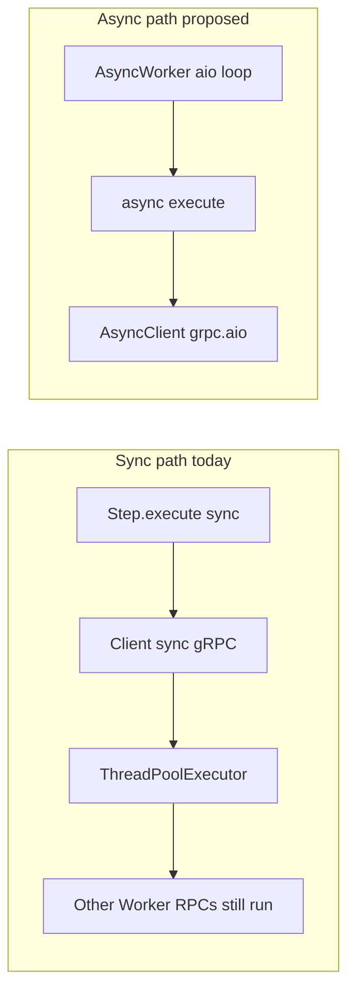

# Python SDK: optional asyncio APIs

Status: implemented (Phase 1 + Phase 2 in `sdk-python`)
Audience: SDK consumers; examples remain sync unless a later FastAPI sample is added

## Problem

The Python SDK today is entirely synchronous:

- [`Client`](../../sdk-python/dex/client.py) — sync `grpc` + `FlowServiceStub`
- [`Worker`](../../sdk-python/dex/worker.py) — `ThreadPoolExecutor` + sync `grpc.server`
- [`Step.execute` / `wait_for`](../../sdk-python/dex/step.py) — sync return types
- Registry rejects coroutine handlers on the sync path

That model is **correct** for Dex Workers. Like Java, a blocking `client.start_flow` / `wait_for_flow` / `invoke_rpc` inside `Step.execute` only occupies one pool thread; other WorkerService RPCs still run. Parent–child examples already do this (e.g. [`parent_flow_v2.py`](../../examples/python/dex_examples/patterns/workflow/parentchild/parent_flow_v2.py)).

Async support is **not** required to avoid a deadlock class. It is for **asyncio hosts**: FastAPI (or similar) controllers that should not block the event loop on gRPC, and optionally Steps that `await` async I/O (HTTP, DB) or `AsyncClient`.



## Goal

Ship a **parallel** asyncio surface while keeping sync as the default:

```python
# Phase 1 — app / controller
client = AsyncClient(registry, blob_cache, ClientOptions(server_address="..."))
run_id = await client.start_flow(flow, flow_id, input, options)

# Phase 2 — async Steps on AsyncWorker
class Run(Step[str]):
    async def execute(self, context: Context, input: str) -> StepDecision:
        await async_client.start_flow(child, child_id, ...)
        return go_to(...)

worker = AsyncWorker(registry, blob_cache, WorkerOptions(...))
await worker.start()
```

Exports: `from dex import AsyncClient, AsyncWorker` alongside existing `Client` and `Worker`.

## Non-goals

- Replacing sync examples or requiring async for parent/child.
- Marketing `asyncio.to_thread(sync_client.method)` as `AsyncClient` — real `grpc.aio` only.
- Changing `StepDurability.ASYNC` (server durability flag; unrelated to asyncio).
- Treating Python async as the same urgency as TypeScript async Step handlers (TS is a correctness fix for event-loop deadlock; Python is ergonomics).
- Dual method names on every API (`start_flow` / `async_start_flow`); use separate types instead.

## Locked design choices

1. **Sync remains default.** Existing `Client` / `Worker` / `Step` / `@rpc` stay unchanged; `examples/python` stays sync.
2. **Parallel types, not suffixes.** `AsyncClient`, `AsyncWorker`, and coroutine-capable handlers when served by `AsyncWorker`.
3. **Transport:** `grpc.aio` for both `AsyncClient` and `AsyncWorker` (reuse generated stubs with aio channel/server where possible).
4. **Mixing rules:**
   - Sync `Worker` must not run coroutine handlers (fail fast at registration or start; keep today’s “must be synchronous” contract for the sync path).
   - `AsyncWorker` may run sync or async handlers (sync handlers return values directly; awaitables are awaited).
   - Inside async `execute`, apps inject and use `AsyncClient` — do not call sync `Client` on the Worker’s event loop (blocks the loop).
5. **Phased delivery** (below).

## Phase 1 — `AsyncClient` (app / controller side)

### Scope

- New `AsyncClient` mirroring the sync `Client` method set with `async def`: at least `start_flow`, `wait_for_flow`, `invoke_rpc`, `publish`, `stop_flow`, `search_flows`, and other public Client RPCs needed for parity.
- `async with AsyncClient(...)` / `await client.close()`.
- Share protobuf build / mapping / hydration with sync Client where practical (extract pure helpers; avoid duplicating request construction).
- Steps and Worker remain sync.

### Use case

Asyncio HTTP layer starts, signals, and waits on flows without `asyncio.to_thread(client.start_flow)`.

### Out of scope for Phase 1

- Coroutine `Step.execute` / `wait_for` / `@rpc`
- `AsyncWorker`

## Phase 2 — `AsyncWorker` + async handlers

### Scope

- `AsyncWorker` serves `WorkerService` via `grpc.aio` server.
- **Loop model:** a single asyncio event loop owned by `AsyncWorker.start()` (document the lifecycle clearly: `await worker.start()` runs until stop/close; or an equivalent documented run pattern — pick one and stick to it).
- Dispatcher awaits handler results when they are awaitables (same idea as awaiting `Promise` in TypeScript).
- Registry / dispatcher:
  - Allow `async def execute` / `wait_for` / RPC methods returning awaitables when the process uses `AsyncWorker`.
  - Sync handlers still allowed on `AsyncWorker`.
  - Sync `Worker` continues to reject coroutine handlers.
- Inside async `execute`, call `AsyncClient` so awaits yield the loop; child / RPC work on the same `AsyncWorker` can proceed.

### Caveats to document

- Long `await async_client.wait_for_flow(...)` inside `execute` holds that WorkerService call until the poll finishes or times out. Prefer short timeouts + step retry (as parent–child examples already do), or a later durable Wait API.
- Do not use blocking sync gRPC or `time.sleep` inside async handlers on `AsyncWorker`.
- `StepDurability.ASYNC` remains a server-side durability option and must not be confused with Python `async def`.

## API sketch

```python
from dex import (
    AsyncClient,
    AsyncWorker,
    ClientOptions,
    WorkerOptions,
    Step,
    StepDecision,
    Context,
    go_to,
)

# Phase 1
async_client = AsyncClient(registry, blob_cache, ClientOptions(server_address="127.0.0.1:8801"))
async with async_client:
    run_id = await async_client.start_flow(flow, flow_id, input, options)

# Phase 2
class StartChild(Step[int]):
    def __init__(self, client: AsyncClient, child_flow: Flow[str]) -> None:
        self._client = client
        self._child = child_flow

    async def execute(self, context: Context, uuid: int) -> StepDecision:
        child_id = f"child-wf-{uuid}"
        await self._client.start_flow(self._child, child_id, str(uuid), options)
        return go_to(self.await_child, {"child_wf_id": child_id})

worker = AsyncWorker(registry, blob_cache, WorkerOptions(bind_address="127.0.0.1:8803"))
await worker.start()
```

## Contrast with TypeScript (context only)

| Concern | TypeScript | Python |
|---------|------------|--------|
| Motivation | Unblock Step↔Client on one Worker | Idiomatic asyncio apps |
| Sync default | Client already async; Step becomes awaitable | Client / Worker / Step stay sync |
| New types | Widen handler return types | Add `AsyncClient` / `AsyncWorker` |
| Examples | Remove dual-Worker bridge after SDK change | No forced rewrite |

These are independent workstreams; no doc cross-links required.

## Tests

Integration tests against a running Dex (`sdk-python` integ suite). Do not add unit tests unless an edge cannot be reached through integ.

About half of the runtime integ modules use `AsyncClient` / `AsyncWorker`
(`test_basic_runtime_async`, `test_rpc_runtime`, `test_channels_runtime`,
plus `test_async_runtime`); `test_basic_runtime_sync` keeps the basic suite
on sync `Client` / `Worker`, and the remaining modules stay sync.

### Phase 1

1. `AsyncClient.start_flow` + `wait_for_flow` happy path.
2. `AsyncClient.invoke_rpc` / `publish` parity with sync `Client`.
3. Concurrent awaits on one `AsyncClient` (multiple in-flight RPCs) without deadlock.
4. Remaining sync `Client` integ modules still pass (regression).

### Phase 2

5. `AsyncWorker` runs async `execute` that `await`s `AsyncClient.start_flow` for a child on the **same** worker; child completes; parent continues.
6. Sync `execute` on `AsyncWorker` still works.
7. Sync `Worker` rejects or fails fast on coroutine `execute` (contract preserved).
8. Long `wait_for_flow` inside async `execute` with a short timeout does not starve other Worker RPCs on the aio server.

## Documentation

- This plan file — keep until Phase 1 / Phase 2 ship; then trim or fold into release notes.
- When implementing: [`sdk-python/README.md`](../../sdk-python/README.md) — separate sync vs asyncio sections; state mixing rules explicitly.
- Changelog / release notes for the `dex-python-sdk` version(s) that ship Phase 1 and Phase 2.
- Do not rewrite `examples/python` to async in Phase 1. Optional later sample (e.g. FastAPI snippet using `AsyncClient`) only after Phase 1 ships.

## UI/UX

N/A: no in-repo web UI.
