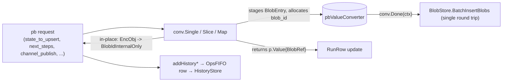

# History Store Design

The history store is the per-run append-only event log behind
`OpsService.GetHistoryEvents`. It records every state change a run goes
through with enough fidelity to reconstruct the run's full trajectory
(start, every step completion, every channel publish, end) without
touching the live `runs` collection.

## 1. Collection Layout

| Field            | Type      | Notes                                                                  |
|------------------|-----------|------------------------------------------------------------------------|
| `run_id`         | string    | UUID; shard key.                                                       |
| `event_id`       | int64     | Monotonically allocated per run; see §3.                               |
| `namespace`      | string    | Tenant identifier (envelope; same for every event of a given run).     |
| `occurred_at_ms` | int64     | Server-side wall clock when the engine emitted the event.              |
| `worker_id`      | string    | Worker `host_id` (best-effort; empty for API-originated events).       |
| `payload_type`   | string    | Stable discriminator (`"run_start"`, `"run_stop"`, `"step_execute_completed"`, `"step_wait_for_completed"`, `"channel_publish"`); see §2. |
| `payload`        | binary    | Proto-marshaled event-type-specific message — schema selected by `payload_type`. The marshaled bytes contain `blob_id` strings in place of `EncodedObject` payloads (see §6 "Blob extraction"). |

Shard key: `{run_id: "hashed"}`. All events for a single run land on one
Atlas shard, so `GetHistoryEvents(run_id=...)` is a single-shard read
and per-run insert ordering is preserved on the same shard.

### 1.1 Indexes

```
PK { run_id: 1, event_id: 1 } unique
```

The PK is also the read cursor (sort by `event_id ASC`), so no secondary
index is needed.

## 2. Event Types

The wire schema is a `oneof payload` on `pb.HistoryEvent`; on the
persistence side `HistoryEvent.Payload` is a sum-type with one pointer
field per variant. `HistoryEventPayload.Validate()` enforces "exactly one
non-nil" both on insert and after read decode.

| Variant (Go pointer / pb oneof case) | Proto message                              | Source                                           |
|--------------------------------------|--------------------------------------------|--------------------------------------------------|
| `RunStart`                           | `pb.HistoryRunStartPayload`                | `StartRunRequest` minus `namespace` + `run_id`. |
| `RunStop`                            | `pb.HistoryRunStopPayload { run_status, reason }` | Terminal `RunStatus` int; `reason` set when stopped via `StopRun`, empty for worker-driven ends. |
| `StepExecuteCompleted`               | `pb.HistoryStepExecuteCompletedPayload`    | `StepExecuteCompletedRequest` minus `namespace` + `run_id`. |
| `StepWaitForCompleted`               | `pb.HistoryStepWaitForCompletedPayload`    | `StepWaitForCompletedRequest` minus `namespace` + `run_id`. |
| `ChannelPublish`                     | `pb.HistoryChannelPublishPayload`          | `PublishToChannelRequest` minus `namespace` + `run_id`. |
| `StepsUnblocked`                     | `pb.HistoryStepsUnblockedPayload`        | `StepsUnblockedRequest` minus `namespace` + `run_id`. |
| `RunFork`                            | `pb.HistoryRunForkPayload`               | `ForkRun` API marker (`fork_to_event_id`, optional `reason`). |

`StepExecuteCompleted`, `StepWaitForCompleted`, and `StepsUnblocked` may embed an
optional `RunStateSnapshot` (see [time-travel-api-design.md](time-travel-api-design.md))
captured at commit time. `ForkRun` restores from these snapshots or from `RunStart`.

`namespace` and `run_id` live on the envelope (and on the storage shard
key) so they're omitted from the payload schema — there's no need to
spend bytes storing them twice.

Per-variant payloads are PROTO-GENERATED Go structs (no hand-written
mirroring) — this keeps the wire format and the persistence layer in
sync without conversion glue. The mongo store proto-marshals the active
variant on insert with a stable string `payload_type` discriminator;
`unmarshalHistoryPayload` reads the discriminator and routes the bytes
into the correct concrete `pb.History*Payload` pointer.

`pb.Value` fields inside payloads (state deltas, channel values, step
inputs) are stored as **blob refs**, not raw `EncodedObject` bytes — see
§6 below for the mechanics, including how the same `blob_id` is shared
between `RunRow.StateMap` and the matching history event so blob bytes
are written to BlobStore exactly once per logical Value.

`StepRetryState` error fields and `StepMethodReport.error` /
`error_stack_trace` are **inline strings** (not blob refs).

## 3. Per-run `event_id` Allocation

`event_id` is monotonically increasing within a single run, gap-free for
any successfully committed run state, and stable across reader restarts.

The engine allocates IDs by bumping `RunRow.LastHistoryEventID` under the
SAME CAS that commits the run state change (see [`engine/run_engine.go`](../server/internal/engine/run_engine.go)
and [`engine/ops_tasks.go`](../server/internal/engine/ops_tasks.go)). The
flow on every state-changing call site:

1. Read `RunRow`, capture `r.LastHistoryEventID`.
2. Build the OpsFIFO `HistoryWrite` task(s); each one bumps a local
   `nextEventID` counter starting at the captured value.
3. Stamp the new high-water mark onto `RunRowUpdate.LastHistoryEventID`.
4. `UpdateRunWithNewTasks(ctx, ..., update, tasks)` commits all of
   `(run-state delta, immediate task(s), ops task(s), LastHistoryEventID
   bump)` atomically inside a single Mongo transaction.

On CAS retry the engine re-reads the run row and starts from the new
(possibly higher) `LastHistoryEventID` — so retries never produce
duplicate `event_id`s. If two writers race, only one transaction wins
and the loser allocates fresh IDs from the new high-water mark.

## 4. Write Path: `BatchInsertHistory`

Writes come exclusively from the OpsFIFO batch executor. The store API:

```go
BatchInsertHistory(ctx, events []HistoryEvent) errors.CategorizedError
```

Implementation: `InsertMany(ordered=false)`. We rely on
`mongo.BulkWriteException` + a per-error `IsDuplicateKeyError` check to
silently swallow duplicate-key errors on `(run_id, event_id)`:

- A successful insert returns nil → reader advances offset.
- A partial-failure where every failure is a duplicate-key returns nil
  too → these are replays of an already-committed batch and are by
  design idempotent.
- Any non-duplicate failure returns a wrapped `Internal` error → the
  OpsFIFO reader retries the WHOLE batch (see ops-fifo-queue-design).

This makes the OpsFIFO "retry forever, never skip" loop safe even when
the writer crashed mid-batch on the previous attempt.

## 5. Read Path: `GetHistoryEvents`

```go
GetHistoryEvents(ctx, namespace, runID string, afterID int64, limit int)
    ([]HistoryEvent, errors.CategorizedError)
```

Cursor is `(afterID, limit)`. The store sorts ASC by `event_id` and
clamps `limit` to 1000 (also defaults to 1000 when 0 / negative).

`namespace` is included in the filter for defense-in-depth (it should
match the run's own namespace; mismatches would indicate either a
misrouted client or a corrupted run row).

`HistoryEvent.Payload` is the strongly-typed sum-type with one variant
set; the OpsService handler splats it into the matching `pb.HistoryEvent`
oneof case (`historyEventToPb`). Clients dispatch on the oneof rather
than parsing a separate type+bytes pair.

Before returning a page to the wire, `OpsService.GetHistoryEvents` runs
a single page-wide blob hydration step: walk every event, collect the
distinct `blob_id` strings referenced by `EncodedObjectBlobIdInternalOnly`
Values, fetch them all in one `BlobStore.BatchGetBlobs` round trip, and
mutate each Value back to `EncodedObject` in place (see §6). Page-level
batching keeps the read path at exactly **one** BlobStore round trip
regardless of how many history events / Values the page contains.

## 6. Blob extraction

`pb.Value.kind` carries an extra server-internal oneof variant alongside
`EncodedObject`:

```proto
string encoded_object_blob_id_internal_only = 6;
```

Storage form. Engine never accepts it inbound, OpsService never returns
it on the wire. It only ever appears inside the OpsFIFO row + the
proto-marshaled history `payload` binary, where it holds the `blob_id`
string of the bytes that live in `BlobStore`.

### 6.1 Write path (1-pass converter, 1 BatchInsertBlobs per API)

The engine's `pbValueConverter` in
[`server/internal/engine/value_converter.go`](../server/internal/engine/value_converter.go)
does triple duty: it extracts `p.Value{BlobRef}` for the RunRow update,
mutates the source `pb.Value` in place from `EncodedObject` to
`EncodedObjectBlobIdInternalOnly`, *and* batches every blob across the
entire engine API call into a single `BlobStore.BatchInsertBlobs` round
trip via `Done(ctx)`.



Three key invariants:

1. **One BlobStore write per engine API call.** A
   `ProcessStepExecuteCompleted` request with a state map, N
   `NextSteps`, and M `ChannelPublish`es triggers `1 + N + M` Single /
   Slice / Map calls but only **one** `BatchInsertBlobs` call when
   `conv.Done(ctx)` runs at the end. Heartbeat path: one converter
   shared across both `WaitForRetryStates` and `ExecuteRetryStates`
   maps, one Done call.
2. **One BlobStore write per logical Value.** Every EncodedObject the
   engine sees flows through the converter exactly once. The converter
   returns a `p.Value{BlobRef}` (used for RunRow), rewrites the source
   `pb.Value` (consumed by the history payload), and stages the bytes
   for batch flush. Both RunRow and history reference the same
   `blob_id` — no duplicate blob writes, no second pass over the message.
3. **Every history-payload `pb.Value` is converter-covered.** Each
   call site explicitly converts every Value-bearing field that ends up
   in a `pb.History*Payload`:

   | History payload field | Converter call |
   |---|---|
   | `RunStart.starting_steps[i].input` | `conv.Slice` |
   | `StepExecuteCompleted.state_to_upsert` | `conv.Map` |
   | `StepExecuteCompleted.next_steps[i].input` | `conv.Single` |
   | `StepExecuteCompleted.channel_publish[i].values` | `conv.Slice` |
   | `StepWaitForCompleted.state_to_upsert` | `conv.Map` |
   | `StepWaitForCompleted.channel_publish[i].values` | `conv.Slice` |
   | `ChannelPublish.values` | `conv.Slice` |

   `ChannelConditionResult` deliberately carries no `pb.Value` — the
   server has the actual messages in `RunRow.UnconsumedChannelMessages`,
   so the worker only echoes back a `consumed_count` (see
   [`dex.proto`](../protocol-grpc/protos/dex.proto)
   `ChannelConditionResult`). This keeps the converter coverage table
   exhaustive and removes any need for a separate reflection-based
   write walker.

### 6.2 Read path

`OpsService.GetHistoryEvents` does the inverse: collect every
`blob_id` referenced across the page, fetch them in one
`BlobStore.BatchGetBlobs(shard_id, namespace, run_id, blob_ids)` call,
then walk every event in place to rewrite `BlobIdInternalOnly` →
`EncodedObject`. `shard_id` is computed from `(namespace, run_id)` via
`ShardMapper.GetShardID` — ops-service deployments share the runs
cluster's shard hashing config (`GetNumShards(namespace)` is the single
source of truth), so no per-doc `shard_id` is stored on history rows.

Missing blob refs (TTL'd, lost, or never written) are degraded to
`NullValue` with a warn log rather than crashing the read.

### 6.3 Defenses against variant misuse

A client that crafts `pb.Value{EncodedObjectBlobIdInternalOnly: "..."}`
on an inbound RPC achieves nothing:

- Every inbound `pb.Value` flows through `pbValueToPersistence` before any
  persistence write or BlobStore call. The explicit case for the variant
  returns `Null` — the `blob_id` string never reaches BlobStore (BlobStore
  is only **written** on the inbound path, never **read** from a
  client-supplied id), so there is no cross-tenant blob read attack
  surface.
- The variant cannot end up in any persistence record from a client path,
  because the engine writes `p.Value` (which has no equivalent of the
  variant) — not `pb.Value` — into `RunRow` / `OpsFIFO` / history.
- No DoS: the variant is silently dropped, not panicked on.

No SDK guard. Server never returns the variant on the wire (OpsService
hydrates every occurrence before responding). Even a buggy server that
did would cause an SDK to see a useless variant in a normal Value field,
not a security issue.

## 7. Failure / Replay Semantics

- **Replay-safe**: duplicate-key on `(run_id, event_id)` is treated as
  success, so the OpsFIFO retry loop replays freely.
- **Gap-free per successful run**: because `LastHistoryEventID` advances
  in the same CAS that produces the OpsTask, every successfully committed
  run state has a corresponding history event row queued. (A failed CAS
  attempt produces no history rows because nothing committed.)
- **No transactional coupling** to the runs cluster: history may live in
  a dedicated Mongo cluster. If the history cluster outages, the
  OpsFIFO falls behind; once it recovers, accumulated tasks drain in
  order.

## 8. Test Coverage

- [`server/internal/engine/history_blob_walker_test.go`](../server/internal/engine/history_blob_walker_test.go)
  — converter in-place mutation (single, slice, map); end-to-end
  convert → marshal → unmarshal → hydrate round-trip; missing-blob-becomes-null
  degradation; page-level blob_id dedup; inbound-variant defense.
- [`server/internal/persistence/mongo/history_store_test.go`](../server/internal/persistence/mongo/history_store_test.go)
  — idempotency on replay, ordering, limit-clamp, run_id-required guard.
- [`server/internal/integration/ops_service_test.go`](../server/internal/integration/ops_service_test.go)
  — `StartRun → OpsFIFO → BatchInsertHistory → GetHistoryEvents` end-to-end,
  plus `PublishToChannel` carrying an `EncodedObject` to verify blob dedup +
  read-side hydration through the full pipeline.
