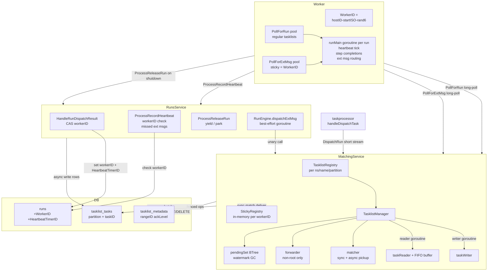
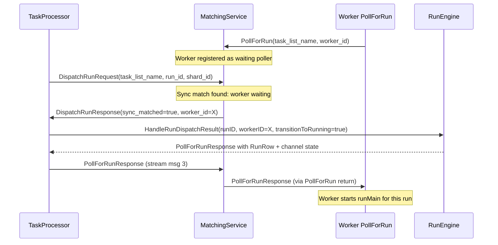
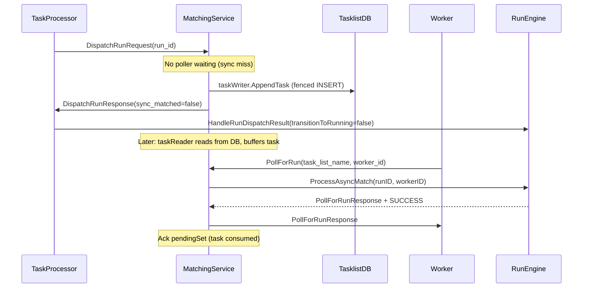
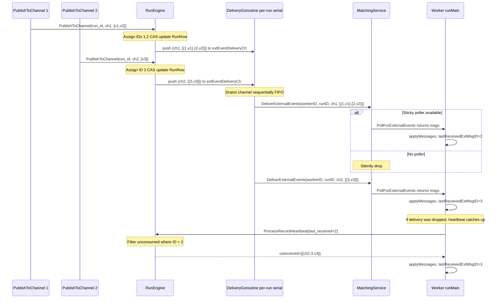
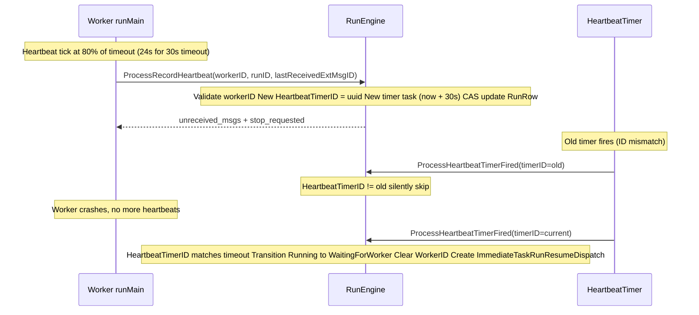
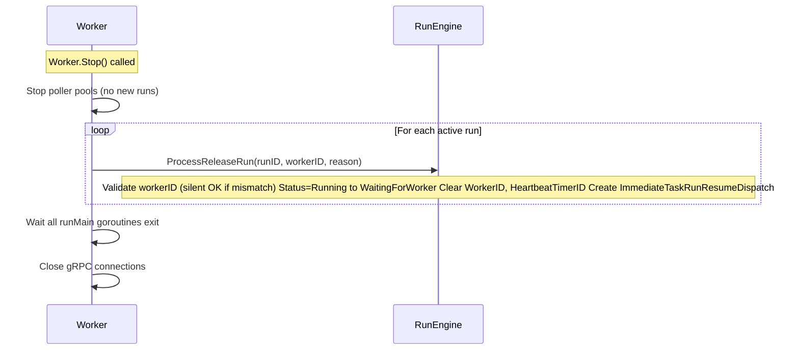

# Matching Tasklist Redesign

## 1. Overview

This document describes a complete rewrite of the dex matching subsystem from a group-based bidirectional-stream architecture to a Cadence-style tasklist + long-poll architecture.

**Primary motivation**: The current design uses bidirectional gRPC streams between workers and the matching service for run dispatch, heartbeat, and external message delivery. When the matching service restarts, all streams break and workers lose their run assignments. The new design makes workers resilient to matching service restarts because heartbeat and step completions go directly to RunsService, not through matching.

**Key changes**:
- Group matching replaced by DB-backed tasklists with rangeID fencing
- Bidirectional streams replaced by long-poll APIs (PollForRun, PollForExternalEvents)
- Server-push heartbeat replaced by worker-driven ProcessRecordHeartbeat
- External message delivery uses best-effort sticky tasklist + heartbeat catch-up guarantee
- WorkerID exclusivity prevents a run from being executed by two workers simultaneously



## 2. Key Design Decisions

1. **Sticky tasklist is pure in-memory**: No DB, no rangeID/ackLevel. Matching service process-internal map, lazy-created on first PollForExternalEvents, cleanup loop removes idle entries.
2. **`group_id` renamed to `task_list_name` everywhere**: proto, RunRow, web BFF, UI, history events.
3. **Hard cutover** (no backward compat): Project has not launched yet. Single PR sequence, no transition period.

## 3. Core Invariants

### Invariant 1: TaskID Encoding

`TaskID = (int64(rangeID) << 32) | int64(localSeq)`

- `rangeID` is int32, assigned by `ClaimTasklist`, never renewed. Panic on overflow (same as shard_manager).
- `localSeq` is int32, monotonically incrementing per owner, reset on ownership change.
- Single goroutine writer assigns taskIDs. Mutex held from seq allocation through DB write commit, ensuring DB visibility implies all prior IDs are committed.

### Invariant 2: maxReadableTaskID

- `atomic.Int64`, writer calls `Store` after DB batch write succeeds.
- Reader calls `Load` each cycle as upper bound for `GetTasks`.
- Reader never reads beyond what writer has written. Zero unnecessary DB I/O.

### Invariant 3: rangeID Fence on All Writes

- `ClaimTasklist`, `UpdateTasklistMetadata(ackLevel)`, `CreateTasks` (batch INSERT) all carry `WHERE range_id = :expected` CAS.
- Read paths (`GetTasks`, `DeleteTasksLessThan`) do NOT fence — new owner must drain old owner's tasks.
- Fence failure triggers self-eviction: manager calls `Stop()`, clears local state.

### Invariant 4: WorkerID Exclusivity

- `RunRow.WorkerID` is set atomically by `HandleRunDispatchResult` when transitioning to Running.
- All worker-to-server APIs (`ProcessRecordHeartbeat`, `ProcessStepExecuteCompleted`, `ProcessStepWaitForCompleted`, `ProcessStepsUnblocked`, `ProcessReleaseRun`) validate `WorkerID` matches. Mismatch returns `WorkerMismatchError`, worker stops the run.
- Server-internal `ProcessHeartbeatTimerFired` does NOT validate WorkerID; it only checks `HeartbeatTimerID` match. Mismatch means heartbeat was renewed — silently skip. Match means timeout — transition to WaitingForWorker.

### Invariant 5: Ack Timing and Async Match Protocol

PendingSet ack happens AFTER successful delivery to worker. `BTree.Min() - 1` is the watermark; GC deletes task rows with `taskID <= watermark`.

**Async match flow** (per task, in PollForRun handler):
1. Matcher pulls task from taskReader buffer, finds waiting poller (worker).
2. Calls `runsClient.ProcessAsyncMatch(runID, workerID)` → CAS to Running with workerID + heartbeat timer → returns `PollForRunResponse`.
3. Delivers `PollForRunResponse` to worker via PollForRun return.
4. Delivery success → ack pendingSet (task consumed).

**Failure fallback**: Step 2 returns gRPC error → push task back to taskReader buffer (pendingSet NOT acked). Step 3 delivery failed → push task back.

**Idempotency**: `ProcessAsyncMatch` returns `AsyncMatchOutcome`:
- `SUCCESS`: Run transitioned to Running, response valid.
- `STALE_SUCCESS`: Run already Running with different worker / terminal. Matcher acks and drops.
- gRPC error: Transient store failure. Matcher pushes task back to buffer.

**Orphan run recovery**: If step 2 succeeded but step 3 failed, run is Running without a worker. Next `ProcessAsyncMatch` sees "Running with different workerID" → STALE_SUCCESS → ack. Heartbeat timer (~30s) fires → WaitingForWorker → new dispatch.

### Invariant 6: Heartbeat Monotonic Advance

Each `ProcessRecordHeartbeat` generates a new `HeartbeatTimerID`. Old timer fires check ID mismatch → silently skip.

### Invariant 6a: Sync Match Protocol

DispatchRun is a short server-stream with 3 messages. The worker's `worker_id` is propagated from the `PollForRun` handler back to the `DispatchRun` handler via the server-internal `Task.workerIDCh` channel:

```
Step 1:  caller (taskprocessor)  --DispatchRunRequest-->  matching
Step 2:  matching tries sync match (matcher.Offer)
  HIT:   matching  reads <-syncTask.workerIDCh (poller's worker_id)
         matching  --DispatchRunResponse{sync_matched=true, worker_id=X}-->  caller
         caller calls HandleRunDispatchResult(workerID=X) → Running + heartbeat timer
         caller builds PollForRunResponse from returned RunRow
         caller  --PollForRunResponse-->  matching
         matching pushes PollForRunResponse to syncTask.pollDeliveryCh
         poller's PollForRun returns PollForRunResponse to worker
         matching  --close stream-->  caller
  MISS:  matching writes task to DB via taskWriter (root or stand-alone partition)
         OR forwards to root via transparent relay (non-root partition)
         matching  --DispatchRunResponse{sync_matched=false}-->  caller (when local + forward both miss)
         caller HandleRunDispatchResult(transitionToRunning=false)
         matching  --close stream-->  caller
```

Worker sees the same `PollForRunResponse` format regardless of sync vs async path. See **Tasklist Partitioning + Forwarding** for the relay protocol when a non-root partition forwards to root.

### Invariant 7: Per-Run Serialization

Worker's `runMain` goroutine handles ALL RunsService calls serially via channel-based event loop. **Worker** increments `worker_request_counter` before each call. Server validates:

```
request.counter == runRow.WorkerRequestCounter     → already processed (idempotent no-op, return success)
request.counter == runRow.WorkerRequestCounter + 1 → proceed (normal case, server $set counter to request.counter on CAS success)
request.counter >  runRow.WorkerRequestCounter + 1 → BUG (server logs error + rejects)
request.counter <  runRow.WorkerRequestCounter     → stale (reject with error)
```

This applies to ALL worker→server APIs including `ProcessRecordHeartbeat` (e.g. heartbeat timeout + worker retry would create duplicate timer tasks without idempotency check). Zero CAS conflicts per run because runMain serializes all calls.

### Invariant 8: External Message Guaranteed Delivery

Best-effort delivery + piggyback catch-up on ALL worker-to-server APIs.

**Schema**: `RunRow.UnconsumedChannelMessages` changes from `map[string][]Value` to `map[string][]ChannelMessage{ID int64, Value Value}`.

**Publish**: One `PublishToChannel` with N values → `ExternalChannelMessageCounter += N`. Value i gets `ID = counterBefore + i + 1`.

**FIFO best-effort delivery via unified `extEventDispatcher`**: External events of multiple types (channel messages, stop requests, future event types) share a single sticky-routed delivery channel per run. This means workers only need ONE poller pool for all out-of-band signals (`PollForExternalEvents`), not separate pollers per event type. The RunEngine uses an `extEventDispatcher` component:

```go
type ExternalEvent struct {
    // oneof: ChannelMessagesReceived OR StopRequested OR (future)
    ChannelMessagesReceived *channelMessagesReceived
    StopRequested           *stopRequested
}

type extEventDispatcher struct {
    matchingClient pb.MatchingServiceClient
    mu             sync.Mutex
    runners        map[string]*extEventRunner  // key: ns/runID
}

type extEventRunner struct {
    ch       chan ExternalEvent  // buffered (configurable ExtEventDeliveryBufferSize, default 256)
    stopOnce sync.Once
    done     chan struct{}
}
```

**Triggers** (events pushed into runner's channel):
- `PublishToChannel` succeeds and run is Running → push `ChannelMessagesReceived{chName, [{ID,Value}, ...]}`
- `StopRun` succeeds and run is Running → push `StopRequested{}` (best-effort; run row already CAS'd to Completed or Failed per `stop_decision`)
- (future event types: e.g. priority bump, drain request, etc.)

**Lifecycle**:
1. **Start**: On first event for a Running run, `extEventDispatcher.Send(ns, runID, workerID, event)` lazily creates an `extEventRunner` with a buffered channel and spawns a goroutine that drains the channel sequentially, batching events into `matchingClient.DeliverExternalEvents` calls in FIFO order.
2. **Send**: Push `ExternalEvent` into the runner's channel. **Non-blocking**: if the channel is full, the event is silently dropped. Recovery paths:
   - Channel messages: heartbeat catch-up via `unreceived_external_channel_messages` in `WorkerCallResponse`.
   - Stop request: `WorkerCallResponse.stop_requested` when `run.status` is terminal (Completed/Failed), on next heartbeat or step completion.
   Both paths self-heal within ~24s (one heartbeat interval) at the latest.
3. **Idle shutdown**: The delivery goroutine exits when it has drained the channel **and** no new event arrives within an idle timeout (e.g. 5s). On exit, it removes itself from the `runners` map. A subsequent event for the same run lazily creates a new runner.
4. **Run leaves Running**: When a run transitions out of Running (heartbeat timeout, ProcessReleaseRun, completion, stop), the RunEngine calls `extEventDispatcher.StopRunner(ns, runID)` which closes the runner's channel. The goroutine drains remaining buffered events (best-effort), then exits.

This guarantees FIFO delivery, no goroutine leak, no global lock contention, and unified handling of all out-of-band signals through a single worker poller pool.

**Piggyback catch-up**: All worker-to-server API requests carry `last_received_external_channel_message_id`. Responses carry `unreceived_external_channel_messages`. Applies to: `ProcessRecordHeartbeat`, `ProcessStepExecuteCompleted`, `ProcessStepWaitForCompleted`, `ProcessStepsUnblocked`, `ProcessReleaseRun(all_steps_waiting)`.

**Shared helper**:
```go
func computeUnreceivedExternalMessages(run *RunRow, lastReceivedID int64) []*UnreceivedChannelMessage {
    var missed []*UnreceivedChannelMessage
    for chName, msgs := range run.UnconsumedChannelMessages {
        for _, m := range msgs {
            if m.ID > lastReceivedID {
                missed = append(missed, &UnreceivedChannelMessage{
                    ChannelName: chName, Id: m.ID, Value: m.Value,
                })
            }
        }
    }
    sort.Slice(missed, func(i, j int) bool { return missed[i].Id < missed[j].Id })
    return missed
}
```

**Worker-side out-of-order handling**: Because the server-side delivery channel may drop messages under backpressure, the worker may receive non-contiguous message IDs from `PollForExternalEvents` (e.g. receives ID=1 then ID=3, missing ID=2). The worker handles this by:
1. **Ignoring out-of-order messages**: If a received message has `ID != lastReceivedExtMsgID + 1`, the worker discards it (does not apply to local channel state, does not advance `lastReceivedExtMsgID`). This prevents the worker from building incorrect local channel state with missing entries.
2. **Relying on catch-up for gap fill**: On the next `ProcessRecordHeartbeat` or step completion call, `last_received_external_channel_message_id` still points to the gap's predecessor. Server returns all unreceived messages (including the dropped one) sorted by ID ASC. Worker applies them in order, restoring contiguous state.
3. **Contiguous messages are applied immediately**: If received ID == `lastReceivedExtMsgID + 1`, the worker applies it to local channel state and advances the watermark. This is the common case (no drops).

This guarantees the worker's local channel state is always a contiguous prefix of the server's `UnconsumedChannelMessages`, and any gaps self-heal within one heartbeat interval (~24s) or on the next step completion RPC.

**New worker takeover**: `last_received = 0` on first API call → server returns all unconsumed messages → worker rebuilds channel state. Same mechanism for catch-up and state recovery.

## 4. RPC Protocol Reference

### MatchingService RPCs

| RPC | Type | Description |
|-----|------|-------------|
| `PollForRun` | Unary long-poll (30s) | Worker sends `task_list_name` + `worker_id`. Server picks read partition, blocks waiting. Returns `PollForRunResponse` or empty. |
| `DispatchRun` | Short server-stream (3 msgs) | Taskprocessor dispatches run. Sync match returns `worker_id` to caller, caller pushes `PollForRunResponse` back. Async miss writes to DB. |
| `DeliverExternalEvents` | Unary best-effort | RunEngine spawns goroutine to deliver to worker's sticky tasklist. Returns `delivered` bool. |
| `PollForExternalEvents` | Unary long-poll (30s, sticky) | Worker polls using `workerID` as sticky tasklist name. Returns messages or empty on timeout. |

### RunsService RPCs (New/Changed)

| RPC | Type | Description |
|-----|------|-------------|
| `ProcessAsyncMatch` | Unary | Replaces `BatchProcessAsyncMatch`. Per-run CAS to Running + heartbeat timer. Returns `PollForRunResponse` + `AsyncMatchOutcome` (SUCCESS / STALE_SUCCESS). gRPC error = transient, matcher pushes task back into taskBuffer (pendingSet not acked). |
| `ProcessRecordHeartbeat` | Unary | Worker heartbeat. Validates workerID, renews HeartbeatTimerID, returns missed messages + `stop_requested` (true when run status is terminal). |
| `StopRun` | Unary | Client stops a run: `stop_decision` (COMPLETE/FAIL) + optional `reason` → CAS to terminal status + `RunStop` history. Best-effort `StopRequested` push to worker. |
| `ProcessReleaseRun` | Unary | Worker shutdown (`yield_to_another_worker`) or park (`all_steps_waiting`). |

### Shared Protocol Patterns

```protobuf
message WorkerCallContext {
  string worker_id = 1;
  int64 last_received_external_channel_message_id = 2;
  int64 worker_request_counter = 3;  // idempotency; server rejects if <= RunRow.WorkerRequestCounter
}

message WorkerCallResponse {
  repeated UnreceivedChannelMessage unreceived_external_channel_messages = 1;
  bool stop_requested = 2;
}
```

All worker-to-server API requests embed `WorkerCallContext`. All responses embed `WorkerCallResponse`. `worker_request_counter` provides idempotency for ALL worker→server APIs — worker increments before each call, server validates `request == runRow+1` to proceed.

**Long-poll safety buffer**: Both `PollForRun` and `PollForExternalEvents` return empty when remaining time < 5s (configurable `LongPollSafetyBuffer`).

## 5. Sequence Diagrams

### 5.1 DispatchRun Sync Match



### 5.2 DispatchRun Async Miss + PollForRun Pickup



### 5.3 External Message Delivery



### 5.4 Worker Heartbeat + Timeout



### 5.5 Worker Shutdown



## 6. Component Architecture

### TaskID Encoding

| Component | Type | Description |
|-----------|------|-------------|
| `rangeID` | int32 | Assigned by `ClaimTasklist`, incremented on each claim. Panic on overflow. |
| `localSeq` | int32 | Per-owner monotonic counter, reset on ownership change. Panic on overflow. |
| `taskID` | int64 | `(int64(rangeID) << 32) \| int64(localSeq)` — globally unique, strictly increasing per partition. |

### Tasklist Naming

| Partition | Name Format | Example |
|-----------|-------------|---------|
| Root (partition 0) | `<name>` | `payment` |
| Sub-partition i | `/__dex_sys/<name>/<i>` | `/__dex_sys/payment/2` |

Default: 4 partitions (configurable per namespace/tasklist via `NumWritePartitions` + `NumReadPartitions`). Only two levels: root + leaves (no intermediate tree nodes).

### WorkerID Format

Format: `<hostID>-<startTimeISO>-<rand6>`
Example: `host-001-20260426T103744Z-a3f9b2`

- Same string used as sticky tasklist name.
- Worker never sends hostID separately; server treats WorkerID as opaque string.
- 6-char `[a-z0-9]` suffix provides ~2 billion variants.

### Ownership Three-Layer Defense

| Layer | Type | Mechanism |
|-------|------|-----------|
| L1 | Optimization | Membership change subscription → preemptively shut down non-owned tasklists |
| L2 | Correctness | rangeID fence on all writes → DB rejects stale owner → self-evict |
| L3 | Prevention | GetOrCreateManager ownership guard → check ringpop before creating TasklistManager |

### Tasklist Partitioning + Forwarding

- **Server-side only**: Worker SDK never sees partition names.
- **Partition selection**: owned by the `Registry` (`ResolveWritePartition` / `ResolveReadPartition`, backed by `LoadBalancer`). The thin matching handler asks the Registry to resolve a partition, then does ownership routing only.
- **Non-root forwarder** (lives entirely in `tasklist/forwarder.go`):
  - `ForwardTask` is the DispatchRun **stream relay**: invoked by `Manager.DispatchRun` (which holds the gRPC stream) on a local sync-match miss. It dials root via `clientForRoot()` and pumps the 3-message protocol (incl. msg3 `PollForRunResponse`). On root match it drives the upstream stream and returns `handled=true`; on root miss it leaves upstream untouched and returns `handled=false` so the caller writes locally exactly once.
  - `ForwardPoll` is the poll fan-in: invoked by `matcher.Poll` carrying the **real worker_id** so root binds the dispatch to the correct worker.
- Token-based concurrency limiter (default `MaxOutstandingTasks=1`) + rate limiter (default `MaxRatePerSecond=10`).

#### Verb Conventions (forward / relay / route)

Two **orthogonal** routing concepts coexist. To keep the codebase
legible, distinct verbs are used:

| Verb | Concept | Where | Example |
|------|---------|-------|---------|
| **forward** | Partition-tree fan-in (sub-partition → root partition). Independent of which physical node owns either side. Includes the DispatchRun stream relay (`ForwardTask`, which pumps all 3 messages incl. msg3) and the poll fan-in (`ForwardPoll`). | `tasklist.forwarder.ForwardTask` / `ForwardPoll` (the ONLY place partition fan-in lives) | non-root partition X has no local poller → relay the dispatch stream to root for sync-match consolidation |
| **route** | Node-ownership routing (this node → owner of the partition). Independent of partition tree position. | `routeDispatchToOwner` / `routePollToOwner` in `matching_service.go` | this node received PollForRun for partition 2, but partition 2 is owned by another node — route via Membership + ClientPool |

The two compose: a partition-forwarded request whose target is the root
partition may still need to be **routed** across nodes if root's owner
is elsewhere. Each layer is single-purpose and the verb naming makes
that explicit.

> Note: there is no separate handler-level `relayDispatchToRoot` anymore.
> The DispatchRun fan-in relay was consolidated into
> `forwarder.ForwardTask`, invoked by `Manager.DispatchRun` (which owns
> the gRPC stream). This dedupes root-owner resolution (`clientForRoot`)
> and removes a latent double-send-on-miss bug.

#### Forwarding Protocol (`forwarded_from_partition`)

Both `PollForRunRequest` and `DispatchRunRequest` carry an optional `forwarded_from_partition` string. Empty for normal client requests; non-empty (= the forwarding partition's wire name) when the matching service itself is forwarding internally. The receiver's behavior is altered in **one specific way per RPC**:

**`PollForRun` forwarded → root behaves non-blocking.** Root tries an immediate sync match / async pickup (TryPoll, no waiting). If nothing is ready, root returns an empty `PollForRunResponse`. The forwarding non-root partition's `matcher.Poll` consumes this result **sequentially, not as a concurrent race**: quick local `TryPoll` → one `ForwardPoll` to root (consumed inline if non-nil) → block on local sources for the rest of the long-poll. This eliminates the previous buffered(1) drop where a task root already committed to this worker could be discarded when a local source won the race. The forwarded poll carries the **real worker_id** so root's `ProcessAsyncMatch` / sync-match binds the dispatch to the correct worker.

**`DispatchRun` forwarded → the relay is `forwarder.ForwardTask`.** `Manager.DispatchRun` (which holds the gRPC stream) calls `forwarder.ForwardTask` on a local miss. It opens an outbound `DispatchRun` stream to root, sets `forwarded_from_partition`, and pumps every message in both directions:

```
TP (caller)         Non-root (relay)            Root (sync-match-only)
   |  Request          |                            |
   |─────────────────►| matcher.Offer local: miss   |
   |                  | open outbound stream, set   |
   |                  | forwarded_from_partition    |
   |                  |───────────────────────────►| matcher.Offer local
   |                  |                            | poller.workerIDCh → wid
   |                  |◄──── Resp{matched, wid} ───|
   |◄─── Resp{matched, wid} ──|                    |
   | TP calls HandleRunDispatchResult(wid)         |
   | builds PollForRunResponse                        |
   |─── PollRunResp ─►|                            |
   |                  |───── PollRunResp ─────────►|
   |                  |                            |─► poller.pollDeliveryCh
                                                       worker receives
```

Root's sole forwarded-mode behavior (enforced by `Manager.DispatchRun`'s forwarded branch): **on sync match miss, return `sync_matched=false` WITHOUT writing to its own DB**. The non-root then writes the task to its own DB as the async fallback — exactly once. This avoids duplicate DB rows.

Why not have root call `RunsService.ProcessAsyncMatch` for forwarded requests? Because the original upstream caller (taskprocessor) is still alive on the stream and has the `RunEngine` reference; it does its normal `HandleRunDispatchResult` regardless of whether non-root or root's poller actually got the task. The forwarder is a relay, not a substitute caller. `ProcessAsyncMatch` is reserved exclusively for the async pickup path (poller pulls a row from a tasklist that was async-written).

#### `Task.workerIDCh` (Server-Internal)

To support the matching handler returning the matched poller's `worker_id` in `DispatchRunResponse`, the server-internal `Task` struct carries a bidirectional rendezvous:

```go
type Task struct {
    ...
    pollDeliveryCh chan *pb.PollForRunResponse  // forward: offerer → poller (the response)
    workerIDCh     chan string               // backward: poller → offerer (worker identity)
}
```

Used in **all** sync match paths (forwarded and non-forwarded):
- Offerer (`DispatchRun` handler) calls `matcher.Offer(syncTask)`.
- Poller's `PollForRun` handler receives the task via `matcher.Poll`, sees `IsSyncMatch()`, and writes its `worker_id` to `task.workerIDCh`.
- Offerer reads `<-task.workerIDCh`, populates `DispatchRunResponse.worker_id`, sends to caller.
- Caller's msg3 `PollForRunResponse` flows back through the offerer to `task.pollDeliveryCh` → poller returns it to the worker.

This is **not** a proto change — it's a Go-level channel inside the matching service.

### Sticky Tasklist (External Messages)

- Pure in-memory, no DB, no fence.
- Key = workerID.
- Only sync match (best-effort delivery).
- Cleanup loop removes idle entries (no pollers for configurable minutes).
- Guaranteed delivery via heartbeat catch-up, not via sticky tasklist persistence.

## 7. Schema Changes

### New Collection

**`tasklist`** (single collection for both metadata and tasks, same pattern as `group_async`)

- **Shard key**: `{ tasklist_key: "hashed" }` where `tasklist_key = "<ns>/<name>/<partitionID>"`. All rows for a single tasklist partition (metadata + all task rows) land on the **same Atlas shard**, enabling **single-shard transactions** for fenced operations (no cross-shard 2PC overhead).
- **Deterministic `_id` construction** (same trick as `group_async`):
  - Metadata row: `_id = "m/<tasklist_key>"`, `row_type = 1`, fields: `range_id` (int32), `ack_level` (int64), `owner_member_id`, `owner_address`, `claimed_at`
  - Task row: `_id = "t/<tasklist_key>/<task_id>"`, `row_type = 2`, fields: `task_id` (int64), `run_id`, `shard_id`, `created_at`
  - Same `_id` pattern as group_async ensures docs sharing a tasklist_key land in the same chunk; per-chunk `_id` uniqueness (Mongo built-in) covers the global uniqueness without a separate compound index.
- **Indexes**:
  - `{ tasklist_key: 1, row_type: 1, task_id: 1 }` — serves `GetTasks` range scan
  - `{ tasklist_key: "hashed" }` — required for sharding
- **Why single collection + single-shard transaction**:
  - `CreateTasks` does `UpdateOne` on metadata row (fence-check `range_id`) + `InsertMany` on task rows in one `session.WithTransaction`. Because all rows share `tasklist_key` and hash to the same shard, this is a **single-shard transaction** — no two-phase commit, ~5-10× faster than cross-shard 2PC under load.
  - Cross-collection or cross-shard transactions would require Mongo's distributed transaction protocol (slower, more conflict potential).
- **Reference**: see `server/internal/persistence/mongo/schema/v0.js` for the `tasklist` collection's index/sharding setup. The original `group_async` design (now removed) used the same deterministic-`_id` + hashed-prefix-key pattern this collection inherits.

### RunRow Changes

| Change | Before | After |
|--------|--------|-------|
| Field rename | `group_id` | `task_list_name` |
| New field | — | `worker_id` (string) |
| Type change | `UnconsumedChannelMessages map[string][]Value` | `map[string][]ChannelMessage{ID int64, Value Value}` |
| Algorithm | `ExternalChannelMessageCounter += 1` per publish | `+= N` per publish (N = number of values) |

### Deleted

- `group_async` collection
- `Group`, `AsyncMatchRun`, `AsyncMatchDeleteEntry`, `GroupStore` types

## 8. Configuration

### TasklistConfig (new)

| Field | Type | Default | Description |
|-------|------|---------|-------------|
| `Mode` | string | `"single"` | `"single"` or `"cluster"` |
| `Cluster` | ClusterConfig | — | Gossip/ring settings for cluster mode |
| `NumWritePartitions` | int | 4 | Default write partitions per tasklist |
| `NumReadPartitions` | int | 4 | Default read partitions per tasklist |
| `PerTasklistOverrides` | map[ns]map[name]Override | — | Per namespace + tasklist name partition overrides |

### MatchingEngineConfig (additions)

| Field | Type | Default | Description |
|-------|------|---------|-------------|
| `MaxTaskWriteBatchSize` | int | 100 | Max tasks per batch INSERT (writer drain) |
| `MaxTaskReadBatchSize` | int | 100 | Max tasks per GetTasks DB call (reader fetch) |
| `MaxTaskDeleteBatchSize` | int | 100 | Max tasks per GC DELETE |
| `MaxTimeBetweenTaskDeletes` | Duration | 1m | GC time threshold |
| `UpdateAckInterval` | Duration | 10s | Ack level persist interval |
| `LongPollDefaultTimeout` | Duration | 30s | Default long-poll timeout |
| `LongPollSafetyBuffer` | Duration | 5s | Return empty when time remaining < this |
| `ForwarderMaxOutstandingTasks` | int | 1 | Max concurrent task forwards |
| `ForwarderMaxOutstandingPolls` | int | 1 | Max concurrent poll forwards |
| `ForwarderMaxRatePerSecond` | int | 10 | Forward rate limit |
| `MembershipChangeBufferSize` | int | 1000 | Membership event channel buffer |

### RunEngineConfig (additions)

| Field | Type | Default | Description |
|-------|------|---------|-------------|
| `HeartbeatTimerDuration` | Duration | 30s | Timer task fire delay |
| `ExtEventDeliveryBufferSize` | int | 256 | Per-run delivery channel buffer |

### Worker SDK Config

| Field | Type | Default | Description |
|-------|------|---------|-------------|
| `RunConcurrency` | int | 100 | Max concurrent in-flight runs. Implemented as a counting semaphore: a poller acquires a slot before issuing PollForRun, hands it to runMain on receipt, runMain releases on exit. |
| `ConcurrentRunPollers` | int | 10 | Number of goroutines long-polling PollForRun. All gated on the RunConcurrency semaphore; setting above RunConcurrency has no effect. |
| `ConcurrentExternalEventPollers` | int | 2 | Number of goroutines long-polling PollForExternalEvents on the sticky tasklist; >1 smooths the reconnect gap. |
| `HeartbeatInterval` | Duration | 8s | Worker→server heartbeat tick. Server's HeartbeatTimerDuration must be > 2× this. |

## 9. Worker SDK Architecture

### WorkerID Generation

```go
func generateWorkerID() string {
    hostID := sanitizeHostID(getHostID())
    startISO := time.Now().UTC().Format("20060102T150405Z")
    randSuffix := randAlphaNumeric(6)
    return fmt.Sprintf("%s-%s-%s", hostID, startISO, randSuffix)
}
```

### Poller Pools

Two independent fixed-size poller pools (no dynamic scaling — each
poller is cheap, and we already get back-pressure from the
`RunConcurrency` semaphore):

- **PollForRun pool** (`ConcurrentRunPollers` goroutines, default 10):
  each iteration acquires a slot from the `RunConcurrency` semaphore
  (capacity 100 by default), long-polls
  `MatchingService.PollForRun(ns, taskListName, workerID)`, and on
  receipt spawns a `runMain` goroutine that releases the slot on exit.
  When all slots are held by active runs, every poller blocks on the
  semaphore — the server sees no available worker and queues the
  dispatch.
- **PollForExternalEvents pool** (`ConcurrentExternalEventPollers`
  goroutines, default 2): long-polls
  `MatchingService.PollForExternalEvents(ns, workerID)` on the sticky
  tasklist; routes received events to the corresponding `runMain` via
  per-run inbox channels (registered/deregistered by `runMain`).
  Running >1 poller is a redundancy knob — when one poll returns and
  the next has not yet been issued, the other is still subscribed, so
  pushed events land within tens of ms even mid-rotation. Missed
  events still self-heal via `WorkerCallResponse` catch-up on the next
  worker→server unary, so this knob is purely a latency optimization.

### runMain Goroutine

Single goroutine per run, processes events serially:

```go
type runMain struct {
    runID, workerID, namespace string
    heartbeatTickCh   <-chan time.Time
    stepCompletedCh   chan stepResult
    extMsgReceivedCh  chan extMsgEvent
    stopCh            chan struct{}
    lastReceivedExtMsgID int64
}
```

All RunsService API calls go through `callRunService` wrapper that auto-injects `WorkerCallContext` (including `worker_request_counter`) and processes `WorkerCallResponse` (catch-up + stop_requested + worker_mismatch).

### External Message Handling at Worker

Worker only applies messages with contiguous IDs (`ID == lastReceivedExtMsgID + 1`). Out-of-order messages from best-effort delivery are discarded. Catch-up via heartbeat or step completion fills gaps. Worker's local channel state is always a contiguous prefix of the server's truth.

### Shutdown Path

1. Stop poller pools (no new runs).
2. For each active run: signal `runMain.stopCh`.
3. `runMain` calls `ProcessReleaseRun(yield)` then exits.
4. Wait all `runMain` goroutines exit.
5. Close gRPC connections.

## 10. Test Plan

### Persistence Layer
- ClaimTasklist: first claim + steal with rangeID increment
- CreateTasks: fenced reject + batch insert + taskID contiguity
- GetTasks: range read boundaries
- DeleteTasksLessThan: batch + limit
- UpdateTasklistMetadata: fenced reject + pass

### Tasklist Components
- **taskWriter**: opportunistic batching, taskID contiguity, maxReadableTaskID visibility, fence failure stops
- **taskReader**: FIFO buffer backpressure, maxReadableTaskID respect, empty read advances readLevel, push-back via blocking send
- **pendingSet**: watermark advance, GC size/time thresholds, shutdown drain
- **matcher**: sync match handoff, PollForRunResponse round-trip, async pickup FIFO, push-back to taskBuffer on delivery failure, stale success ack
- **forwarder**: token limit, rate limit, root refuses
- **manager**: start/stop lifecycle, graceful drain, fence failure stop
- **registry**: lazy create, membership change release, GetOrCreateManager ownership guard, partition resolution (LoadBalancer)
- **sticky_registry**: deliver best-effort, no-poller drops, idle cleanup

### RunEngine
- HandleRunDispatchResult: WorkerID CAS (same passes, different fails)
- ProcessRecordHeartbeat: happy path, worker mismatch, status mismatch, missed messages
- ProcessReleaseRun: yield happy path, all_steps_waiting park, worker mismatch silent
- HeartbeatTimer: ID match/mismatch
- External message: best-effort FIFO delivery, heartbeat catch-up, out-of-order discard at worker
- Stop request: via any worker-to-server API response
- Step completion piggyback: catch-up across all 3 step handlers
- WorkerRequestCounter idempotency

### Integration (E2E)
- DispatchRun sync match: PollForRunResponse reaches worker
- DispatchRun async write + pickup
- Partitioning round-robin
- Forwarding non-root to root
- Membership change: tasklist transfer + fence rejection
- **Worker survives matching service restart** (primary motivation)
- Heartbeat catch-up of missed external messages
- WorkerID exclusivity: two-worker CAS protection
- Sticky tasklist + external message end-to-end
