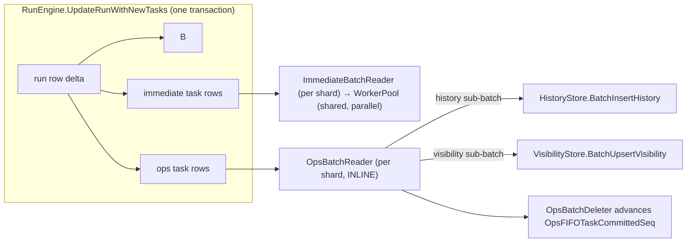

# OpsFIFO Queue Design

The OpsFIFO queue is the third per-shard task queue (alongside immediate
and timer) that drains observability writes — visibility upserts and
history event inserts — from the engine's transactional outbox into the
visibility + history downstream stores. It exists because we want
observability to be **strictly ordered per run** and **decoupled from
the engine commit's request latency**, without sacrificing per-run
correctness.

## 1. Why a Third Queue (vs. ImmediateTask)

ImmediateTask is fan-out / parallel: tasks read from the queue go to a
shared worker pool and run concurrently. That's correct for run dispatch
(every run is independent) but WRONG for observability:

- Two visibility upserts for the same run could land out of order →
  the visibility view shows a stale status.
- Two history events for the same run could insert out of order → the
  per-run event log is interleaved nonsensically.

OpsFIFO is **inline + per-shard FIFO** — there is no worker pool, the
reader processes one batch at a time, and a run is always on a single
shard. Shard-FIFO ⊃ run-FIFO.



## 2. Row Layout

`OpsFIFOTaskRow` is `RowType=4` in the unified `runs` collection, indexed
by the existing `pk_idx (shard_id, row_type, namespace, sort_key, id)`.

| Field                | Notes                                                            |
|----------------------|------------------------------------------------------------------|
| `shard_id`           | Same as the run's shard.                                         |
| `row_type`           | 4 (RowTypeOpsFIFOTask).                                          |
| `namespace`          | Empty (matches the immediate / timer convention).                |
| `sort_key`           | Per-shard OpsFIFO `TaskSeq = (RangeID<<32) \| LocalSeq`.         |
| `id`                 | UUID; tie-breaker on the index.                                  |
| `task_type`          | `OpsFIFOTaskHistoryWrite` or `OpsFIFOTaskVisibilityWrite`.       |
| `history_payload`    | Set when `task_type == HistoryWrite`. Includes the pre-allocated `event_id`. Carries blob_id refs only — every `pb.Value{EncodedObject}` inside the embedded `pb.History*Payload` was rewritten in place to `pb.Value{EncodedObjectBlobIdInternalOnly}` by the engine's `pb.Value -> p.Value` converter at the call site, so the OpsFIFO row never balloons with raw blob bytes. See [history-store-design.md §6 "Blob extraction"](history-store-design.md). |
| `visibility_payload` | Set when `task_type == VisibilityWrite`.                         |
| `created_at`         | Used for the `ops_fifo_task_lag_latency` histogram.              |

## 3. Sequence Allocation

The OpsFIFO uses an INDEPENDENT per-shard mutex + atomic counter from the
immediate task queue (`shardState.opsFIFOTaskSeqMu` +
`shardState.opsFIFOLocalSeq`). Independent because:

- The two outboxes have very different write patterns (immediate is
  bursty during dispatch; OpsFIFO is one or two rows per state change). A
  shared lock would couple them artificially.
- Lock ordering is fixed: `ShardedRunStore.write` always acquires the
  immediate lock before the OpsFIFO lock, so deadlock-free even when both
  queues need allocation in the same `UpdateRunWithNewTasks` call.

`TaskSeq = (RangeID << 32) | LocalSeq` — same encoding as immediate, so
the per-shard monotonic-visibility argument from
[`docs/task-processing-design.md`](task-processing-design.md) applies
unchanged: any commit visible to the reader at seq=k implies all
commits with seq<=k are visible too, which is what makes the
`afterSeq` cursor sound.

## 4. Engine Integration: Where OpsFIFO Tasks Are Enqueued

Every state-changing engine call site appends 0–3 `OpsFIFOTaskRow` entries
to the `newTasks` slice it hands to `UpdateRunWithNewTasks` /
`CreateRunWithTasks`. The matrix:

| Call site                              | Visibility | History event(s)                                          |
|----------------------------------------|------------|------------------------------------------------------------|
| `StartRun`                            | yes (Pending) | `RunStart`                                              |
| `StopRun`                             | yes (Completed or Failed per `stop_decision`) | `RunStop` (includes optional user `reason`)              |
| `ProcessStepExecuteCompleted`          | iff status changed | `StepExecuteCompleted` + `RunStop` if terminal     |
| `ProcessStepWaitForCompleted`          | iff status changed | `StepWaitForCompleted`                            |
| `ProcessExternalChannelMessagesReceived` | iff status changed | `ChannelPublish`                                |
| `BatchProcessAsyncMatch` (per run)     | iff status changed | none                                              |
| `HandleRunDispatchResult`              | iff status changed | none                                              |
| `ProcessHeartbeatTimerFired` (heartbeat-failed path) | yes (WaitingForWorker) | none                                  |
| `ProcessStepWaitForTimerFired`         | iff status changed | none                                              |

The per-event helper lives in
[`server/internal/engine/ops_tasks.go`](../server/internal/engine/ops_tasks.go)
(`opsTaskBuilder`). It also bumps `RunRow.LastHistoryEventID` so the
allocated event IDs are committed atomically with the run state delta —
see [history-store-design.md §3](history-store-design.md#3-per-run-event_id-allocation).

## 5. Reader Loop (Inline)

```text
for !ctx.Done() && !shutdown:
  tasks = RangeReadOpsFIFOTasks(afterSeq=lastSeq, limit=OpsBatchReadLimit)
  if len(tasks) == 0:
    wait on newOpsFIFOCh OR OpsPollInterval (safety net)
    continue
  observeFIFOLag(tasks)
  history, visibility = splitOpsBatch(tasks)
  visibility = mergeVisibilityByRunID(visibility)   # latest-wins, start_time-pinned
  for attempt := 0; ; attempt++ :
    if writeBoth(history, visibility) :             # both sub-batches, indefinite retry
      deleter.SetCommittedSeq(max SortKey)
      lastSeq = max SortKey
      break
    metrics.CounterOpsTaskBatchStuck++
    if attempt+1 % OpsBatchStuckWarnEvery == 0 :    # operator log signal
      logger.Warn(...)
    sleep nextOpsRetryDelay(attempt) OR ctx.Done() OR shutdown
  sleep OpsBatchReadDelay  # debounce so the next read coalesces more rows
```

### 5.1 Debounce

`OpsBatchReadDelay` (default 100 ms) sleeps AFTER each successful batch
so the next read pulls more accumulated rows. This trades a fixed sub-
second observability latency for fewer Mongo round-trips downstream
when the engine is under bursty load.

### 5.2 Visibility Merge

Within a batch, multiple visibility entries for the same `(namespace,
run_id)` collapse into a single upsert:
- `status`, `updated_at`, `flow_type`, `task_list_name` ← latest (highest-seq) entry.
- `start_time` ← earliest non-zero entry (immutable).

This eliminates redundant Mongo writes when a run flips status N times
in rapid succession.

### 5.3 Failure Semantics: No DLQ, No Skip

OpsFIFO MUST remain strictly in order. Skipping a failing task would
let later tasks for the same run be applied out of order — a `RunStop`
landing before its preceding step-completed event, or a stale
visibility row overwriting a fresh one. So the reader retries the
**whole batch** indefinitely:

- `OpsTaskRetryPolicy.TotalTimeout = 0` (infinite). Backoff caps at
  10 minutes.
- The retry loop is naturally bounded by **shard lease cancellation**:
  when the lease can't be renewed, `ctx.Done()` / `shutdownCh` fire,
  the reader exits, and the new shard owner resumes from
  `OpsFIFOTaskCommittedSeq` (lease-renewal-piggybacked). A permanently-
  broken downstream cluster never holds a single instance hostage.
- Both batch APIs are idempotent on replay: visibility upserts converge
  on the latest state; history inserts are deduplicated by the
  `(run_id, event_id)` unique index. So replaying the same batch after
  a partial failure is correct.

#### Operator signal

- `ops_fifo_task_batch_stuck_counter` is bumped on **every** failed attempt
  → alert directly on the metric rate.
- `OpsBatchStuckWarnEvery` (default 5) controls log throttling:
  warn-level log every N consecutive retries with shard / batch size.

## 6. Deleter

`OpsBatchDeleter` is dramatically simpler than the immediate / timer
deleters because the inline reader processes whole batches atomically —
there are never out-of-order completions to track. So instead of a
B-tree pending set + min-watermark, the deleter is just:

- `committedSeq atomic.Int64` — the highest TaskSeq through which the
  OpsFIFO has been successfully processed.
- `Run` loop fires `RangeDeleteOpsFIFOTasks(committedSeq)` on a periodic
  timer (with jitter) to reclaim disk space.
- `GetWatermark()` is exposed via `ShardTaskProcessorFactory.GetMetadataForShard`
  so `OpsFIFOTaskCommittedSeq` rides shard-lease renewal — when the shard
  owner changes, the new owner resumes from this offset.

No `DoneCh`, no pending set, no `InsertPending`/`removePending`.

## 7. Notifier

`LocalTaskNotifier.NotifyNewOpsFIFOTask(shardID)` is the doorbell. It
uses the same capacity-1 channel pattern as the immediate notifier
(`ShardTaskNotifier.newOpsFIFOCh`) — non-blocking send, dropped duplicates
are harmless because the reader's loop drains and re-reads on every
iteration.

The fallback `OpsPollInterval` (default 30 s) is the safety net for the
ONE lost-signal scenario: `UpdateRunWithNewTasks` commits the row in
Mongo but the gRPC client times out before getting the ack — the
engine returns an error, never calls `signalTasks`, and yet the row is
durably on disk. Without the poll, the reader would wait on the channel
forever. Every other "interesting" case (shard ownership flip,
buffer-1 channel coalescing) is NOT a lost-signal case (see comment on
the config field for details).

## 8. Configuration

| Field                       | Default | Purpose                                                                 |
|-----------------------------|---------|-------------------------------------------------------------------------|
| `OpsBatchReadLimit`         | 1000    | Max rows per `RangeReadOpsFIFOTasks`.                                   |
| `OpsBatchReadDelay`         | 100 ms  | Debounce after each successful batch (coalesces bursts).                |
| `OpsPollInterval`           | 30 s    | Safety-net poll cadence when idle (lost-signal recovery only).          |
| `OpsDeleteInterval`         | 30 s    | How often to range-delete processed rows.                               |
| `OpsDeleteIntervalJitter`   | 3 s     | Jitter to avoid global synchronization.                                 |
| `OpsTaskRetryPolicy`        | 200ms→10min, infinite | Indefinite-retry backoff (TotalTimeout MUST be 0).         |
| `OpsBatchStuckWarnEvery`    | 5       | Warn-log + counter trigger cadence; metric is bumped on every failure.  |

## 9. Test Coverage

- [`server/internal/taskprocessor/ops_batch_reader_test.go`](../server/internal/taskprocessor/ops_batch_reader_test.go)
  — pure-Go tests for `splitOpsBatch`, `mergeVisibilityByRunID`,
  `nextOpsRetryDelay`.
- [`server/internal/taskprocessor/ops_batch_reader_inline_test.go`](../server/internal/taskprocessor/ops_batch_reader_inline_test.go)
  — happy path, indefinite-retry without offset advance, empty-batch
  short circuit. Uses in-process fakes for the three stores; no Mongo.
- [`server/internal/shardmanager/sharded_run_store_test.go`](../server/internal/shardmanager/sharded_run_store_test.go)
  — independent ops seq counter and signal fan-out.
- [`server/internal/integration/ops_service_test.go`](../server/internal/integration/ops_service_test.go)
  — full `StartRun → OpsFIFO → downstream stores → OpsService` chain.
