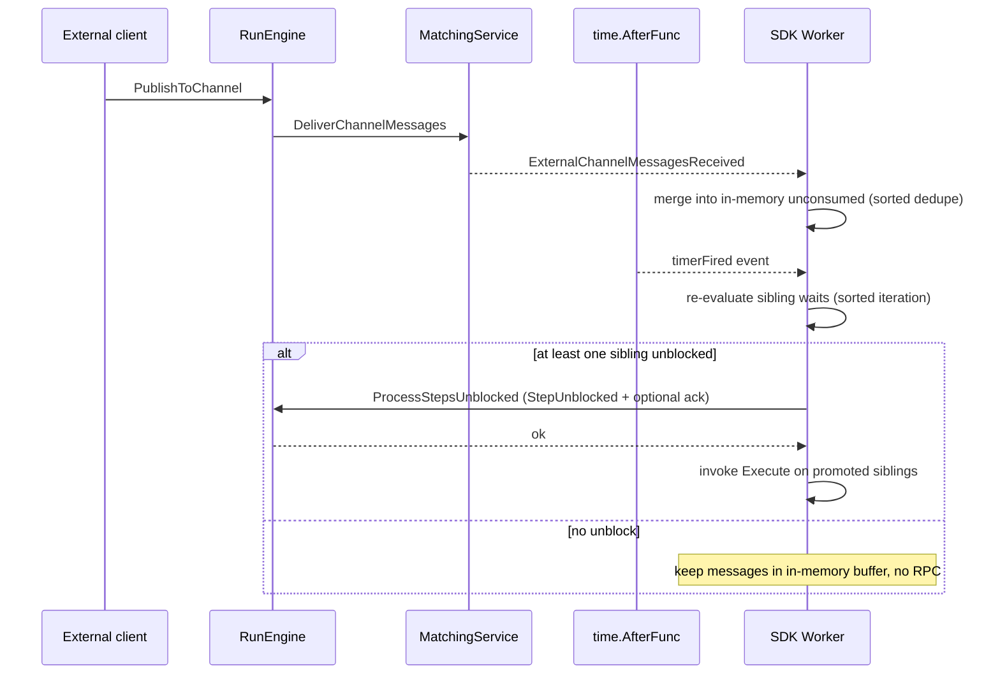

# WaitFor Conditions Design

This document describes how the SDK and server cooperate to execute step
`WaitFor` conditions: timers, channels, AnyOf/AllOf composition, and the
out-of-band unblock paths (external channel deliveries and local timer
fires while a worker is holding a Running run).

It is the canonical reference for the worker-driven channel-consumption
contract and the crash-window correctness argument behind the
`RunsService.ProcessStepsUnblocked` RPC.

The symmetric operation — having a step's `Execute` actively cancel
sibling step executions instead of waiting for one of their conditions
to fire — is documented in
[cancel-sibling-step-execution-design](cancel-sibling-step-execution-design.md).

## Surface area

User-facing SDK API:

```go
return dex.AnyOf(
    notifyCh.Condition(dex.WithMin(2), dex.WithMax(5)),
    dex.Timer(30*time.Second),
).WithStateUpsertDelta(myDelta).
  WithPublishToChannel(dex.NewChannelMessage(downstreamCh, payload)), nil
```

A step's `WaitFor(ctx, input, stateRO) (*WaitForCondition, error)` returns
either:

- `AnyOf(...)` — satisfied as soon as at least one branch is satisfied.
  **Greedy consumption**: the evaluator checks every branch independently
  and marks **all** branches that are currently satisfied, not just the first
  one. A step that waited on `AnyOf(timer, channelA, channelB)` and finds
  both `channelA` and `channelB` ready when it wakes will receive consumed
  messages from both channels and can check `ctx.TimerFired()` for the timer.
  Timer branches consume nothing from the queue. Channel branches consume
  `Min`–`Max` messages from the front of the channel queue, accounting for
  reservations held by concurrent `INVOKING_EXECUTE` siblings.
- `AllOf(...)` — satisfied only when every branch is satisfied. Multiple
  conditions on the same channel sum their `Min` requirement; the engine
  consumes that summed amount from the front.

The optional `WithStateUpsertDelta` and `WithPublishToChannel` are committed
**atomically** with the `WAITING_FOR_CONDITION` transition.

## High-level flow

```mermaid
sequenceDiagram
    participant Step as Step.WaitFor
    participant Worker as SDK Worker
    participant Engine as RunEngine
    participant Mongo as Mongo
    participant Match as MatchingService
    Worker->>Step: invoke WaitFor(ctx, input, state)
    Step-->>Worker: WaitForCondition + (state delta + publishes)
    Worker->>Engine: ProcessStepWaitForCompleted (atomic CAS)
    Engine->>Mongo: persist active step + state + push channel pubs + create durable timer
    alt all steps now waiting
        Note over Worker: completion keeps Running; worker parks later
        Worker->>Engine: ProcessReleaseRun(all_steps_waiting)
        Engine->>Engine: status = AllStepsWaitingForConditions
        Engine->>Mongo: timer task scheduled (TimerTaskStepWaitForTimer)
    end
    Note over Worker,Match: Worker exits; matching re-dispatches when an event arrives
```

## Channel message reservation (two-phase consume)

The server is the **source of truth for messages**
(`RunRow.UnconsumedChannelMessages`). Promotion from
`WAITING_FOR_CONDITION → INVOKING_EXECUTE` **reserves** messages by
persisting `ActiveStepExecution.condition_results` and allocating
`executeMethodExeID`; the queue is **not** shortened until Execute completes
or a reserved step is cancelled.

### Reserve (promote)

Whoever promotes MUST persist `ConditionResults` in the same CAS:

| Path | Mechanism |
|------|-----------|
| Worker-driven | `ProcessStepsUnblocked`, or `steps_unblocked` piggyback on WaitFor/Execute completion |
| Server-driven | `serverWakePromoteIfAny` (AllStepsWaiting external publish, durable timer fire) |

Worker-driven promotion: the worker pre-allocates `execute_method_exe_id`
from its local `StepMethodExeCounter` mirror (sorted by `step_exe_id` when
batch-promoting) and sends it on `StepUnblocked.execute_method_exe_id` or
`NextStep.wait_for_method_exe_id` / `NextStep.execute_method_exe_id`. The
server leniently persists the supplied ids and advances
`RunRow.StepMethodExeCounter` to `max(current, supplied)`.

Server-driven promotion (`serverWakePromoteIfAny` while the worker is not on
the run) still bumps `StepMethodExeCounter` server-side (sorted by
`step_exe_id`). The next worker syncs from `PollForRunResponse.step_method_exe_counter`.

`ChannelConditionResult.consumed_count` is the **reserved count**, not a
queue mutation hint on unblock RPCs.

### Counter mirrors

| Counter | Worker mirror | Server authority |
|---------|---------------|------------------|
| `StepExeIDCounters` | Yes — from `PollForRunResponse.step_execution_id_counters`; bumps when minting `NextSteps` | Persists from worker-supplied `NextSteps` on completion |
| `StepMethodExeCounter` | Yes — from `PollForRunResponse.step_method_exe_counter`; pre-allocates on `NextStep` / `StepUnblocked` | Lenient persist of worker-supplied ids; server-only bump on `StartRun` and `serverWakePromoteIfAny` |

### Remove (Execute complete or cancel)

On `ProcessStepExecuteCompleted`, the engine splices each reserved
range out of `UnconsumedChannelMessages` in one batch (descending
`executeMethodExeID` per channel). Cancelled `INVOKING_EXECUTE` siblings with
reservations join the same batch. Timer-only reservations (`consumed_count=0`)
skip splice. Top-level `condition_results` on the Execute request are ignored
for queue mutation (history/observability only).

The SDK worker mirrors the same offset/splice logic locally before shipping
the completion RPC.

### Read by ordering

A reserved step reads messages at
`offset = sum(lower executeMethodExeID reservations' consumed_count on channel)`
then `[offset : offset+count)`.

## Resume after WAITING_FOR_CONDITION

When the engine dispatches a run from `AllStepsWaitingForConditions →
Pending` (durable timer fired or external publish), satisfied steps are
promoted server-side via
`serverWakePromoteIfAny`: status becomes `INVOKING_EXECUTE` with persisted
`condition_results` and `execute_method_exe_id`. Messages stay in the queue
until Execute completes.

Server-side paths that promote:

1. **External publish (fresh)** — `tryProcessExternalChannelMessages` on
   `AllStepsWaiting`.
2. **Durable timer fire** — `tryProcessStepWaitForTimerFired`.

All funnel through `serverWakePromoteIfAny`
(`server/internal/engine/channel_promotion.go`).

The
`PollResponse` carries:

- `unconsumed_channel_messages` — every channel's full unconsumed buffer.
- `active_step_executions[stepExeId]` with `status = WAITING_FOR_CONDITION`
  AND `wait_for_condition` populated.
- `durable_timer_fired = true` if the engine path that woke the run was a
  durable timer fire.
- `server_timestamp_ms` — the engine's notion of "now", anchored for
  consistent timer evaluation across worker clock skew.

The worker, on first sight of such a step:

1. Locally re-evaluates the `wait_for_condition` against
   `unconsumed_channel_messages` with `effectiveNow =
   pr.ServerTimestampMs`. The SDK (`sdk-go/dex/evaluate/`) and server
   (`server/internal/engine/evaluate/`) are symmetric ports of the same
   reservation-aware evaluator, so picks are deterministic modulo input drift.
2. If satisfied, builds `Context.channelMessages` from the consumed
   `pb.Value`s (JSON-decoded into untyped `map[string][]any`) and sets
   `timerFired = true` if any timer condition fired.
3. Invokes Execute with that populated context.
4. The Execute completion's `condition_results` echoes the consumed counts
   back; the engine prunes the queue.

## Out-of-band unblocks during Running state

Two events can unblock a sibling waiting step while the worker is mid-run
on an unrelated step:

1. **External channel delivery push.** While the run is `Running`, the
   matching service forwards `ServerToWorkerMessage_ExternalChannelMessagesReceived`
   on the open `PollForRun` stream (originated by `PublishToChannel` →
   engine → `ImmediateTaskExternalChannelMessagesReceived` → matching).
2. **Local timer fire.** The server's `tryProcessStepWaitForTimerFired`
   intentionally drops timer fires when status != `AllStepsWaitingForConditions`
   (counted by `counter_step_wait_for_timer_fired_dropped_not_all_waiting`).
   To make timers prompt during Running state, the SDK arms a
   `time.AfterFunc` per `TimerCondition` of every waiting sibling, anchored
   to `pr.ServerTimestampMs + time.Since(pollReceivedAt)`.

Both feed into the same in-memory `unconsumedChannels` map owned by
`processRun` and trigger a sibling-unblock evaluation. The result, if a
sibling was satisfied, must be **durably checkpointed before Execute runs**
(see next section).



## Why ProcessStepsUnblocked is mandatory (not an optimization)

The internal-publish path (Source A in the SDK code) is naturally durable
because the unblock decision rides on the **same**
`StepExecuteCompletedRequest` as the publish that caused it — server commits
both in one CAS. Out-of-band triggers (external delivery, local timer fire)
have no such piggyback: the only existing durable record of the trigger is
the message itself in `UnconsumedChannelMessages` (for external deliveries)
and the timer task on the server (for timers).

Without a synchronous checkpoint, this misbehavior is possible:

| Time | Server state | Crashed worker action |
|------|--------------|----------------------|
| t0 | stepA, stepB both `WAITING` on chan, Min=2 / Min=1 | — |
| t1 | unconsumed = `[m1]` (ext arrives) | locally promote stepB, Execute m1, calls downstream API |
| t2 | unconsumed = `[m1]` | crash mid-Execute |
| t3 | unconsumed = `[m1, m2]` (another ext arrives) | — |
| t4 | re-dispatch | new worker sees both satisfiable; may pick stepA (now Min=2 satisfied), consumes [m1,m2]. stepB never logically runs even though its downstream side-effect already happened at t1. |

Sorted determinism alone does not save us because the inputs to the eval
are not stable across the crash window: more external publishes can arrive
durably, sibling completions can land via in-flight RPCs, and the server
can re-create timer tasks.

`ProcessStepsUnblocked` closes the window: after the worker calls it
synchronously and gets ok, the unblock is durable on the server, so a
crash before Execute simply causes the new worker to pick up the same
already-promoted step.

## RPC reference

```proto
service RunsService {
  rpc ProcessStepsUnblocked(StepsUnblockedRequest) returns (StepsUnblockedResponse);
}

message StepsUnblockedRequest {
  string namespace = 1;
  string run_id = 2;
  repeated StepUnblocked steps_unblocked = 3;
  WorkerCallContext context = 4;
}
```

Empty-steps invocations short-circuit before CAS and emit no history event.
The worker should never send one — `counter_steps_unblocked_empty_no_op`
flags any SDK regression that does.

Worker recovery when the active worker is gone:

- **`Running`**: heartbeat timeout or `ProcessReleaseRun(yield)` transitions to
  `WaitingForWorker` and schedules resume dispatch. Published messages
  remain in `UnconsumedChannelMessages` for catch-up on the next poll.
- **`AllStepsWaitingForConditions`**: worker parks via
  `ProcessReleaseRun(all_steps_waiting)` after draining inbox and
  re-evaluating waiting steps. External publish and durable timer fire
  call `serverWakePromoteIfAny` directly (see "Resume after
  WAITING_FOR_CONDITION").

The worker dedupes any push it receives twice against
`pr.ExternalChannelMessageCounter` so re-dispatch interleaving never
double-applies a message.

### Race recap: external publish during worker exit

The dev-stack benchmark (`./dev-stack.sh` at repo root) exercises a
back-to-back per-key publish pattern that surfaces a subtle race:

1. `PublishToChannel(ord-1)` lands while the run is `AllStepsWaiting` →
   engine promotes to `Pending`, dispatches to a worker.
2. `PublishToChannel(ord-2)` lands milliseconds later while the run is
   still `Running` → engine appends to `RunRow.UnconsumedChannelMessages`.
3. The worker finishes `ord-1`'s chain. Its main loop drains inbox,
   re-evaluates waiting steps, then calls `ProcessReleaseRun(all_steps_waiting)`
   to park the run.

Two converging fixes close the gap so the run resumes promptly instead
of sitting behind the 2-minute durable timer:

- **SDK exit drain** (`checkToExitRunLoopIfAllStepsAreWaitingForConditions`):
  before parking, the worker non-blockingly drains `inbox` so a server
  push that landed AFTER the last RPC can still trigger an in-process
  promotion via `ProcessStepsUnblocked`.
- **`ProcessReleaseRun(all_steps_waiting)` catch-up**: if the worker is
  behind on `last_received_external_channel_message_id`, the server
  returns catch-up without parking; the worker loops and retries.

`server/internal/integration/sdke2e/sdk_e2e_dynamic_channel_test.go::
TestSDKE2E_DynamicChannel_LateExternalPublishUnblocksAfterAllStepsWaiting`
reproduces the back-to-back race and asserts the run completes within
seconds.

## History event

Every non-empty `ProcessStepsUnblocked` produces a
`HistoryStepsUnblockedPayload` event:

```proto
message HistoryStepsUnblockedPayload {
  int64 worker_request_counter = 1;
  repeated StepUnblocked steps_unblocked = 2;
}
```

The WebUI renders it as a distinct timeline entry with a cause-colored
badge (blue = external delivery, amber = local timer fired, purple = mixed)
plus a list of the promoted step IDs and their per-channel `consumed_count`.

## Local timer arming

When `processRun` first sees a `WAITING_FOR_CONDITION` step (either from
the initial `PollResponse` or from a freshly-completed sibling's
`StepWaitForCompleted`), it arms one `time.AfterFunc` per
`TimerCondition` in that step's `WaitForCondition.conditions`:

```go
delta := t.FireAtUnixMs - serverNowMs()
if delta < 0 { delta = 0 }
armedTimers[stepExeID][condIdx] = time.AfterFunc(delta * time.Millisecond, func() {
    timerFiredCh <- timerFireEvent{stepExeID, condIdx}
})
```

`serverNowMs()` is `pr.ServerTimestampMs + time.Since(pollReceivedAt)`,
isolating us from worker-host clock skew. All armed timers are `.Stop()`'d
on `processRun` exit (clean shutdown, run stopped, run completed) to
prevent goroutine leaks.

## Tests

- Server-side integration: `TestE2E_DurableTimer_FullFireCycle`,
  `TestE2E_Channel_ReservationSpliceOnComplete`,
  `TestE2E_AllOf_TimerAndChannel_BothMustFire`,
  `TestE2E_ProcessStepsUnblocked_OutOfBandCheckpoint`,
  `TestE2E_ProcessStepsUnblocked_PureAck_NoCAS_NoHistory` in
  `server/internal/integration/runengine/runengine_test.go`.
- SDK unit: `condition_evaluator_test.go`, `wait_encoder_test.go` in
  `sdk-go/dex/`.
- Benchmark workflows that exercise these scenarios live in
  `benchmark/cmd/benchmarkworker/wait_flows.go` and are auto-triggered
  by `./dev-stack.sh`.

## Observability

Metrics (defined in `server/internal/metrics/metrics_defs.go`):

| Metric | Tier | Tags |
|---|---|---|
| `steps_unblocked_committed_counter` | Info | `namespace` |
| `process_steps_unblocked_error_counter` | Info | `namespace`, `error_kind` |
| `process_steps_unblocked_latency` | Info | `namespace` |
| `steps_unblocked_empty_no_op_counter` | Debug | `namespace` |
| `channel_messages_consumed_counter` | Info | `namespace` |
| `channel_external_publish_counter` | Info | `namespace` |
| `step_wait_for_timer_fired_dropped_not_all_waiting_counter` | Debug | `namespace` |
| `running_to_all_steps_waiting_dispatched_from_unconsumed_counter` | Info | `namespace` |

Logging: see `.cursor/rules/log-message-no-dynamic-values.mdc`. Static
messages, all dynamic values in tags
(`server/common/log/tag/tags.go`: `UnblockedCount`,
`ConsumedCount`, `ExternalChannelMessageID`).

## Dynamic channels

A **dynamic channel** is a typed channel whose name is constructed at runtime
from a fixed prefix plus a per-instance key. The SDK type
[`DynamicChannel[T]`](../sdk-go/dex/channel.go) is purely a client-side
naming convention over the same opaque-string channel API used by static
channels — the wire contract, server engine, and persistence layer treat
every channel name as an arbitrary string and do not have a separate
"dynamic" code path.

```go
// Define once at package scope.
var OrderUpdates = dex.NewDynamicChannel[map[string]any]("order-update-")

// Consumer side — wait on a specific instance.
func (s *waitStep) WaitFor(_ *dex.Context, in WaitInput, _ State) (*dex.WaitForCondition, error) {
    return dex.AnyOf(OrderUpdates.Of(in.OrderID).Condition()), nil
}

// Producer side — internal publish from another step's Execute.
return dex.Complete(state).
    WithPublishToChannel(dex.NewChannelMessage(OrderUpdates.Of(orderID), payload)), nil

// External publish — typed helper resolves prefix+key for you.
err := dex.PublishToDynamicChannel(client, ctx, runID, OrderUpdates, orderID, payload)
```

### Resolution

`dc.Of(key).Name == dc.Prefix + key`. The SDK does **not** insert any
delimiter between prefix and key — the prefix must include any trailing
separator (e.g. the trailing `-` in `"order-update-"`). The resulting
`Channel[T]` is a regular static channel for every other API
(`Condition()`, `NewChannelMessage()`, `GetChannelMessages()`).

### Wire and persistence

The server is name-agnostic end-to-end:

- `RunRow.UnconsumedChannelMessages` is `map[string][]Value` keyed by the
  full resolved name.
- `RunsService.PublishToChannel` accepts any string in `channel_name`.
- `MatchingService.DeliverChannelMessages` forwards by full name.
- `WaitForCondition.Validate()` does **not** check channel names against
  any per-flow registry (no such registry exists on the server).
- `ChannelDef.IsDynamic` (set by `dex.DefineDynamicChannel`) is metadata
  only — it is not sent over the wire and not consumed at runtime.

This means dynamic channels "just work" on top of every existing channel
mechanism: per-key isolation, condition counting, ack tracking, and
external publish all flow through the same code paths as static channels.

### Per-key isolation

Two distinct keys resolve to two distinct channel names with disjoint
backlogs. `PublishToDynamicChannel(..., dc, "k1", v)` only unblocks steps
waiting on `dc.Of("k1").Condition()`; steps waiting on `dc.Of("k2")` are
unaffected. This is the foundational guarantee for per-order /
per-tenant / per-session pub/sub patterns.

### Internal publish round-trip

A step's `WithPublishToChannel(NewChannelMessage(dc.Of(key), v))` round-trips
through the engine like any other channel publish: the engine appends to
`UnconsumedChannelMessages[dc.Of(key).Name]` atomically with the rest of
the step commit, then `MatchingService.DeliverChannelMessages` pushes to
the active worker stream so any sibling step waiting on the same instance
unblocks promptly. The benchmark `dynamicChannelFlow`
(`benchmark/cmd/benchmarkworker/wait_flows.go`) demonstrates this with a
fan-out of `orderWaitStep` (consumes external `order-update-{id}` and
publishes `order-ack-{id}`) plus a sibling `orderAckStep` (waits on the
same `order-ack-{id}`).

### UI

[`RunStatePanel`](../web/app/flow/show/RunStatePanel.tsx) renders one row per
distinct resolved channel name in `unconsumed_channel_messages`, sorted
lexicographically (so `order-update-ord-1`, `order-update-ord-2`,
`order-update-ord-3` group naturally even without explicit family
awareness). [`WaitForConditionPanel`](../web/app/components/WaitForConditionPanel.tsx)
displays each channel condition by its full resolved name in a mono `<code>`
chip. No special "dynamic family" UI exists today; the panel handles many
distinct names cleanly because each is just another row.

### Cardinality

`channel_name` is intentionally **not** a metric tag (see the comment in
[server/internal/metrics/metrics_defs.go](../server/internal/metrics/metrics_defs.go))
exactly because dynamic-channel families like `order-update-{id}` would
otherwise blow up Prometheus cardinality. Counters
(`channel_external_publish_counter`, `channel_messages_consumed_counter`)
record per-namespace volume regardless of whether the underlying name is
static or dynamic.

### Tests

- SDK unit: [sdk-go/dex/channel_test.go](../sdk-go/dex/channel_test.go)
  covers `Of` resolution, type preservation, condition encoding, and
  `NewChannelMessage` round-tripping.
- SDK e2e: [server/internal/integration/sdke2e/sdk_e2e_dynamic_channel_test.go](../server/internal/integration/sdke2e/sdk_e2e_dynamic_channel_test.go)
  covers per-key isolation (external publish), internal publish unblocking
  a sibling step, internal publish without a waiter (orphan landing in
  `UnconsumedChannelMessages`), and condition_results carrying the full
  resolved name in history events.
- Benchmark + dev-stack: `./dev-stack.sh` triggers the
  `dynamicChannel` mode (3 orders fan-out × 2 siblings = 6 branches) and
  publishes to two of the three orders so the WebUI shows both completed
  branches and a still-waiting branch.
