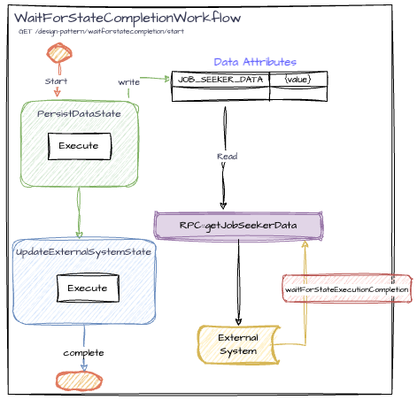

# WaitForStepCompletionWorkflow

This Flow demonstrates returning a client-visible result after one Step completes while background work continues.

## Endpoints

To start the `WaitForStepCompletionWorkflow', use the following REST endpoint:

```http request
GET /patterns/wait-for-step-completion/start?workflowId={workflowId}
```

## Use Cases

- Replacing Mongo Change Data Capture (CDC): To kick off a background operation after database write people usually would use database CDC(change data capture) technology, which is very heavy and complex. This pattern can simplify the whole architecture to a few lines of code.
- Frontend data needed for rendering: Wait for **PersistData**, then return the persisted data while background work continues.
- Replacing datastore polling: Wait for the Step that persists data instead of querying the datastore in a loop.

## Workflow Details


<br>([diagram_link](https://drive.google.com/file/d/1T_Tp5ZCoq7l2bVFD7gByHVVaXuTmeMRI/view?usp=drive_link))

### Flow Steps

The workflow consists of the following state:

- **PersistData**: Persists job seeker data using the provided mocked `mongoCollection`.
- **UpdateExternalSystem**: Publishes job seeker data to an external system.

### Persistence

The workflow uses a persistence schema to define the data attributes that need to be stored. In this case, it includes:

- **Data Attribute**: `JOB_SEEKER_DATA`
    - **Type**: `JobSeekerData`
    - **Description**: Stores the job seeker information that is required for the workflow operations.

### RPC Method: `getJobSeekerData`

- **Description**: Retrieves the job seeker data from the persistence layer.
- **Returns**: `JobSeekerData` object containing the job seeker information.
- **Throws**: `IllegalStateException` if the job seeker data is not found in the data store.

### Usage

To start a `WaitForStepCompletionWorkflow`, use the above endpoint. Example:

```http request
http://localhost:8080/patterns/wait-for-step-completion/start?workflowId=waitforstepcompletion_1
```
The controller starts the Flow, calls **waitForStepCompletion** for **PersistData**, then reads the persisted value.
